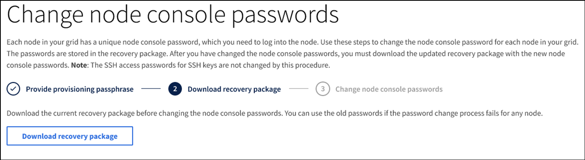

= 更改节点控制台密码
:allow-uri-read: 
:icons: font
:imagesdir: ../media/

[role="lead"]
网格中的每个节点都有一个唯一的节点控制台密码，您需要使用该密码登录到该节点。按照以下步骤更改网格中每个节点的每个唯一节点控制台密码。

.您需要的内容
* 您将使用登录到网格管理器 xref:../admin/web-browser-requirements.adoc[支持的 Web 浏览器]。
* 您具有维护或 root 访问权限。
* 您具有当前配置密码短语。

.关于此任务
使用节点控制台密码以 "admin" 身份使用 SSH 登录到节点，或者以 VM/ 物理控制台连接上的 root 用户身份登录到节点。更改节点控制台密码过程会为网格中的每个节点创建新密码，并将这些密码存储在恢复包中更新的 `passwords.txt` 文件中。密码将在 Passwords.txt 文件的 Password 列中列出。

NOTE: 用于节点间通信的 SSH 密钥具有单独的 SSH 访问密码。此操作步骤 不会更改 SSH 访问密码。

== 访问向导

. 选择 * 配置 * > * 访问控制 * > * 网格密码 * 。
+
image::../media/grid_password_change_node_console.png[网格密码]

. 在 * 更改节点控制台密码 * 下选择 * 进行更改 * 。

== 输入配置密码短语

. 输入配置密码短语。
+
image::../media/node-console-provisioning-passphrase.png[输入配置密码短语]

. 选择 * 继续 * 。

== 下载当前的恢复包

. 选择 * 下载恢复包 * 。
+
如果任何节点的密码更改过程失败，您可以使用当前恢复包中的旧密码。

+

. 将恢复软件包文件（ .zip ）复制到两个安全的单独位置。
+

CAUTION: 恢复包文件必须受到保护，因为它包含可用于从 StorageGRID 系统获取数据的加密密钥和密码。

. 选择 * 继续 * 。

== 更改节点控制台密码

. 选择 * 是 * 确认要更改节点控制台密码。
+
image::../media/node-console-start-passwords-change.png[开始更改密码]

+
如果选择 * 是 * ，则会使用新密码生成一个新的恢复包。使用新密码生成新的恢复包可能需要几分钟的时间。

+
如果选择 * 取消 * ，则会返回到上一页。

. 选择 * 下载新恢复包 * 。
+

. 下载完成后：
+
.. 打开 .zip 文件。
.. 提取 .zip 文件的内容。
.. 确认您可以打开 `passwords.txt` 文件，并且内容是可读的。

. 将新的恢复软件包文件（ .zip ）复制到两个安全，安全且独立的位置。
+

CAUTION: 请勿覆盖旧的恢复软件包。

+
您应只查看 `passwords.txt` 文件，或者如果无法查看，请先删除提取的 `passwords.txt` 文件，然后再将恢复软件包复制到两个单独的安全位置。恢复包文件必须受到保护，因为它包含可用于从 StorageGRID 系统获取数据的加密密钥和密码。

. 选中此复选框以指示您已下载新的恢复软件包并验证其内容。
. 选择 * 更改节点控制台密码 * 并等待所有节点密码更新。这可能需要几分钟时间。
+
如果所有节点的密码均已更改，则会显示一个绿色的成功横幅。继续执行下一步。

+
如果更新过程中出现错误，则会显示一条横幅消息，列出无法更改密码的节点数。系统将在任何无法更改密码的节点上自动重试此过程。如果此过程结束时某些节点仍没有更改密码，则会显示 * 重试 * 按钮。

+
如果一个或多个节点的密码更新失败：

+
.. 查看表中列出的错误消息。
.. 解决问题。
.. 选择 * 重试 * 。
+

NOTE: 重试仅会更改先前尝试更改密码期间失败的节点上的节点控制台密码。

. 更改所有节点的节点控制台密码后，删除旧的恢复软件包。
. 或者，也可以使用 * 恢复软件包 * 链接下载新恢复软件包的其他副本。

