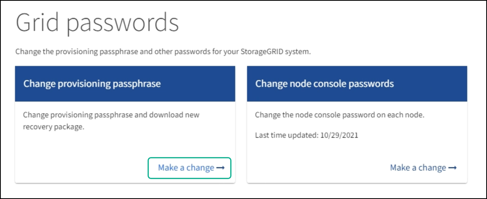

= 更改配置密码短语
:icons: font
:imagesdir: ../media/

[role="lead"]
使用此操作步骤 更改 StorageGRID 配置密码短语。恢复，扩展和维护过程需要密码短语。下载恢复软件包备份时也需要使用密码短语，其中包括网格拓扑信息，网格节点控制台密码以及 StorageGRID 系统的加密密钥。

.您需要什么？ #8217 ；将需要什么
* 您将使用登录到网格管理器 xref:../admin/web-browser-requirements.adoc[支持的 Web 浏览器]。
* 您具有维护或 root 访问权限。
* 您具有当前配置密码短语。

许多安装和维护过程以及都需要配置密码短语 xref:../maintain/downloading-recovery-package.adoc[正在下载恢复包]。配置密码短语未列在 `passwords.txt` 文件中。请务必记录配置密码短语并将其保存在安全的位置。

.步骤
. 选择 * 配置 * > * 访问控制 * > * 网格密码 * 。
+

. 在 * 更改配置密码短语 * 下选择 * 进行更改 * 。
+
image::../media/grid_password_change_provisioning_passphrase.png[网格密码会更改配置密码短语]

. 输入当前配置密码短语。
. 输入新密码短语。密码短语必须至少包含 8 个字符，并且不能超过 32 个字符。密码短语区分大小写。
. 将新配置密码短语存储在安全位置。安装，扩展和维护过程需要使用它。
. 重新输入新密码短语，然后选择 * 保存 * 。
+
配置密码短语更改完成后，系统将显示一个绿色的成功横幅。

+
image::../media/change_provisioning_passphrase_success.png[更改配置密码短语成功]

. 选择 * 恢复包 * 。
. 输入新的配置密码短语以下载新的恢复软件包。
+

CAUTION: 更改配置密码短语后，您必须立即下载新的恢复软件包。通过恢复包文件，您可以在发生故障时还原系统。

