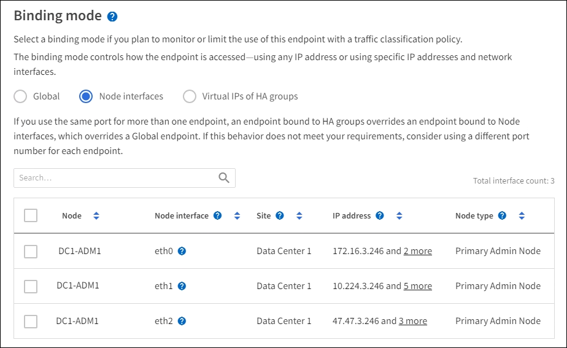

= 配置负载平衡器端点
:allow-uri-read: 
:icons: font
:imagesdir: ../media/

[role="lead"]
负载平衡器端点决定了 S3 和 Swift 客户端在连接到网关和管理节点上的 StorageGRID 负载平衡器时可以使用的端口和网络协议。

.您需要的内容
* 您将使用登录到网格管理器 xref:../admin/web-browser-requirements.adoc[支持的 Web 浏览器]。
* 您具有 root 访问权限。
* 如果您先前已重新映射要用于负载平衡器端点的端口，则表示您已重新映射 xref:../maintain/removing-port-remaps.adoc[已删除端口重新映射]。
* 您已创建计划使用的任何高可用性（ HA ）组。建议使用 HA 组，但不要求使用 HA 组。请参见 xref:managing-high-availability-groups.adoc[管理高可用性组]。
* 负载平衡器端点是否将由使用 xref:../admin/manage-s3-select-for-tenant-accounts.adoc[S3 Select 的 S3 租户]，不能使用任何裸机节点的 IP 地址或 FQDN 。用于 S3 Select 的负载平衡器端点仅允许使用 SG100 或 SG1000 设备以及基于 VMware 的软件节点。
* 您已配置计划使用的任何 VLAN 接口。请参见 xref:configure-vlan-interfaces.adoc[配置 VLAN 接口]。
* 如果要创建 HTTPS 端点（建议），则您具有服务器证书的信息。
+

NOTE: 对端点证书所做的更改可能需要长达 15 分钟才能应用于所有节点。

+
** 要上传证书，您需要服务器证书，证书专用密钥以及 CA 捆绑包（可选）。
** 要生成证书，您需要 S3 或 Swift 客户端用于访问此端点的所有域名和 IP 地址。您还必须知道主题（可分辨名称）。
** 如果要使用 StorageGRID S3 和 Swift API 证书（也可用于直接连接到存储节点），则已将默认证书替换为由外部证书颁发机构签名的自定义证书。请参见xref:../admin/configuring-custom-server-certificate-for-storage-node-or-clb.adoc[配置 S3 和 Swift API 证书]。
+
此证书可以使用通配符表示运行负载平衡器服务的所有管理节点和网关节点的完全限定域名。例如， ` * .storagegrid._example_.com` 使用 * 通配符表示 `adm1.storagegrid._example_.com` 和 `gn1.storagegrid._example_.com` 。请参见 xref:configuring-s3-api-endpoint-domain-names.adoc[配置 S3 API 端点域名]。

== 创建负载平衡器端点

每个负载平衡器端点都指定一个端口，一个客户端类型（ S3 或 Swift ）和一个网络协议（ HTTP 或 HTTPS ）。

=== 访问向导

. 选择 * 配置 * > * 网络 * > * 负载平衡器端点 * 。
. 选择 * 创建 * 。

=== 输入端点详细信息

. 输入端点的详细信息。
+
image::../media/load_balancer_endpoint_create_http.png[创建 LB 端点]

+
[cols="1a,3a"]
|===
| 字段 | Description 

 a| 
Name
 a| 
端点的描述性名称，将显示在负载平衡器端点页面的表中。

 a| 
Port
 a| 
端口客户端将使用连接到管理节点和网关节点上的负载平衡器服务。

接受建议的端口号或输入其他网格服务未使用的任何外部端口。输入一个介于 1 到 65535 之间的值。

如果输入 * 。 80* 或 * 。 443* ，则仅在网关节点上配置端点。这些端口在管理节点上预留。

请参见 xref:../network/index.adoc[网络连接准则] 有关外部端口的信息。

 a| 
客户端类型
 a| 
要使用此端点的客户端应用程序类型，可以是 * S3 或 * Swift* 。

 a| 
网络协议
 a| 
客户端在连接到此端点时将使用的网络协议。

** 选择 * HTTPS * 可进行安全的 TLS 加密通信（建议）。您必须附加安全证书，然后才能保存此端点。
** 选择 * HTTP * 可实现不太安全的未加密通信。对于非生产网格，请仅使用 HTTP 。

|===
. 选择 * 继续 * 。

=== 选择绑定模式

. 为端点选择绑定模式以控制端点的访问方式。
+
[cols="1a,3a"]
|===
| 选项 | Description 

 a| 
全局（默认）
 a| 
客户端可以使用完全限定域名（ FQDN ），任何网关节点或管理节点的 IP 地址或任何网络上任何 HA 组的虚拟 IP 地址来访问此端点。

除非需要限制此端点的可访问性，否则请使用 * 全局 * 设置（默认）。

 a| 
节点接口
 a| 
客户端必须使用选定节点的 IP 地址和网络接口来访问此端点。

 a| 
HA 组的虚拟 IP
 a| 
客户端必须使用 HA 组的虚拟 IP 地址来访问此端点。

只要为端点选择的 HA 组不重叠，具有此绑定模式的端点都可以使用相同的端口号。

只要您为端点选择的接口不重叠，采用此模式的端点都可以使用相同的端口号。

|===
+

NOTE: 如果对多个端点使用同一端口，则使用 * HA 组的虚拟 IP * 模式的端点将覆盖使用 * 节点接口 * 模式的端点，而此模式将覆盖使用 * 全局 * 模式的端点。

. 如果选择了 * 节点接口 * ，请为要与此端点关联的每个管理节点或网关节点选择一个或多个节点接口。
+

. 如果选择了 * HA 组的虚拟 IP * ，请选择一个或多个 HA 组。
+
image::../media/load_balancer_endpoint_ha_group_vips_binding_mode.png[端点 HA 组 VIP 绑定模式]

. 如果要创建 * HTTP * 端点，则不需要附加证书。选择 * 创建 * 以添加新的负载平衡器端点。然后，转到 <<After-you-finish,完成后>>。否则，请选择 * 继续 * 以附加证书。

=== 附加证书

. 如果要创建 * HTTPS * 端点，请选择要附加到该端点的安全证书类型。
+
此证书可保护 S3 和 Swift 客户端之间的连接以及管理节点或网关节点上的负载平衡器服务。

+
** * 上传证书 * 。如果您要上传自定义证书，请选择此选项。
** * 生成证书 * 。如果您具有生成自定义证书所需的值，请选择此选项。
** * 使用 StorageGRID S3 和 Swift 证书 * 。如果要使用全局 S3 和 Swift API 证书，则选择此选项，此证书也可用于直接连接到存储节点。
+
除非已将由网格 CA 签名的默认 S3 和 Swift API 证书替换为由外部证书颁发机构签名的自定义证书，否则无法选择此选项。请参见xref:../admin/configuring-custom-server-certificate-for-storage-node-or-clb.adoc[配置 S3 和 Swift API 证书]。

. 如果您未使用 StorageGRID S3 和 Swift 证书，请上传或生成此证书。
+
[role="tabbed-block"]
====
.上传证书
--
.. 选择 * 上传证书 * 。
.. 上传所需的服务器证书文件：
+
*** * 服务器证书 * ： PEM 编码的自定义服务器证书文件。
*** * 证书专用密钥 * ：自定义服务器证书专用密钥文件（` 。 key` ）。
+

NOTE: EC 专用密钥必须大于或等于 224 位。RSA 私钥必须大于或等于 2048 位。

*** * CA bundle* ：一个可选文件，其中包含来自每个中间颁发证书颁发机构（ CA ）的证书。此文件应包含 PEM 编码的每个 CA 证书文件，并按证书链顺序串联。

.. 展开 * 证书详细信息 * 以查看您上传的每个证书的元数据。如果您上传了可选的 CA 包，则每个证书都会显示在其自己的选项卡上。
+
*** 选择 * 下载证书 * 以保存证书文件，或者选择 * 下载 CA 捆绑包 * 以保存证书捆绑包。
+
指定证书文件名和下载位置。使用扩展名 ` .pem` 保存文件。

+
例如： `storagegRid_certificate.pem`

*** 选择 * 复制证书 PEM* 或 * 复制 CA 捆绑包 PEM* ，将证书内容复制到其他位置进行粘贴。

.. 选择 * 创建 * 。+ 已创建负载平衡器端点。自定义证书用于 S3 和 Swift 客户端与端点之间的所有后续新连接。

--
.生成证书
--
.. 选择 * 生成证书 * 。
.. 指定证书信息：
+
*** * 域名 * ：要包含在证书中的一个或多个完全限定域名。使用 * 作为通配符表示多个域名。
*** * IP * ：要包含在证书中的一个或多个 IP 地址。
*** * 主题 * ：证书所有者的 X.509 主题或可分辨名称（ DN ）。
*** * 有效天数 * ：创建证书后的天数到期。

.. 选择 * 生成 * 。
.. 选择 * 证书详细信息 * 可查看生成的证书的元数据。
+
*** 选择 * 下载证书 * 以保存证书文件。
+
指定证书文件名和下载位置。使用扩展名 ` .pem` 保存文件。

+
例如： `storagegRid_certificate.pem`

*** 选择 * 复制证书 PEM* 将证书内容复制到其他位置进行粘贴。

.. 选择 * 创建 * 。
+
此时将创建负载平衡器端点。自定义证书用于 S3 和 Swift 客户端与此端点之间的所有后续新连接。

--
====

=== 完成后的操作

. 如果您使用域名系统（ DNS ），请确保 DNS 包含一条记录，以便将 StorageGRID 完全限定域名与客户端用于建立连接的每个 IP 地址相关联。
+
在 DNS 记录中输入的 IP 地址取决于您是否使用的是由负载平衡节点组成的 HA 组：

+
** 如果已配置HA组、则客户端将连接到该HA组的虚拟IP地址。
** 如果您不使用HA组、则客户端将使用任何网关节点或管理节点的IP地址连接到StorageGRID 负载平衡器服务。
+
此外，还必须确保 DNS 记录引用所有必需的端点域名，包括任何通配符名称。

. 为 S3 和 Swift 客户端提供连接到端点所需的信息：
+
** 端口号
** 完全限定域名或 IP 地址
** 任何必需的证书详细信息

== 查看和编辑负载平衡器端点

您可以查看现有负载平衡器端点的详细信息，包括安全端点的证书元数据。您还可以更改端点的名称或绑定模式，并更新任何关联的证书。

您不能更改服务类型（ S3 或 Swift ），端口或协议（ HTTP 或 HTTPS ）。

* 要查看所有负载平衡器端点的基本信息，请查看负载平衡器端点页面上的表。
+
image::../media/load_balancer_endpoint_table.png[负载平衡器端点表]

* 要查看有关特定端点的所有详细信息，包括证书元数据，请在表中选择端点的名称。
+
image::../media/load_balancer_endpoint_details.png[负载平衡器端点详细信息]

* 要编辑端点，请使用负载平衡器端点页面上的 * 操作 * 菜单或特定端点的详细信息页面。
+

IMPORTANT: 编辑端点后，您可能需要等待长达 15 分钟，才能将所做的更改应用于所有节点。

+
[cols="1a, 2a,2a"]
|===
| 任务 | 操作菜单 | 详细信息页面 

 a| 
编辑端点名称
 a| 
.. 选中端点对应的复选框。
.. 选择 * 操作 * > * 编辑端点名称 * 。
.. 输入新名称。
.. 选择 * 保存 * 。

 a| 
.. 选择端点名称以显示详细信息。
.. 选择编辑图标 image:../media/icon_edit_tm.png["编辑图标"]。
.. 输入新名称。
.. 选择 * 保存 * 。

 a| 
编辑端点绑定模式
 a| 
.. 选中端点对应的复选框。
.. 选择 * 操作 * > * 编辑端点绑定模式 * 。
.. 根据需要更新绑定模式。
.. 选择 * 保存更改 * 。

 a| 
.. 选择端点名称以显示详细信息。
.. 选择 * 编辑绑定模式 * 。
.. 根据需要更新绑定模式。
.. 选择 * 保存更改 * 。

 a| 
编辑端点证书
 a| 
.. 选中端点对应的复选框。
.. 选择 * 操作 * > * 编辑端点证书 * 。
.. 根据需要上传或生成新的自定义证书或开始使用全局 S3 和 Swift 证书。
.. 选择 * 保存更改 * 。

 a| 
.. 选择端点名称以显示详细信息。
.. 选择 * 证书 * 选项卡。
.. 选择 * 编辑证书 * 。
.. 根据需要上传或生成新的自定义证书或开始使用全局 S3 和 Swift 证书。
.. 选择 * 保存更改 * 。

|===

== 删除负载平衡器端点

您可以使用 * 操作 * 菜单删除一个或多个端点，也可以从详细信息页面中删除单个端点。

IMPORTANT: 为防止客户端中断，请在删除负载平衡器端点之前更新任何受影响的 S3 或 Swift 客户端应用程序。更新每个客户端以使用分配给另一个负载平衡器端点的端口进行连接。请务必同时更新所需的任何证书信息。

* 删除一个或多个端点：
+
.. 在负载平衡器页面中，选中要删除的每个端点对应的复选框。
.. 选择 * 操作 * > * 删除 * 。
.. 选择 * 确定 * 。

* 从详细信息页面中删除一个端点：
+
.. 从负载平衡器页面。选择端点名称。
.. 在详细信息页面上选择 * 删除 * 。
.. 选择 * 确定 * 。

