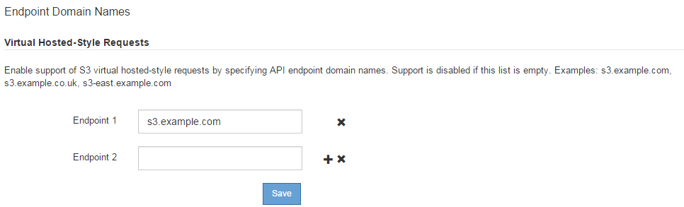

= 配置 S3 API 端点域名
:icons: font
:imagesdir: ../media/

[role="lead"]
要支持 S3 虚拟托管模式请求，您必须使用网格管理器配置 S3 客户端连接到的端点域名列表。

.您需要什么？ #8217 ；将需要什么
* 您将使用登录到网格管理器 xref:../admin/web-browser-requirements.adoc[支持的 Web 浏览器]。
* 您具有特定的访问权限。
* 您已确认网格升级未在进行中。
+

CAUTION: 在进行网格升级时，请勿对域名配置进行任何更改。

要使客户端能够使用 S3 端点域名，您必须执行以下所有操作：

* 使用网格管理器将 S3 端点域名添加到 StorageGRID 系统。
* 确保客户端用于与 StorageGRID 的 HTTPS 连接的证书已针对客户端所需的所有域名进行签名。
+
例如，如果端点为 `s3.company.com` ，则必须确保用于 HTTPS 连接的证书包含 `s3.company.com` 端点和端点的通配符使用者备用名称（ SAN ）： ` * .s3.company.com` 。

* 配置客户端使用的 DNS 服务器。为客户端用于建立连接的 IP 地址提供 DNS 记录，并确保这些记录引用所有必需的端点域名，包括任何通配符名称。
+

NOTE: 客户端可以使用网关节点，管理节点或存储节点的 IP 地址或连接到高可用性组的虚拟 IP 地址连接到 StorageGRID 。您应了解客户端应用程序如何连接到网格，以便在 DNS 记录中包含正确的 IP 地址。

使用 HTTPS 连接（建议）连接到网格的客户端可以使用以下任一证书：

* 连接到负载平衡器端点的客户端可以对该端点使用自定义证书。可以对每个负载平衡器端点进行配置，以识别不同的端点域名。
* 如果客户端连接到负载平衡器端点，直接连接到存储节点或直接连接到网关节点上已弃用的 CLB 服务，则可以自定义全局 S3 和 Swift API 证书，以包含所有必需的端点域名。

.步骤
. 选择 * 配置 * > * 网络 * > * 域名 * 。
+
此时将显示 Endpoint Domain Names 页面。

+

. 在 * 端点 * 字段中输入 S3 API 端点域名列表。使用 image:../media/icon_plus_sign_black_on_white_old.png["加号图标"] 图标以添加其他字段。
+
如果此列表为空，则会禁用对 S3 虚拟托管模式请求的支持。

. 选择 * 保存 * 。
. 确保客户端使用的服务器证书与所需的端点域名匹配。
+
** 如果客户端连接到使用自己证书的负载平衡器端点，请更新与此端点关联的证书。
** 如果客户端连接到使用全局 S3 和 Swift API 证书的负载平衡器端点，直接连接到存储节点或网关节点上的 CLB 服务，请更新全局 S3 和 Swift API 证书。

. 添加所需的 DNS 记录，以确保可以解决端点域名请求。

现在，当客户端使用端点 `bucket.s3.company.com` 时， DNS 服务器会解析到正确的端点，并且证书会按预期对端点进行身份验证。

.相关信息
* xref:../s3/index.adoc[使用 S3]
* xref:viewing-ip-addresses.adoc[查看 IP 地址]
* xref:configure-high-availability-group.adoc[配置高可用性组]
* xref:configuring-custom-server-certificate-for-storage-node-or-clb.adoc[配置 S3 和 Swift API 证书]
* xref:configuring-load-balancer-endpoints.adoc[配置负载平衡器端点]

