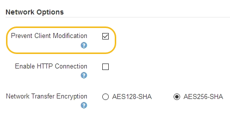

= 控制允许哪些客户端操作
:allow-uri-read: 
:icons: font
:imagesdir: ../media/

[role="lead"]
您可以选择阻止客户端修改网格选项来拒绝特定的 HTTP 客户端操作。

.您需要什么？ #8217 ；将需要什么
* 您将使用登录到网格管理器 xref:../admin/web-browser-requirements.adoc[支持的 Web 浏览器]。
* 您具有特定的访问权限。

" 阻止客户端修改 " 是系统范围的设置。选择阻止客户端修改选项后，以下请求将被拒绝：

* * S3 REST APi*
+
** 删除存储分段请求
** 修改现有对象数据，用户定义的元数据或 S3 对象标记的任何请求
+

NOTE: 此设置不适用于启用了版本控制的存储分段。版本控制已阻止对对象数据，用户定义的元数据和对象标记进行修改。

* * Swift REST APi*
+
** 删除容器请求
** 修改任何现有对象的请求。例如，以下操作被拒绝： PUT 覆盖，删除，元数据更新等。

.步骤
. 选择 * 配置 * > * 系统 * > * 网格选项 * 。
. 在网络选项部分中，选中 * 阻止客户端修改 * 复选框。
+

. 选择 * 保存 * 。

