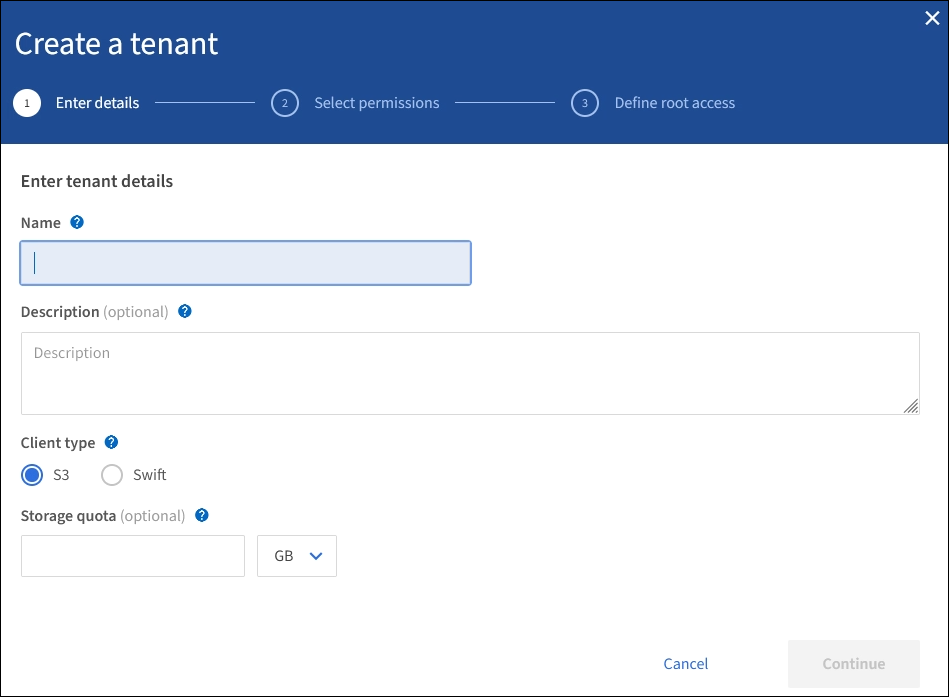

= 创建租户帐户
:allow-uri-read: 
:icons: font
:imagesdir: ../media/

[role="lead"]
您必须至少创建一个租户帐户，才能控制对 StorageGRID 系统中存储的访问。

创建租户帐户时，您可以指定名称，客户端协议以及存储配额（可选）。如果为 StorageGRID 启用了单点登录（ SSO ），则还可以指定具有 root 访问权限的联合组来配置租户帐户。如果 StorageGRID 不使用单点登录，则还必须指定租户帐户是否使用其自己的身份源，并为租户的本地 root 用户配置初始密码。

网格管理器提供了一个向导，用于指导您完成创建租户帐户的步骤。这些步骤因是否而异 xref:using-identity-federation.adoc[身份联合] 和 xref:configuring-sso.adoc[单点登录] 已配置，并且您用于创建租户帐户的网格管理器帐户是否属于具有 root 访问权限的管理组。

.您需要什么？ #8217 ；将需要什么
* 您将使用登录到网格管理器 xref:../admin/web-browser-requirements.adoc[支持的 Web 浏览器]。
* 您具有特定的访问权限。
* 如果租户帐户将使用为网格管理器配置的身份源，并且您要将租户帐户的 root 访问权限授予某个联合组，则您已将该联合组导入到网格管理器中。您无需为此管理员组分配任何 Grid Manager 权限。请参见 xref:managing-admin-groups.adoc[管理组的管理说明]。

.步骤
. 选择 * 租户 * 。
. 选择 * 创建 * ，然后为租户输入以下信息：
+
.. * 名称 * ：输入租户帐户的名称。租户名称不必唯一。创建租户帐户时，它会收到一个唯一的数字帐户 ID 。
.. * 问题描述 * （可选）：输入有助于识别租户的问题描述 。
.. * 客户端类型 * ：选择客户端类型为 * S3 * 或 * Swift* 。
.. * 存储配额 * （可选）：如果希望此租户具有存储配额，请为配额输入一个数值，然后选择正确的单位（ GB ， TB 或 PB ）。
+

. 选择 * 继续 * 并配置 S3 或 Swift 租户。

[role="tabbed-block"]
====
.S3 租户
--
为租户选择适当的权限。其中某些权限还有其他要求。有关详细信息，请参见每个权限的联机帮助。

* 允许平台服务
* 使用自己的身份源（仅当未使用 SSO 时才可选择）
* 允许 S3 选择（请参见 xref:manage-s3-select-for-tenant-accounts.adoc[管理租户帐户的 S3 Select]）

--
.Swift 租户
--
如果租户要使用自己的身份源，请选择 * 使用自己的身份源 * （只有在未使用 SSO 时才可选择）。

--
====
. 选择 * 继续 * 并为租户帐户定义 root 访问权限。

[role="tabbed-block"]
====
.未配置身份联合
--
. 输入本地 root 用户的密码。
. 选择 * 创建租户 * 。

--
.已启用 SSO
--
为 StorageGRID 启用 SSO 后，租户必须使用为网格管理器配置的身份源。没有本地用户可以登录。您可以指定具有 root 访问权限的联合组来配置租户帐户。

. 从网格管理器中选择一个现有联合组，以获得租户的初始 root 访问权限。
+

NOTE: 如果您拥有足够的权限，则在选择此字段时，将列出网格管理器中的现有联合组。否则，请输入组的唯一名称。

. 选择 * 创建租户 * 。

--
.未启用 SSO
--
. 根据租户是管理自己的组和用户，还是使用为网格管理器配置的身份源，完成表中所述的步骤。
+
[cols="1a,3a"]
|===
| 租户是否要 ... | 执行此操作 ... 

 a| 
管理自己的组和用户
 a| 
.. 选择 * 使用自己的身份源 * 。
+
* 注 * ：如果选中此复选框，并且您要对租户组和用户使用身份联合，则租户必须配置自己的身份源。请参见 xref:../tenant/index.adoc[有关使用租户帐户的说明]。

.. 为租户的本地 root 用户指定密码，然后选择 * 创建租户 * 。
.. 选择 * 以 root 用户身份登录 * 以配置租户，或者选择 * 完成 * 以稍后配置租户。

 a| 
使用为网格管理器配置的组和用户
 a| 
.. 执行以下操作之一或同时执行这两项操作：
+
*** 从网格管理器中选择一个应具有租户初始根访问权限的现有联合组。
+
* 注 * ：如果您拥有足够的权限，则在选择此字段时，将列出网格管理器中的现有联合组。否则，请输入组的唯一名称。

*** 为租户的本地 root 用户指定密码。

.. 选择 * 创建租户 * 。

|===

--
====
. 要立即登录到租户，请执行以下操作：
+
** 如果您要通过受限端口访问网格管理器，请在租户表中选择 * 受限 * ，了解有关访问此租户帐户的更多信息。
+
租户管理器的 URL 格式如下：

+
`https://_FQDN_or_Admin_Node_IP:port_/?accountId=_20-digit-account-id_/`

+
*** ` fqdn_or_Admin_Node_IP_` 是完全限定域名或管理节点的 IP 地址
*** ` 端口 _` 是仅租户端口
*** ` _20-Digid-account-id_` 是租户的唯一帐户 ID

** 如果您正在通过端口 443 访问网格管理器，但未为本地 root 用户设置密码，请在网格管理器的租户表中选择 * 登录 * ，然后在 root 访问联合组中输入用户的凭据。
** 如果要通过端口 443 访问网格管理器并为本地 root 用户设置密码：
+
... 选择 * 以 root 用户身份登录 * 以立即配置租户。
+
登录时，将显示用于配置分段或容器，身份联合，组和用户的链接。

+
image::../media/configure_tenant_account.png[配置租户帐户]

... 选择用于配置租户帐户的链接。
+
每个链接都会在租户管理器中打开相应的页面。要完成此页面，请参见 xref:../tenant/index.adoc[有关使用租户帐户的说明]。

... 否则，请选择 * 完成 * 以稍后访问租户。

. 要稍后访问租户，请执行以下操作：
+
[cols="1a,2a"]
|===
| 如果您使用的是 ... | 执行以下操作之一 ... 

 a| 
端口 443
 a| 
** 在网格管理器中，选择 * 租户 * ，然后选择租户名称右侧的 * 登录 * 。
** 在 Web 浏览器中输入租户的 URL ：
+
`https://_FQDN_or_Admin_Node_IP_/?accountId=_20-digit-account-id_/`

+
*** ` fqdn_or_Admin_Node_IP_` 是完全限定域名或管理节点的 IP 地址
*** ` _20-Digid-account-id_` 是租户的唯一帐户 ID

 a| 
受限端口
 a| 
** 在网格管理器中，选择 * 租户 * ，然后选择 * 受限 * 。
** 在 Web 浏览器中输入租户的 URL ：
+
`https://_FQDN_or_Admin_Node_IP:port_/?accountId=_20-digit-account-id_`

+
*** ` fqdn_or_Admin_Node_IP_` 是完全限定域名或管理节点的 IP 地址
*** ` 端口 _` 是仅租户的受限端口
*** ` _20-Digid-account-id_` 是租户的唯一帐户 ID

|===

.相关信息
* xref:controlling-access-through-firewalls.adoc[通过防火墙控制访问]
* xref:manage-platform-services-for-tenants.adoc[管理 S3 租户帐户的平台服务]

