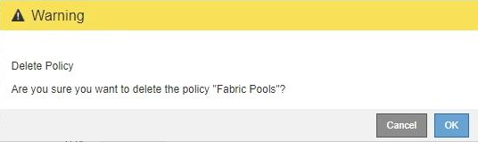

= 删除流量分类策略
:allow-uri-read: 
:icons: font
:imagesdir: ../media/

[role="lead"]
如果您不再需要流量分类策略，可以将其删除。

.您需要什么？ #8217 ；将需要什么
* 您将使用登录到网格管理器 xref:../admin/web-browser-requirements.adoc[支持的 Web 浏览器]。
* 您具有 root 访问权限。

.步骤
. 选择 * 配置 * > * 网络 * > * 流量分类 * 。
+
此时将显示 " 流量分类策略 " 页面，并在表中列出现有策略。

+
image::../media/traffic_classification_policies_main_screen_w_examples.png[流量分类策略示例]

. 选择要删除的策略左侧的单选按钮。
. 选择 * 删除 * 。
+
此时将显示警告对话框。

+

. 选择 * 确定 * 确认要删除此策略。
+
此策略将被删除。

