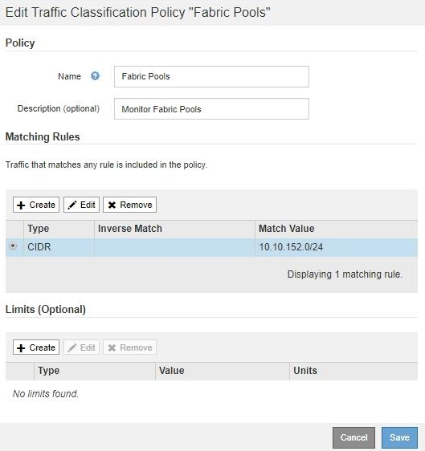

= 编辑流量分类策略
:allow-uri-read: 
:icons: font
:imagesdir: ../media/

[role="lead"]
您可以编辑流量分类策略以更改其名称或问题描述 ，或者创建，编辑或删除此策略的任何规则或限制。

.您需要的内容
* 您将使用登录到网格管理器 xref:../admin/web-browser-requirements.adoc[支持的 Web 浏览器]。
* 您具有 root 访问权限。

.步骤
. 选择 * 配置 * > * 网络 * > * 流量分类 * 。
+
此时将显示 " 流量分类策略 " 页面，并在表中列出现有策略。

+
image::../media/traffic_classification_policies_main_screen_w_examples.png[流量分类策略示例]

. 选择要编辑的策略左侧的单选按钮。
. 选择 * 编辑 * 。
+
此时将显示编辑流量分类策略对话框。

+

. 根据需要创建，编辑或删除匹配的规则和限制。
+
.. 要创建匹配的规则或限制，请选择 * 创建 * ，然后按照说明创建规则或创建限制。
.. 要编辑匹配的规则或限制，请选择规则或限制的单选按钮，在 * 匹配规则 * 部分或 * 限制 * 部分中选择 * 编辑 * ，然后按照说明创建规则或创建限制。
.. 要删除匹配的规则或限制，请选择规则或限制的单选按钮，然后选择 * 删除 * 。然后，选择 * 确定 * 以确认要删除规则或限制。

. 创建或编辑规则或限制后，请选择 * 应用 * 。
. 编辑完策略后，选择 * 保存 * 。
+
您对策略所做的更改将被保存，网络流量现在将根据流量分类策略进行处理。您可以查看流量图表并验证策略是否正在强制实施预期的流量限制。

