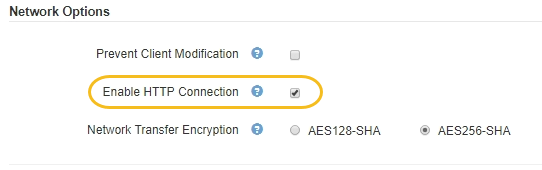

= 为客户端通信启用 HTTP
:icons: font
:imagesdir: ../media/

[role="lead"]
默认情况下，客户端应用程序会使用 HTTPS 网络协议连接到存储节点或网关节点上已弃用的 CLB 服务。您可以选择为这些连接启用 HTTP ，例如在测试非生产网格时。

.您需要什么？ #8217 ；将需要什么
* 您将使用登录到网格管理器 xref:../admin/web-browser-requirements.adoc[支持的 Web 浏览器]。
* 您具有特定的访问权限。

只有当 S3 和 Swift 客户端需要直接与存储节点或网关节点上已弃用的 CLB 服务建立 HTTP 连接时，才能完成此任务。

对于仅使用 HTTPS 连接的客户端或连接到负载平衡器服务的客户端，您无需完成此任务（因为您可以将每个负载平衡器端点配置为使用 HTTP 或 HTTPS ）。有关详细信息，请参见有关配置负载平衡器端点的信息。

请参见 xref:summary-ip-addresses-and-ports-for-client-connections.adoc[摘要：客户端连接的 IP 地址和端口] 了解使用 HTTP 或 HTTPS 连接到存储节点或已弃用的 CLB 服务时 S3 和 Swift 客户端使用的端口

IMPORTANT: 为生产网格启用 HTTP 时请务必小心，因为请求会以未加密方式发送。

.步骤
. 选择 * 配置 * > * 系统 * > * 网格选项 * 。
. 在网络选项部分中，选中 * 启用 HTTP 连接 * 复选框。
+

. 选择 * 保存 * 。

.相关信息
* xref:configuring-load-balancer-endpoints.adoc[配置负载平衡器端点]
* xref:../s3/index.adoc[使用 S3]
* xref:../swift/index.adoc[使用 Swift]

