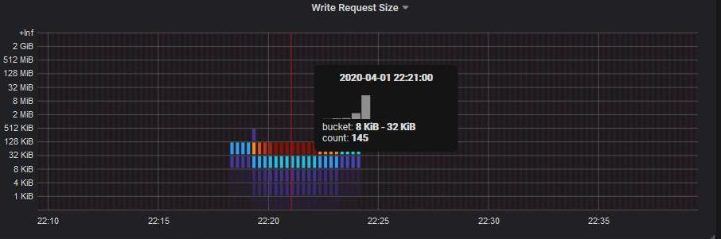

= 查看网络流量指标
:allow-uri-read: 
:icons: font
:imagesdir: ../media/

[role="lead"]
您可以通过查看 " 流量分类策略 " 页面上的图形来监控网络流量。

.您需要什么？ #8217 ；将需要什么
* 您将使用登录到网格管理器 xref:../admin/web-browser-requirements.adoc[支持的 Web 浏览器]。
* 您具有 root 访问权限或租户帐户权限。

对于任何现有流量分类策略，您可以查看负载平衡器服务的指标，以确定该策略是否成功限制网络中的流量。图形中的数据可以帮助您确定是否需要调整策略。

即使没有为流量分类策略设置限制，也会收集指标，并且图形可提供有用的信息来了解流量趋势。

.步骤
. 选择 * 配置 * > * 网络 * > * 流量分类 * 。
+
此时将显示 " 流量分类策略 " 页面，并在表中列出现有策略。

+
image::../media/traffic_classification_policies_main_screen_w_examples.png[图形的流量策略示例]

+

NOTE: 如果您具有租户帐户权限，但没有 root 访问权限，则 * 创建 * ， * 编辑 * 和 * 删除 * 按钮将被禁用。

. 选择要查看指标的策略左侧的单选按钮。
. 选择 * 指标 * 。
+
此时将打开一个新浏览器窗口，并显示流量分类策略图形。这些图形仅显示与选定策略匹配的流量的指标。

+
您可以使用 * 策略 * 下拉列表选择其他要查看的策略。

+
image::../media/traffic_classification_policy_graph.png[网络流量图]

+
网页上包含以下图形。

+
** 负载平衡器请求流量：此图提供负载平衡器端点与发出请求的客户端之间传输的数据吞吐量的 3 分钟移动平均值，以每秒位数为单位。
** 负载平衡器请求完成率：此图按请求类型（ GET ， PUT ， HEAD 和 DELETE ）细分，提供每秒已完成请求数的 3 分钟移动平均值。验证新请求的标头后，此值将更新。
** 错误响应率：此图提供了每秒返回给客户端的错误响应数的 3 分钟移动平均值，并按错误响应代码进行细分。
** 平均请求持续时间（非错误）：此图提供了按请求类型（ GET ， PUT ， HEAD 和 DELETE ）细分的 3 分钟移动平均请求持续时间。每个请求持续时间从负载平衡器服务解析请求标头时开始，到将完整的响应正文返回给客户端时结束。
** 按对象大小划分的写入请求速率：此热图根据对象大小提供 3 分钟的写入请求完成速率移动平均值。在这种情况下，写入请求仅指 PUT 请求。
** 按对象大小划分的读取请求速率：此热图提供了根据对象大小完成读取请求的 3 分钟移动平均值。在这种情况下，读取请求仅指获取请求。热图中的颜色表示各个图形中对象大小的相对频率。较冷的颜色（例如紫色和蓝色）表示相对速率较低，较热的颜色（例如橙色和红色）表示相对速率较高。

. 将光标悬停在折线图上可查看该图特定部分的值弹出窗口。
+
image::../media/traffic_classification_policy_graph_popup_closeup.png[流量折线图弹出值]

. 将光标悬停在热图上可看到一个弹出窗口，其中显示样本的日期和时间，聚合到计数中的对象大小以及该时间段内的每秒请求数。
+

. 使用左上角的 * 策略 * 下拉列表选择其他策略。
+
此时将显示选定策略的图形。

. 或者，也可以从 * 支持 * 菜单访问这些图形。
+
.. 选择 * 支持 * > * 工具 * > * 指标 * 。
.. 在页面的 * Grafan* 部分中，选择 * 流量分类策略 * 。
.. 从页面左上角的下拉列表中选择策略。
+
流量分类策略通过其 ID 进行标识。策略 ID 会列在 " 流量分类策略 " 页面上。

. 分析图形以确定策略限制流量的频率以及是否需要调整策略。

xref:../monitor/index.adoc[监控和故障排除]
