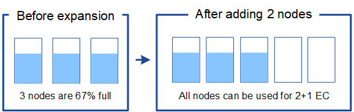

= 为经过纠删编码的对象添加存储容量
:allow-uri-read: 
:icons: font
:imagesdir: ../media/

[role="lead"]
如果 ILM 策略包含创建纠删编码副本的规则，则必须计划在何处添加新存储以及何时添加新存储。您添加的存储量和添加的时间可能会影响网格的可用存储容量。

规划存储扩展的第一步是，检查 ILM 策略中用于创建纠删编码对象的规则。由于 StorageGRID 会为每个纠删编码对象创建 _k+m_fragments ，并将每个片段存储在不同的存储节点上，因此您必须确保在扩展后至少 _k+m_ 存储节点具有用于存储新纠删编码数据的空间。如果纠删编码配置文件提供站点丢失保护，则必须向每个站点添加存储。请参见 xref:../ilm/index.adoc[使用 ILM 管理对象]。

您需要添加的节点数还取决于执行扩展时现有节点的容量。

== 有关为经过纠删编码的对象添加存储容量的一般建议

如果要避免详细计算，可以在现有存储节点容量达到 70% 时为每个站点添加两个存储节点。

对于单站点网格和纠删编码可提供站点丢失保护的网格，此一般建议可在多种纠删编码方案中提供合理的结果。

要更好地了解导致此建议的因素或为您的站点制定更精确的计划，请查看下一节。有关针对您的情况优化的自定义建议，请联系您的 NetApp 客户代表。

== 计算要为擦除编码对象添加的扩展存储节点数

要优化存储纠删编码对象的部署扩展方式，您必须考虑许多因素：

* 正在使用纠删编码方案
* 用于纠删编码的存储池的特征，包括每个站点上的节点数和每个节点上的可用空间量
* 网格之前是否已扩展（因为每个存储节点上的可用空间量可能并非所有节点上的大致相同）
* ILM 策略的确切性质，例如 ILM 规则是否同时创建复制的对象和经过纠删编码的对象

以下示例可帮助您了解纠删编码方案的影响，存储池中的节点数以及每个节点上的可用空间量。

类似的注意事项会影响存储复制数据和纠删编码数据的 ILM 策略的计算以及先前扩展的网格的计算。

IMPORTANT: 本节中的示例介绍了向 StorageGRID 系统添加存储容量的最佳实践。如果无法添加建议的节点数，则可能需要运行 EC 重新平衡操作步骤 ，以便存储其他经过纠删编码的对象。请参见 xref:considerations-for-rebalancing-erasure-coded-data.adoc[重新平衡经过纠删编码的数据]。

== 示例 1 ：扩展使用 2+1 纠删编码的单站点网格

此示例显示了如何扩展仅包含三个存储节点的简单网格。

NOTE: 为了简单起见，此示例仅使用三个存储节点。但是，不建议仅使用三个存储节点：实际生产网格应至少使用 _k+m_ + 1 个存储节点来实现冗余，此值等于本示例中的四个存储节点（ 2+1+1 ）。

假设满足以下条件：

* 所有数据均使用 2+1 纠删编码方案进行存储。使用 2+1 纠删编码方案时，每个对象都存储为三个片段，每个片段保存在不同的存储节点上。
* 您有一个站点包含三个存储节点。每个存储节点的总容量为 100 TB 。
* 要通过添加新的 100 TB 存储节点进行扩展。
* 您希望最终在新旧节点之间平衡经过纠删编码的数据。

根据执行扩展时存储节点的容量，您可以选择多种方法。

* * 如果现有节点已满，请添加三个 100 TB 存储节点 *
+
在此示例中，现有节点已满 100% 。由于没有可用容量，您必须立即添加三个节点以继续 2+1 纠删编码。

+
扩展完成后，对对象进行纠删编码后，所有片段都将放置在新节点上。

+
image::../media/used_space_after_3_node_expansion.png[3 节点扩展后的已用空间]

+

NOTE: 此扩展可添加 _k+m_nodes 。为实现冗余，建议添加四个节点。如果在现有节点已满 100% 时仅添加 _k+m_expansion Storage Node ，则所有新对象都会存储在扩展节点上。如果任何新节点变得不可用，即使是暂时不可用， StorageGRID 也无法满足 ILM 要求。

* * 如果现有存储节点已满 67% ，请添加两个 100 TB 存储节点 *
+
在此示例中，现有节点已满 67% 。由于现有节点上有 100 TB 的可用容量（每个节点 33 TB ），因此，如果您现在执行扩展，则只需添加两个节点。

+
添加 200 TB 的额外容量后，您可以继续 2+1 纠删编码，并最终在所有节点之间平衡经过纠删编码的数据。

+

* * 如果现有存储节点已满 33% ，请添加一个 100 TB 存储节点 *
+
在此示例中，现有节点已满 33% 。由于现有节点上有 200 TB 的可用容量（每个节点 67 TB ），因此，如果您现在执行扩展，则只需要添加一个节点。

+
添加 100 TB 的额外容量后，您可以继续 2+1 纠删编码，并最终在所有节点之间平衡经过纠删编码的数据。

+
image::../media/node_expansion_example_33_percent.png[节点扩展示例 1 33%]

== 示例 2 ：扩展使用 6+3 纠删编码的三站点网格

此示例显示了如何为多站点网格制定扩展计划，该网格采用的纠删编码方案包含更多片段。尽管这些示例之间存在差异，但建议的扩展计划非常相似。

假设满足以下条件：

* 所有数据均使用 6+3 纠删编码方案进行存储。使用 6+3 纠删编码方案时，每个对象将存储为 9 个片段，每个片段将保存到不同的存储节点。
* 您有三个站点，每个站点有四个存储节点（共 12 个节点）。每个节点的总容量为 100 TB 。
* 要通过添加新的 100 TB 存储节点进行扩展。
* 您希望最终在新旧节点之间平衡经过纠删编码的数据。

根据执行扩展时存储节点的容量，您可以选择多种方法。

* * 如果现有节点已满，请添加九个 100 TB 存储节点（每个站点三个） *
+
在此示例中， 12 个现有节点已满。由于没有可用容量，您必须立即添加九个节点（ 900 TB 的额外容量），才能继续 6+3 纠删编码。

+
扩展完成后，对对象进行纠删编码后，所有片段都将放置在新节点上。

+

NOTE: 此扩展可添加 _k+m_nodes 。为了实现冗余，建议添加 12 个节点（每个站点四个）。如果在现有节点已满 100% 时仅添加 _k+m_expansion Storage Node ，则所有新对象都会存储在扩展节点上。如果任何新节点变得不可用，即使是暂时不可用， StorageGRID 也无法满足 ILM 要求。

* * 如果现有节点已满 75% ，请添加六个 100 TB 存储节点（每个站点两个） *
+
在此示例中， 12 个现有节点已满 75% 。由于可用容量为 300 TB （每个节点 25 TB ），因此，如果您现在执行扩展，则只需添加六个节点。您应向这三个站点中的每个站点添加两个节点。

+
添加 600 TB 的存储容量后，您可以继续 6+3 纠删编码，并最终在所有节点之间平衡经过纠删编码的数据。

* * 如果现有节点已满 50% ，请添加三个 100 TB 存储节点（每个站点一个） *
+
在此示例中， 12 个现有节点已满 50% 。由于可用容量为 600 TB （每个节点 50 TB ），因此，如果您现在执行扩展，则只需添加三个节点。您应向这三个站点中的每个站点添加一个节点。

+
添加 300 TB 的存储容量后，您可以继续 6+3 纠删编码，并最终在所有节点之间平衡经过纠删编码的数据。

