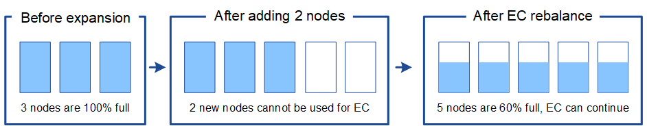

= 重新平衡经过纠删编码的数据的注意事项
:icons: font
:imagesdir: ../media/

[role="lead"]
如果要执行扩展以添加存储节点，并且 ILM 策略包含一个或多个用于擦除代码数据的 ILM 规则，则可能需要在扩展完成后执行 EC 重新平衡操作步骤 。

例如，如果您无法为所使用的纠删编码方案添加建议数量的存储节点，则可能需要运行 EC 重新平衡操作步骤 以存储其他经过纠删编码的对象。

查看这些注意事项后，请执行扩展，然后转到 xref:rebalancing-erasure-coded-data-after-adding-storage-nodes.adoc[添加存储节点后重新平衡经过纠删编码的数据] 以运行操作步骤 。

== 什么是 EC 重新平衡？

EC 重新平衡是扩展存储节点后可能需要的 StorageGRID 操作步骤 。操作步骤 将作为主管理节点上的命令行脚本运行。运行 EC 重新平衡操作步骤 时， StorageGRID 会在站点的现有存储节点和新扩展的存储节点之间重新分布经过擦除编码的片段。

EC 重新平衡操作步骤 ：

* 仅移动经过纠删编码的对象数据。它不会移动复制的对象数据。
* 在站点内重新分布数据。它不会在站点之间移动数据。
* 在站点的所有存储节点之间重新分布数据。它不会在存储卷中重新分配数据。
* 在确定从何处移动经过纠删编码的数据时，不会考虑每个存储节点上的复制数据使用情况

完成 EC 重新平衡操作步骤 后：

* 经过纠删编码的数据会从可用空间较少的存储节点移至可用空间较多的存储节点。
* 由于 EC 重新平衡操作步骤 不会移动复制的对象副本，因此存储节点之间的已用（ % ）值可能会保持不同。
* 擦除编码对象的数据保护将保持不变。

当 EC 重新平衡操作步骤 运行时， ILM 操作以及 S3 和 Swift 客户端操作的性能可能会受到影响。因此，您只能在有限情况下执行此操作步骤 。

== 何时不执行 EC 重新平衡

例如，当您不需要执行 EC 重新平衡时，请考虑以下几点：

* StorageGRID 正在一个站点上运行，该站点包含三个存储节点。
* ILM 策略对大于 1.0 MB 的所有对象使用 2+1 擦除编码规则，对较小的对象使用双副本复制规则。
* 所有存储节点均已完全满，并且已在主要严重性级别触发 * 对象存储空间不足 * 警报。建议执行扩展操作步骤 以添加存储节点。
+
image::../media/used_space_before_expansion.png[扩展前已用空间]

要在此示例中扩展站点，建议您添加三个或更多新的存储节点。StorageGRID 需要三个存储节点来执行 2+1 纠删编码，以便可以将两个数据片段和一个奇偶校验片段放置在不同的节点上。

添加三个存储节点后，原始存储节点将保持全满状态，但可以继续将对象载入新节点上的 2+1 纠删编码方案中。在这种情况下，不建议运行 EC 重新平衡操作步骤 ：运行操作步骤 将暂时降低性能，这可能会影响客户端操作。

image::../media/used_space_after_3_node_expansion.png[3 节点扩展后的已用空间]

== 何时执行 EC 重新平衡

例如，您应在何时执行 EC 重新平衡操作步骤 ，请考虑相同的示例，但假定您只能添加两个存储节点。由于 2+1 纠删编码至少需要三个存储节点，因此新节点不能用于纠删编码的数据。

image::../media/used_space_after_2_node_expansion.png[双节点扩展后的已用空间]

要解析此问题描述 并使用新的存储节点，您可以运行 EC 重新平衡操作步骤 。运行此操作步骤 时， StorageGRID 会在站点的所有存储节点之间重新分发经过纠删编码的数据和奇偶校验片段。在此示例中，当 EC 重新平衡操作步骤 完成后，所有五个节点的容量现在仅为 60% ，并且可以继续将对象载入所有存储节点上的 2+1 纠删编码方案。

== EC 重新平衡的要求

通常，您只能在有限情况下运行 EC 重新平衡操作步骤 。具体而言，只有在以下所有陈述均正确的情况下，才应执行 EC 重新平衡：

* 您可以对对象数据使用纠删编码。
* 已针对站点上的一个或多个存储节点触发 * 对象存储空间不足 * 警报，表示这些节点已满 80% 或以上。
* 您无法为正在使用的纠删编码方案添加建议数量的新存储节点。请参见 xref:adding-storage-capacity-for-erasure-coded-objects.adoc[为经过纠删编码的对象添加存储容量]。
* 当 EC 重新平衡操作步骤 正在运行时， S3 和 Swift 客户端的写入和读取操作可以容忍较低的性能。

== EC 重新平衡操作步骤 如何与其他维护任务进行交互

您不能在运行 EC 重新平衡操作步骤 的同时执行某些维护过程。

[cols="1a,2a"]
|===
| 操作步骤 | 在 EC 重新平衡操作步骤 期间是否允许？ 

 a| 
其他 EC 重新平衡过程
 a| 
否

一次只能运行一个 EC 重新平衡操作步骤 。

 a| 
停用操作步骤

EC 数据修复作业
 a| 
否

* 在 EC 重新平衡操作步骤 运行期间，系统会阻止您启动停用操作步骤 或 EC 数据修复。
* 在存储节点停用操作步骤 操作步骤 或 EC 数据修复正在运行时，系统会阻止您启动 EC 重新平衡。

 a| 
扩展操作步骤
 a| 
否

如果需要在扩展中添加新的存储节点，应等待运行 EC 重新平衡操作步骤 ，直到添加完所有新节点为止。如果在添加新存储节点时正在进行 EC 重新平衡操作步骤 ，则不会将数据移动到这些节点。

 a| 
升级操作步骤
 a| 
否

如果需要升级 StorageGRID 软件，应在运行 EC 重新平衡操作步骤 之前或之后执行升级操作步骤 。您可以根据需要终止 EC 重新平衡操作步骤 以执行软件升级。

 a| 
设备节点克隆操作步骤
 a| 
否

如果需要克隆设备存储节点，应等待运行 EC 重新平衡操作步骤 ，直到添加新节点为止。如果在添加新存储节点时正在进行 EC 重新平衡操作步骤 ，则不会将数据移动到这些节点。

 a| 
修补程序操作步骤
 a| 
是的。

您可以在 EC 重新平衡操作步骤 运行期间应用 StorageGRID 修补程序。

 a| 
其他维护过程
 a| 
否

在运行其他维护过程之前，您必须终止 EC 重新平衡操作步骤 。

|===

== EC 重新平衡操作步骤 如何与 ILM 交互

在运行 EC 重新平衡操作步骤 时，请避免进行可能会更改现有纠删编码对象位置的 ILM 更改。例如，请勿开始使用具有不同擦除编码配置文件的 ILM 规则。如果需要进行此类 ILM 更改，应中止 EC 重新平衡操作步骤 。
