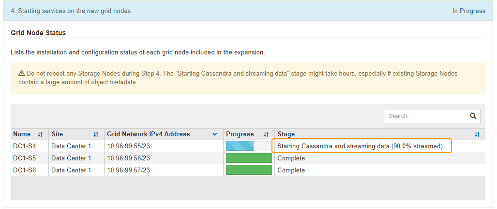

= 执行扩展
:icons: font
:imagesdir: ../media/

[role="lead"]
执行扩展时，新的网格节点将添加到现有 StorageGRID 部署中。

.您需要什么？ #8217 ；将需要什么
* 您将使用登录到网格管理器 xref:../admin/web-browser-requirements.adoc[支持的 Web 浏览器]。
* 您具有维护或 root 访问权限。
* 您具有配置密码短语。
* 您已部署要在此扩展中添加的所有网格节点。
* 如果您要添加存储节点，则已确认在恢复过程中执行的所有数据修复操作均已完成。请参见 xref:../maintain/checking-data-repair-jobs.adoc[检查数据修复作业]。
* 如果要添加新站点，则必须在启动扩展操作步骤 之前查看和更新 ILM 规则，以确保在扩展完成之前不会将对象副本存储到新站点。例如，如果某个规则使用默认存储池（所有存储节点），则必须创建一个仅包含现有存储节点的新存储池，并更新 ILM 规则以使用新存储池。否则，一旦新站点上的第一个节点变为活动状态，对象就会复制到该站点。请参见的说明 xref:../ilm/index.adoc[使用 ILM 管理对象]。

执行扩展包括以下阶段：

. 您可以通过指定是添加新网格节点还是添加新站点并批准要添加的网格节点来配置扩展。
. 开始扩展。
. 在扩展过程运行期间，您会下载一个新的恢复软件包文件。
. 您可以监控网格配置阶段的状态，这些配置阶段会自动运行。阶段集取决于要添加的网格节点类型以及是否要添加新站点。
+

IMPORTANT: 在大型网格上运行某些阶段可能需要大量时间。例如，如果 Cassandra 数据库为空，则将 Cassandra 流式传输到新存储节点可能只需要几分钟的时间。但是，如果 Cassandra 数据库包含大量对象元数据，则此阶段可能需要数小时或更长时间。请勿在 " 扩展 Cassandra 集群 " 或 " 启动 Cassandra 和流式数据 " 阶段重新启动任何存储节点。

.步骤
. 选择 * 维护 * > * 任务 * > * 扩展 * 。
+
此时将显示网格扩展页面。"Pending Nodes" 部分列出了准备添加的所有节点。

+
image::../media/grid_expansion_page.png[显示网格扩展页面的屏幕截图]

. 选择 * 配置扩展 * 。
+
此时将显示站点选择对话框。

+
image::../media/configure_expansion_dialog.gif[站点选择对话框]

. 选择要启动的扩展类型：
+
** 如果要添加新站点，请选择 * 新建 * ，然后输入新站点的名称。
** 如果要向现有站点添加网格节点，请选择 * 现有 * 。

. 选择 * 保存 * 。
. 查看 * 待定节点 * 列表，并确认它显示了您部署的所有网格节点。
+
根据需要，您可以将光标悬停在节点的 * 网格网络 MAC 地址 * 上以查看有关该节点的详细信息。

+
image::../media/grid_node_details.gif[网格节点详细信息的屏幕截图]

+

NOTE: 如果缺少网格节点，请确认已成功部署该节点。

. 从待定节点列表中，批准此扩展的网格节点。
+
.. 选择要批准的第一个待定网格节点旁边的单选按钮。
.. 选择 * 批准 * 。
+
此时将显示网格节点配置表单。

+
image::../media/grid_node_configuration.gif[网格节点配置表]

.. 根据需要修改常规设置：
+
*** * 站点 * ：要与网格节点关联的站点的名称。如果要添加多个节点，请确保为每个节点选择正确的站点。如果要添加新站点，则所有节点都将添加到新站点。
*** * 名称 * ：将分配给节点的主机名以及将在网格管理器中显示的名称。
*** * NTP 角色 * ：网格节点的网络时间协议（ NTP ）角色。选项包括 * 自动 * ， * 主 * 和 * 客户端 * 。选择 * 自动 * 会将主角色分配给管理节点，具有模板转换服务的存储节点，网关节点以及具有非静态 IP 地址的任何网格节点。所有其他网格节点都分配有客户端角色。
+

NOTE: 将主 NTP 角色分配给每个站点上至少两个节点。这样，系统便可对外部计时源进行冗余访问。

*** * ADC* 服务 * （仅限存储节点）：此存储节点是否将运行管理域控制器（ ADC-A ）服务。此 ADA 服务可跟踪网格服务的位置和可用性。每个站点至少有三个存储节点必须包含此 ADC-Service 。在部署此节点后，您不能将此 ADC 服务添加到该节点中。
+
**** 如果要添加此节点以替换存储节点，请选择 * 是 * ，前提是要替换的节点包含此 ADA 服务。由于如果仍会保留的 ADD 服务太少，则无法停用存储节点，因此，这样可以确保在删除旧服务之前新的 ADD 服务可用。
**** 否则，请选择 * 自动 * 以让系统确定此节点是否需要使用此 ADC-Service 。了解有关模数转换器仲裁的信息 xref:../maintain/understanding-adc-service-quorum.adoc[此处]。

.. 根据需要修改网格网络，管理网络和客户端网络的设置。
+
*** * IPv4 地址（ CIDR ） * ：网络接口的 CIDR 网络地址。例如： 172.16.10.100/24
*** * 网关 * ：网格节点的默认网关。例如： 172.16.10.1
*** * 子网（ CIDR ） * ：管理网络的一个或多个子网。

.. 选择 * 保存 * 。
+
批准的网格节点将移至批准的节点列表。

+
image::../media/grid_expansion_approved_nodes.png[显示已批准节点的屏幕截图]

+
*** 要修改已批准的网格节点的属性，请选择其单选按钮，然后选择 * 编辑 * 。
*** 要将已批准的网格节点移回 "Pending Nodes" 列表，请选择其单选按钮，然后选择 * 重置 * 。
*** 要永久删除已批准的网格节点，请关闭此节点。然后，选择其单选按钮并选择 * 删除 * 。

.. 对要批准的每个待定网格节点重复上述步骤。
+

NOTE: 如果可能，您应批准所有待定网格注释并执行一次扩展。如果执行多个小型扩展，则需要更多时间。

. 批准所有网格节点后，输入 * 配置密码短语 * ，然后选择 * 扩展 * 。
+
几分钟后，此页面将更新以显示扩展操作步骤 的状态。如果正在执行影响单个网格节点的任务，则网格节点状态部分将列出每个网格节点的当前状态。

+

NOTE: 在此过程中，对于设备， StorageGRID 设备安装程序会显示安装从第 3 阶段移至第 4 阶段 " 完成安装 " 。阶段 4 完成后，控制器将重新启动。

+
image::../media/grid_expansion_progress.png[此图通过周围的文本进行了说明。]

+

NOTE: 站点扩展包括一项额外任务，用于为新站点配置 Cassandra 。

. 显示 * 下载恢复包 * 链接后，立即下载恢复包文件。
+
在对 StorageGRID 系统进行网格拓扑更改后，您必须尽快下载恢复包文件的更新副本。通过恢复包文件，您可以在发生故障时还原系统。

+
.. 选择下载链接。
.. 输入配置密码短语，然后选择 * 开始下载 * 。
.. 下载完成后，打开 ` .zip` 文件并确认其中包含 `gpt 备份` 目录和 ` sed_said.zip` 文件。然后，提取 ` sa_sid.zip` 文件，转到 ` /GID* _REV*` 目录，确认您可以打开 `passwords.txt` 文件。
.. 将下载的恢复软件包文件（ .zip ）复制到两个安全的单独位置。
+

IMPORTANT: 恢复包文件必须受到保护，因为它包含可用于从 StorageGRID 系统获取数据的加密密钥和密码。

. 按照说明向现有站点添加存储节点或添加新站点。

[role="tabbed-block"]
====
.将存储节点添加到现有站点
--
如果要向现有站点添加一个或多个存储节点，请查看状态消息中显示的百分比，以监控 " 启动 Cassandra 和流式传输数据 " 阶段的进度。

此百分比根据可用的 Cassandra 数据总量以及已写入新节点的数据量估计 Cassandra 流操作的完成程度。

IMPORTANT: 请勿在 " 扩展 Cassandra 集群 " 或 " 启动 Cassandra 和流式数据 " 阶段重新启动任何存储节点。对于每个新存储节点，这些阶段可能需要花费数小时才能完成，尤其是在现有存储节点包含大量对象元数据的情况下。

--
.添加新站点
--
如果要添加新站点，请使用 `nodetool status` 监控 Cassandra 流式传输的进度，并查看在 " 扩展 Cassandra 集群 " 阶段已向新站点复制多少元数据。新站点上的总数据负载应介于当前站点总负载的 20% 左右。

IMPORTANT: 请勿在 " 扩展 Cassandra 集群 " 或 " 启动 Cassandra 和流式数据 " 阶段重新启动任何存储节点。对于每个新存储节点，这些阶段可能需要花费数小时才能完成，尤其是在现有存储节点包含大量对象元数据的情况下。

--
====
. 继续监控扩展，直到所有任务均完成，并且 * 配置扩展 * 按钮再次出现。

根据您添加的网格节点类型，您必须执行其他集成和配置步骤。请参见 xref:configuring-expanded-storagegrid-system.adoc[扩展后的配置步骤]。
