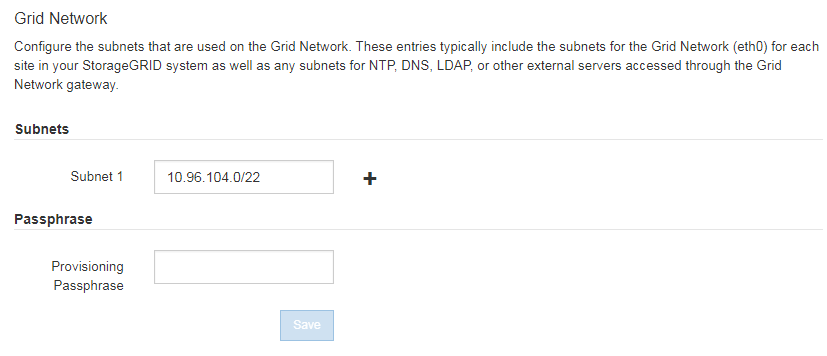

= 更新网格网络的子网
:allow-uri-read: 
:icons: font
:imagesdir: ../media/

[role="lead"]
在扩展中添加网格节点或新站点时，您可能需要更新子网或向网格网络添加子网。

StorageGRID 会维护一个网络子网列表，用于在网格网络（ eth0 ）上的网格节点之间进行通信。这些条目包括 StorageGRID 系统中每个站点用于网格网络的子网，以及通过网格网络网关访问的 NTP ， DNS ， LDAP 或其他外部服务器所使用的任何子网。

.您需要什么？ #8217 ；将需要什么
* 您将使用登录到网格管理器 xref:../admin/web-browser-requirements.adoc[支持的 Web 浏览器]。
* 您具有维护或 root 访问权限。
* 您具有配置密码短语。
* 您已获得要配置的子网的网络地址，以 CIDR 表示法表示。

如果任何新节点的子网上有一个以前未使用的网格网络 IP 地址，则必须在开始扩展之前将此新子网添加到网格网络子网列表中。否则，您必须取消扩展，添加新子网并重新启动操作步骤 。

.步骤
. 选择 * 维护 * > * 网络 * > * 网格网络 * 。
+

. 在子网列表中，选择加号以 CIDR 表示法添加新子网。
+
例如，输入 10.96.104.0/22 。

. 输入配置密码短语，然后选择 * 保存 * 。
+
您指定的子网将自动为 StorageGRID 系统配置。

