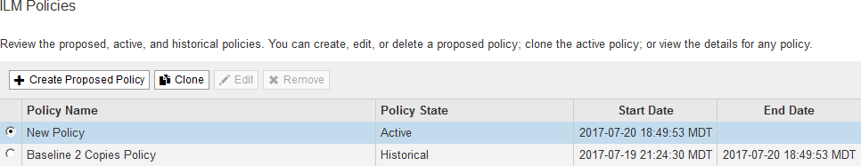

= 激活 ILM 策略
:allow-uri-read: 
:icons: font
:imagesdir: ../media/

[role="lead"]
将 ILM 规则添加到建议的 ILM 策略，模拟该策略并确认其行为符合预期后，您便可激活建议的策略。

.您需要什么？ #8217 ；将需要什么
* 您将使用登录到网格管理器 xref:../admin/web-browser-requirements.adoc[支持的 Web 浏览器]。
* 您具有特定的访问权限。
* 您已保存并模拟建议的 ILM 策略。

CAUTION: ILM 策略中的错误可能会导致发生原因 丢失不可恢复的数据。在激活策略之前，请仔细查看并模拟策略，以确认策略将按预期运行。

CAUTION: 激活新的 ILM 策略时， StorageGRID 会使用它来管理所有对象，包括现有对象和新载入的对象。在激活新的 ILM 策略之前，请查看对现有复制对象和纠删编码对象的放置方式所做的任何更改。在评估和实施新放置时，更改现有对象的位置可能会导致临时资源问题。

激活 ILM 策略时，系统会将新策略分发到所有节点。但是，只有在所有网格节点均可接收新策略之后，新的活动策略才会实际生效。在某些情况下，系统会等待实施新的活动策略，以确保不会意外删除网格对象。

* 如果进行策略更改以提高数据冗余或持久性，则这些更改将立即实施。例如，如果您激活包含三个副本规则而不是双个副本规则的新策略，则该策略将立即实施，因为它会增加数据冗余。
* 如果进行的策略更改可能会降低数据冗余或持久性，则只有在所有网格节点均可用后，这些更改才会实施。例如，如果您激活的新策略使用的是双副本规则，而不是三副本规则，则新策略将标记为 "`Active ，` " ，但只有在所有节点联机且可用后，它才会生效。

.步骤
. 准备好激活建议的策略后，请在 "ILM Policies" 页面上选择该策略并选择 * 激活 * 。
+
此时将显示一条警告消息，提示您确认是否要激活建议的策略。

+
image::../media/ilm_policy_activate_warning.gif[激活策略之前显示警告]

+
如果策略的默认规则不会永久保留对象，则警告消息中会显示一条提示。在此示例中，保留示意图显示默认规则将在 2 年后删除对象。您必须在文本框中键入 *2* ，以确认策略中未与其他规则匹配的任何对象将在 2 年后从 StorageGRID 中删除。

+
image::../media/ilm_policy_default_rule_not_forever_prompt.png[ILM Policy Default Rule not forever 提示符]

. 选择 * 确定 * 。

激活新的 ILM 策略后：

* 此策略在 "ILM Policies" 页面上的表中显示为 "Policy State Active" 。" 开始日期 " 条目指示策略的激活日期和时间。
+

* 此时将显示先前活动的策略，并且策略状态为 " 历史 " 。" 开始日期 " 和 " 结束日期 " 条目用于指示策略何时处于活动状态以及何时不再有效。

xref:example-6-changing-ilm-policy.adoc[示例 6 ：更改 ILM 策略]
