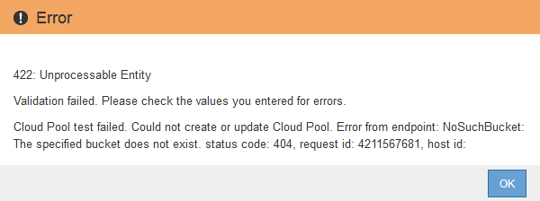

= C2S S3 ：指定云存储池的身份验证详细信息
:allow-uri-read: 
:icons: font
:imagesdir: ../media/

[role="lead"]
要将商用云服务（ C2S ） S3 服务用作云存储池，您必须将 C2S 访问门户（ CAP ）配置为身份验证类型，以便 StorageGRID 可以请求临时凭据来访问 C2S 帐户中的 S3 存储分段。

.您需要什么？ #8217 ；将需要什么
* 您已输入 Amazon S3 云存储池的基本信息，包括服务端点。
* 您知道 StorageGRID 用于从 CAP 服务器获取临时凭据的完整 URL ，包括分配给 C2S 帐户的所有必需和可选 API 参数。
* 您拥有一个由适当的政府证书颁发机构（ CA ）颁发的服务器 CA 证书。StorageGRID 使用此证书来验证 CAP 服务器的身份。服务器 CA 证书必须使用 PEM 编码。
* 您拥有一个由适当的政府证书颁发机构（ CA ）颁发的客户端证书。StorageGRID 使用此证书向 CAP 服务器标识自身。客户端证书必须使用 PEM 编码，并且必须已授予对 C2S 帐户的访问权限。
* 您已为客户端证书使用 PEM 编码的专用密钥。
* 如果客户端证书的专用密钥已加密，则您可以使用密码短语对其进行解密。

.步骤
. 在 * 身份验证 * 部分中，从 * 身份验证类型 * 下拉列表中选择 * CAP （ C2S Access Portal ） * 。
+
此时将显示 CAP C2S 身份验证字段。

+
image::../media/cloud_storage_pool_create_c2s.png[创建云存储池 C2S]

. 请提供以下信息：
+
.. 对于 * 临时凭据 URL* ，输入 StorageGRID 从 CAP 服务器获取临时凭据所使用的完整 URL ，包括分配给 C2S 帐户的所有必需和可选 API 参数。
.. 对于 * 服务器 CA 证书 * ，选择 * 选择新 * ，然后上传 PEM 编码的 CA 证书， StorageGRID 将使用该证书来验证 CAP 服务器。
.. 对于 * 客户端证书 * ，选择 * 选择新 * ，然后将 StorageGRID 用于标识自身的 PEM 编码证书上传到 CAP 服务器。
.. 对于 * 客户端专用密钥 * ，选择 * 选择新 * ，然后为客户端证书上传 PEM 编码的专用密钥。
+
如果私钥已加密，则必须使用传统格式。（不支持 PKCS 8 加密格式。）

.. 如果客户端专用密钥已加密，请输入用于对客户端专用密钥进行解密的密码短语。否则，请将 * 客户端专用密钥密码短语 * 字段留空。

. 在服务器验证部分中，提供以下信息：
+
.. 对于 * 证书验证 * ，选择 * 使用自定义 CA 证书 * 。
.. 选择 * 选择新 * ，然后上传 PEM 编码的 CA 证书。

. 选择 * 保存 * 。

保存云存储池时， StorageGRID 将执行以下操作：

* 验证存储分段和服务端点是否存在，以及是否可以使用您指定的凭据访问它们。
* 将标记文件写入存储分段，以将存储分段标识为云存储池。切勿删除名为 `x-ntap-sgws-cloud pool-uuid` 的文件。

如果云存储池验证失败，您将收到一条错误消息，说明验证失败的原因。例如，如果存在证书错误或您指定的存储分段不存在，则可能会报告错误。

请参见的说明 xref:troubleshooting-cloud-storage-pools.adoc[对云存储池进行故障排除]，解析问题描述 ，然后再次尝试保存云存储池。
