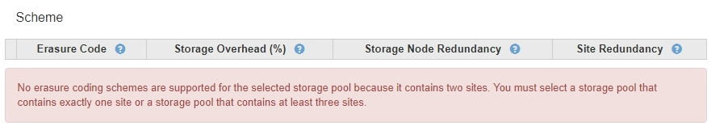

= 创建擦除编码配置文件
:allow-uri-read: 
:icons: font
:imagesdir: ../media/

[role="lead"]
要创建擦除编码配置文件，请将包含存储节点的存储池与擦除编码方案关联。此关联可确定创建的数据和奇偶校验片段的数量，以及系统将这些片段分布在何处。

.您需要的内容
* 您将使用登录到网格管理器 xref:../admin/web-browser-requirements.adoc[支持的 Web 浏览器]。
* 您具有特定的访问权限。
* 您已创建一个仅包含一个站点的存储池，或者创建了一个包含三个或更多站点的存储池。对于只有两个站点的存储池，没有可用的纠删编码方案。

.关于此任务
擦除编码配置文件中使用的存储池必须仅包含一个站点或三个或更多站点。如果要提供站点冗余，则存储池必须至少具有三个站点。

NOTE: 您必须选择包含存储节点的存储池。您不能对纠删编码的数据使用归档节点。

.步骤
. 选择 * ILM * > * 擦除编码 * 。
+
此时将显示擦除编码配置文件页面。

+
image::../media/ec_profiles_page.png[纠删编码配置文件页面]

. 选择 * 创建 * 。
+
此时将显示创建 EC 配置文件对话框。

+
image::../media/create_ec_profile_page.png[创建 EC 配置文件页面]

. 为擦除编码配置文件输入一个唯一名称。
+
纠删编码配置文件名称必须是唯一的。如果您使用现有配置文件的名称，则会发生验证错误，即使该配置文件已停用也是如此。

+

NOTE: Erasure Coding 配置文件名称会附加到 ILM 规则放置说明中的存储池名称中。

+
image::../media/storage_pool_and_erasure_coding_profile.png[存储池和 EC 配置文件名称]

. 选择为此擦除编码配置文件创建的存储池。
+

NOTE: 如果网格当前仅包含一个站点，则系统将阻止您使用默认存储池，所有存储节点或任何包含默认站点的存储池，所有站点。此行为可防止添加第二个站点时擦除编码配置文件变得无效。

+

NOTE: 如果存储池仅包含两个站点，则不能使用该存储池进行纠删编码。对于具有两个站点的存储池，没有可用的纠删编码方案。

+
选择存储池时，将根据池中的存储节点和站点数量显示可用纠删编码方案的列表。

+
image::../media/create_ec_profile_three_sites.png[创建 EC 配置文件三个站点]

+
列出了每个可用纠删编码方案的以下信息：

+
** * 擦除代码 * ：擦除编码方案的名称，格式如下：数据片段 + 奇偶校验片段。
** * 存储开销（ % ） * ：相对于对象的数据大小，奇偶校验片段所需的额外存储。存储开销 = 奇偶校验片段的总数 / 数据片段的总数。
** * 存储节点冗余 * ：在保持检索对象数据的能力的情况下可能丢失的存储节点数。
** * 站点冗余 * ：选定纠删代码是否允许在站点丢失时检索对象数据。
+
要支持站点冗余，选定存储池必须包含多个站点，每个站点都具有足够的存储节点，以允许任何站点丢失。例如，要使用 6+3 纠删编码方案支持站点冗余，选定存储池必须至少包含三个站点，每个站点至少包含三个存储节点。

+
在以下情况下会显示消息：

+
** 您选择的存储池不提供站点冗余。如果选定存储池仅包含一个站点，则会显示以下消息。您可以在 ILM 规则中使用此擦除编码配置文件来防止节点故障。
+
image::../media/create_ec_profile_no_site_redundancy.png[创建 EC 配置文件无站点冗余]

** 您选择的存储池不满足任何纠删编码方案的要求。例如，如果选定存储池仅包含两个站点，则会显示以下消息。如果要使用纠删编码来保护对象数据，则必须选择一个存储池（仅包含一个站点）或一个存储池（包含三个或更多站点）。
+

** 您的网格仅包含一个站点，并且您选择了默认存储池，所有存储节点或任何包含默认站点的存储池，所有站点。
+
image::../media/ilm_ec_profile_all_storage_nodes_warning.png[ILM EC 配置文件所有存储节点警告]

** 您选择的纠删编码方案和存储池与另一个纠删编码配置文件重叠。
+
image::../media/ilm_ec_profile_ec_scheme_warning.png[ILM EC 配置文件擦除编码方案警告]

+
在此示例中，将显示一条警告消息，因为另一个纠删编码配置文件正在使用 2+1 方案，而另一个配置文件的存储池也使用全部 3 个站点存储池中的一个站点。

+
虽然不会阻止您创建此新配置文件，但在 ILM 策略中开始使用此配置文件时必须非常小心。如果将此新配置文件应用于已受另一个配置文件保护的现有纠删编码对象，则 StorageGRID 将创建一组全新的对象片段。它不会重复使用现有 2+1 片段。从一个纠删编码配置文件迁移到另一个纠删编码配置文件时，可能会出现资源问题，即使纠删编码方案相同也是如此。

. 如果列出了多个纠删编码方案，请选择要使用的方案。
+
在确定要使用的纠删编码方案时，您应根据修复所需的网络流量要求（碎片越多，网络流量越多）平衡容错（通过具有更多奇偶校验分段来实现）。例如，在选择 4+2 方案和 6+3 方案时，如果需要额外的奇偶校验和容错功能，请选择 6+3 方案。如果在节点修复期间网络资源受到限制，从而减少了网络使用量，请选择 4+2 方案。

. 选择 * 保存 * 。

