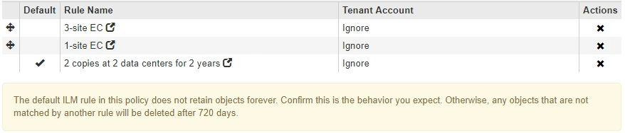

= 创建建议的 ILM 策略
:allow-uri-read: 
:icons: font
:imagesdir: ../media/

[role="lead"]
您可以从头开始创建建议的 ILM 策略，也可以克隆当前活动策略（如果要从同一组规则开始）。

NOTE: 如果已启用全局 S3 对象锁定设置，请改用此操作步骤 ： xref:creating-ilm-policy-after-s3-object-lock-is-enabled.adoc[启用 S3 对象锁定后创建 ILM 策略]。

.您需要的内容
* 您将使用登录到网格管理器 xref:../admin/web-browser-requirements.adoc[支持的 Web 浏览器]。
* 您具有特定的访问权限。
* 您已创建要添加到建议策略的 ILM 规则。您可以根据需要保存建议的策略，创建其他规则，然后编辑建议的策略以添加新规则。
* 您已拥有 xref:creating-default-ilm-rule.adoc[已创建默认 ILM 规则] 不包含任何筛选器的策略。
* 您也可以观看以下视频： https://["视频： StorageGRID ILM 策略"^]
+
[link=https://netapp.hosted.panopto.com/Panopto/Pages/Viewer.aspx?id=c929e94e-353a-4375-b112-acc5013c81c7]
image::../media/video-screenshot-ilm-policies.png[视频： StorageGRID ILM 策略]

.关于此任务
创建建议 ILM 策略的典型原因包括：

* 您添加了一个新站点，需要使用新的 ILM 规则在该站点上放置对象。
* 您正在停用某个站点，并且需要删除引用此站点的所有规则。
* 您添加了一个具有特殊数据保护要求的新租户。
* 您已开始使用云存储池。

IMPORTANT: 仅在测试系统中使用系统的内置策略基线 2 副本策略。此策略中的 Make 2 Copies 规则使用包含所有站点的所有存储节点存储池。如果 StorageGRID 系统具有多个站点，则一个对象的两个副本可能会放置在同一站点上。

.步骤
. 选择 * ILM * > * 策略 * 。
+
此时将显示 "ILM Policies" 页面。在此页面中，您可以查看建议的策略，活动策略和历史策略列表；创建，编辑， 或删除建议的策略；克隆活动策略；或查看任何策略的详细信息。

+
image::../media/ilm_policies_page.gif[ILM 策略页面]

. 确定要如何创建建议的 ILM 策略。
+
[cols="1a,2a"]
|===
| 选项 | 步骤 

 a| 
创建尚未选择任何规则的新建议策略
 a| 
.. 如果当前存在建议的 ILM 策略，请选择该策略，然后选择 * 删除 * 。
+
如果已存在建议的策略，则无法创建新的建议策略。

.. 选择 * 创建建议策略 * 。

 a| 
根据活动策略创建建议的策略
 a| 
.. 如果当前存在建议的 ILM 策略，请选择该策略，然后选择 * 删除 * 。
+
如果已存在建议的策略，则无法克隆活动策略。

.. 从表中选择活动策略。
.. 选择 * 克隆 * 。

 a| 
编辑现有建议的策略
 a| 
.. 从表中选择建议的策略。
.. 选择 * 编辑 * 。

|===
+
此时将显示配置 ILM 策略对话框。

+
如果要创建新的建议策略，则所有字段均为空，不会选择任何规则。

+
image::../media/ilm_policies_configure_ilm_policy.png[ILM 策略配置 ILM 策略]

+
如果要克隆活动策略，则 * 名称 * 字段将显示活动策略的名称，并附加一个版本号（在示例中为 "`v2` " ）。活动策略中使用的规则将按其当前顺序进行选择和显示。

+
image::../media/ilm_policies_version.gif[ILM 策略版本]

. 在 * 名称 * 字段中为建议的策略输入一个唯一名称。
+
您必须输入至少 1 个字符，并且不能超过 64 个字符。如果要克隆活动策略，可以使用当前名称并附加版本号，也可以输入新名称。

. 在 * 更改原因 * 字段中输入创建新建议策略的原因。
+
您必须输入至少 1 个字符，并且不能超过 128 个字符。

. 要向策略中添加规则，请选择 * 选择规则 * 。
+
此时将显示为策略选择规则对话框，其中列出了所有已定义的规则。如果要克隆策略：

+
** 此时将选择要克隆的策略使用的规则。
** 如果要克隆的策略使用了任何不含筛选器的规则，而这些规则不是默认规则，则系统会提示您删除除其中一个规则之外的所有规则。
** 如果默认规则使用筛选器或非当前参考时间，系统将提示您选择新的默认规则。
** 如果默认规则不是最后一条规则，则可以使用按钮将该规则移动到新策略的末尾。
+
image::../media/ilm_policies_select_rules_for_policy.png[ILM 策略选择策略规则]

. 选择规则名称或更多详细信息图标 image:../media/icon_nms_more_details.gif["更多详细信息图标"] 以查看该规则的设置。
+
此示例显示了在两个站点创建两个复制副本的 ILM 规则的详细信息。

+
image::../media/ilm_rule_summary_page.png[ILM 规则摘要页面]

. 在 * 选择默认规则 * 部分中，为建议的策略选择一个默认规则。
+
默认规则适用场景 与策略中的其他规则不匹配的任何对象。默认规则不能使用任何筛选器，并且始终会在最后进行评估。

+

NOTE: 如果 " 选择默认规则 " 部分未列出任何规则，则必须退出 ILM 策略页面和 xref:creating-default-ilm-rule.adoc[创建默认 ILM 规则]。

+

IMPORTANT: 请勿使用 Make 2 copies 常用规则作为策略的默认规则。" 创建 2 个副本 " 规则使用一个存储池 " 所有存储节点 " ，其中包含所有站点。如果 StorageGRID 系统具有多个站点，则一个对象的两个副本可能会放置在同一站点上。

. 在 * 选择其他规则 * 部分中，选择要包含在策略中的任何其他规则。
+
其他规则会在默认规则之前进行评估，并且必须至少使用一个筛选器（租户帐户，分段名称，高级筛选器或非当前参考时间）。

. 选择完规则后，请选择 * 应用 * 。
+
此时将列出您选择的规则。默认规则位于末尾，上面有其他规则。

+
image::../media/ilm_policies_selected_rules.png[ILM 策略选定规则]

+
[NOTE]
====
如果默认规则不会永久保留对象，则会显示警告。激活此策略时，您必须确认希望 StorageGRID 在默认规则的放置说明过后删除对象（除非分段生命周期将对象保留较长时间）。

====
. 拖放非默认规则的行以确定评估这些规则的顺序。
+
您不能移动默认规则。

+

IMPORTANT: 您必须确认 ILM 规则的顺序正确。激活策略后，新对象和现有对象将按列出的顺序从顶部开始进行评估。

. 根据需要选择删除图标 image:../media/icon_nms_delete_new.gif["删除图标"] 要删除策略中不需要的任何规则，请选择 * 选择规则 * 以添加更多规则。
. 完成后，选择 * 保存 * 。
+
此时将更新 "ILM Policies" 页面：

+
** 您保存的策略将显示为建议的策略。建议的策略没有开始日期和结束日期。
** 此时将启用 * 模拟 * 和 * 激活 * 按钮。
+
image::../media/ilm_policy_proposed_policy_saved.png[已保存 ILM 策略建议策略]

. 转至 xref:simulating-ilm-policy.adoc[模拟 ILM 策略]。

.相关信息
* xref:what-ilm-policy-is.adoc[什么是 ILM 策略]
* xref:managing-objects-with-s3-object-lock.adoc[使用 S3 对象锁定管理对象]

