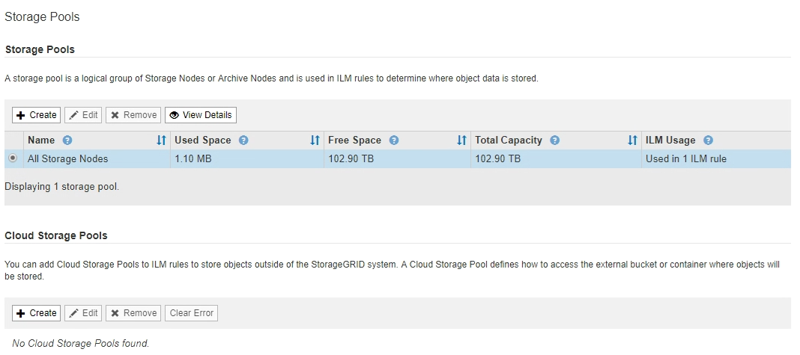

= 创建存储池
:allow-uri-read: 
:icons: font
:imagesdir: ../media/

[role="lead"]
您可以创建存储池来确定 StorageGRID 系统存储对象数据的位置以及使用的存储类型。每个存储池包括一个或多个站点以及一个或多个存储级别。

.您需要什么？ #8217 ；将需要什么
* 您将使用登录到网格管理器 xref:../admin/web-browser-requirements.adoc[支持的 Web 浏览器]。
* 您具有特定的访问权限。
* 您已查看创建存储池的准则。

存储池用于确定对象数据的存储位置。所需的存储池数量取决于网格中的站点数量以及所需的副本类型：复制副本或经过纠删编码的副本。

* 对于复制和单站点纠删编码，请为每个站点创建一个存储池。例如，如果要将复制的对象副本存储在三个站点上，请创建三个存储池。
* 要在三个或更多站点上进行纠删编码，请创建一个存储池，其中包含每个站点的条目。例如，如果要跨三个站点擦除代码对象，请创建一个存储池。选择加号图标 image:../media/icon_plus_sign_black_on_white.gif["插入图标"] 为每个站点添加一个条目。
+

IMPORTANT: 请勿将默认的所有站点站点站点包含在要在擦除编码配置文件中使用的存储池中。而是在存储池中为要存储纠删编码数据的每个站点添加一个单独的条目。请参见 <<entries,此步骤>> 例如。

* 如果您有多个存储级别，请勿在一个站点上创建包含不同存储级别的存储池。请参见 xref:guidelines-for-creating-storage-pools.adoc[创建存储池的准则]。

.步骤
. 选择 * ILM * > * 存储池 * 。
+
此时将显示存储池页面，其中列出了所有已定义的存储池。

+

+
此列表包括系统默认存储池，使用系统默认站点的所有存储节点，所有站点以及默认存储级别的所有存储节点。

+

IMPORTANT: 由于每当添加新的数据中心站点时，所有存储节点存储池都会自动更新，因此不建议在 ILM 规则中使用此存储池。

. 要创建新存储池，请选择 * 创建 * 。
+
此时将显示创建存储池对话框。

+
image::../media/create_storage_pool.png[创建存储池]

. 输入存储池的唯一名称。
+
在配置纠删编码配置文件和 ILM 规则时，请使用易于识别的名称。

. 从 * 站点 * 下拉列表中，为此存储池选择一个站点。
+
选择站点时，此表中的存储节点和归档节点数将自动更新。

+
通常，不要在任何存储池中使用默认的所有站点站点站点。使用所有站点存储池的 ILM 规则会将对象放置在任何可用站点上，从而减少对对象放置的控制。此外，所有站点存储池会立即使用新站点上的存储节点，这可能不是您所期望的行为。

. 从 * 存储级别 * 下拉列表中，选择 ILM 规则使用此存储池时要使用的存储类型。
+
默认的所有存储节点存储级别包括选定站点上的所有存储节点。默认归档节点存储级别包括选定站点上的所有归档节点。如果您为网格中的存储节点创建了其他存储级别，则这些存储级别将在下拉列表中列出。

. 【条目】如果要在多站点擦除编码配置文件中使用存储池，请选择 image:../media/icon_plus_sign_black_on_white.gif["插入图标"] 将每个站点的条目添加到存储池中。
+
image::../media/storage_pools_all_3_sites_for_ec.png[存储池为 EC 配置所有 3 个站点]

+
[NOTE]
====
您不能创建重复条目，也不能创建既包含 * 归档节点 * 存储级别又包含存储节点的任何存储级别的存储池。

如果您为一个站点添加多个条目，但存储级别不同，则系统会向您发出警告。

====
+
要删除条目，请选择 image:../media/icon_nms_delete_new.gif["删除图标"]。

. 如果您对所做的选择感到满意，请选择 * 保存 * 。
+
此时，新存储池将添加到此列表中。

