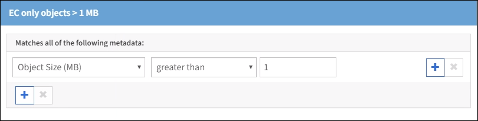

= 示例 2 ：用于 EC 对象大小筛选的 ILM 规则和策略
:icons: font
:imagesdir: ../media/

[role="lead"]
您可以使用以下示例规则和策略作为起点来定义一个 ILM 策略，该策略按对象大小进行筛选以满足建议的 EC 要求。

CAUTION: 以下 ILM 规则和策略仅为示例。配置 ILM 规则的方法有多种。在激活新策略之前，请模拟建议的策略，以确认它将按预期工作，以防止内容丢失。

== ILM 规则 1 示例 2 ：对大于 1 MB 的对象使用 EC

此示例中的 ILM 规则擦除将对大于 1 MB 的对象进行编码。

IMPORTANT: 纠删编码最适合大于 1 MB 的对象。请勿对小于 200 KB 的对象使用纠删编码，以避免管理极小的纠删编码片段所产生的开销。

[cols="1a,2a"]
|===
| 规则定义 | 示例值 

 a| 
规则名称
 a| 
仅 EC 对象 >1 MB

 a| 
参考时间
 a| 
载入时间

 a| 
对对象大小进行高级筛选
 a| 
对象大小（ MB ）大于 1

 a| 
内容放置
 a| 
使用三个站点创建 2+1 纠删编码副本

|===

== ILM 规则 2 示例 2 ：两个复制副本

此示例 ILM 规则将创建两个复制副本，而不按对象大小进行筛选。此规则是策略的默认规则。由于第一个规则会筛选出大于 1 MB 的所有对象，因此此规则仅筛选 1 MB 或更小的适用场景 对象。

[cols="1a,2a"]
|===
| 规则定义 | 示例值 

 a| 
规则名称
 a| 
两个复制副本

 a| 
参考时间
 a| 
载入时间

 a| 
对对象大小进行高级筛选
 a| 
无

 a| 
内容放置
 a| 
创建两个复制副本并将其保存在两个数据中心 DC1 和 DC2 上

|===

== 示例 2 中的 ILM 策略：对大于 1 MB 的对象使用 EC

此示例 ILM 策略包括两个 ILM 规则：

* 第一个规则擦除将对大于 1 MB 的所有对象进行编码。
* 第二个（默认） ILM 规则会创建两个复制副本。由于规则 1 已筛选出大于 1 MB 的对象，因此规则 2 仅筛选 1 MB 或更小的适用场景 对象。
+
image::../media/policy_2_configured_policy.png[示例 2 中的 ILM 策略：对大于 1 MB 的对象使用 EC]

