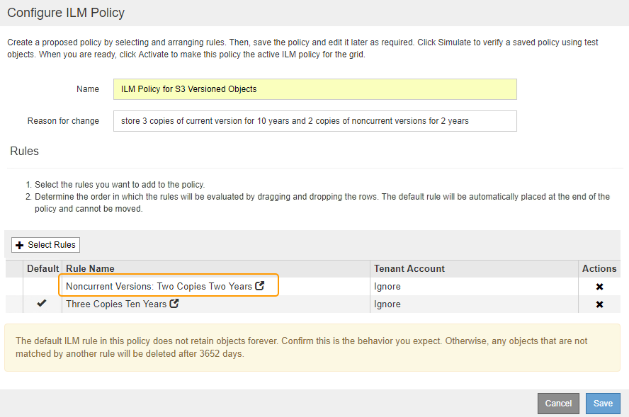

= 示例 4 ： S3 版本对象的 ILM 规则和策略
:allow-uri-read: 
:icons: font
:imagesdir: ../media/

[role="lead"]
如果您的 S3 存储分段已启用版本控制，则可以通过在 ILM 策略中包含使用 * 非当前时间 * 作为参考时间的规则来管理非当前对象版本。

如本示例所示，您可以通过对非当前对象版本使用不同的放置说明来控制受版本控制的对象使用的存储量。

CAUTION: 以下 ILM 规则和策略仅为示例。配置 ILM 规则的方法有多种。在激活新策略之前，请模拟建议的策略，以确认它将按预期工作，以防止内容丢失。

NOTE: 如果要创建 ILM 策略来管理非当前对象版本，请注意，要模拟此策略，您必须知道对象版本的 UUID 或 CBID 。要查找对象的 UUID 和 CBID ，请在对象仍为最新状态时使用对象元数据查找。请参见 xref:verifying-ilm-policy-with-object-metadata-lookup.adoc[使用对象元数据查找验证 ILM 策略]。

.相关信息
* xref:how-objects-are-deleted.adoc[如何删除对象]

== ILM 规则 1 示例 4 ：保存三个副本 10 年

此示例 ILM 规则会将每个对象的一个副本存储在三个数据中心，持续 10 年。

此规则将适用场景 所有对象，无论它们是否已受版本控制。

[cols="1a,2a"]
|===
| 规则定义 | 示例值 

 a| 
存储池
 a| 
三个存储池，分别位于不同的数据中心，分别名为 DC1 ， DC2 和 DC3 。

 a| 
规则名称
 a| 
三个副本十年

 a| 
参考时间
 a| 
载入时间

 a| 
内容放置
 a| 
在第 0 天，保留三个复制副本 10 年（ 3 ， 652 天），一个在 DC1 ，一个在 DC2 ，一个在 DC3 。10 年后，删除对象的所有副本。

|===
image::../media/ilm_rule_1_example_4.png[ILM 规则 1 示例 4 ：保存三个副本并保留 5 年]

== ILM 规则 2 示例 4 ：将两个非最新版本副本保存 2 年

此示例 ILM 规则会将 S3 版本对象的两个非最新版本副本存储 2 年。

由于 ILM 规则 1 会对对象的所有版本进行适用场景 处理，因此您必须创建另一个规则来筛选出任何非最新版本。此规则对参考时间使用 * 非当前时间 * 选项。

在此示例中，仅存储两个非最新版本副本，这些副本将存储两年。

[cols="1a,2a"]
|===
| 规则定义 | 示例值 

 a| 
存储池
 a| 
两个存储池，分别位于不同的数据中心，分别名为 DC1 和 DC2 。

 a| 
规则名称
 a| 
非最新版本：两个副本，两年

 a| 
参考时间
 a| 
非当前时间

 a| 
内容放置
 a| 
在相对于非当前时间（即从对象版本成为非当前版本之日开始）的第 0 天，将两个非当前对象版本的复制副本保留 2 年（ 730 天），一个在 DC1 中，一个在 DC2 中。2 年后，删除非最新版本。

|===
image::../media/ilm_rule_2_example_4.png[ILM 规则 2 示例 4 ：将非最新对象版本保留 2 年]

== ILM 策略示例 4 ： S3 版本对象

如果要以与当前版本不同的方式管理对象的旧版本，则使用 * 非当前时间 * 作为参考时间的规则必须先显示在 ILM 策略中，然后再显示适用于当前对象版本的规则。

S3 版本对象的 ILM 策略可能包括以下 ILM 规则：

* 从每个对象的任何较旧（非最新）版本变为非最新版本之日起，保留两年。
+

NOTE: 在应用于当前对象版本的规则之前，非当前时间规则必须显示在策略中。否则，非当前对象版本将永远不会与非当前时间规则匹配。

* 载入时，创建三个复制副本，并在三个数据中心中的每个数据中心存储一个副本。将当前对象版本的副本保留 10 年。

模拟此示例策略时，您希望按如下所示评估测试对象：

* 第一个规则将匹配任何非最新的对象版本。如果非当前对象版本超过 2 年，则 ILM 会将其永久删除（非当前版本的所有副本都会从网格中删除）。
+

NOTE: 要模拟非当前对象版本，必须使用该版本的 UUID 或 CBID 。虽然对象仍为最新对象，但您可以使用对象元数据查找来查找其 UUID 和 CBID 。

* 当前对象版本将与第二个规则匹配。当前对象版本存储 10 年后， ILM 过程会添加一个删除标记作为对象的当前版本，并使先前的对象版本 "`` noncurrent." 下次进行 ILM 评估时，此非最新版本将与第一个规则匹配。因此， DC3 上的副本将被清除， DC1 和 DC2 上的两个副本将再存储 2 年。

