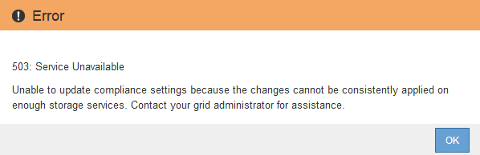

= 解决更新 S3 对象锁定或原有合规性配置时出现的一致性错误
:icons: font
:imagesdir: ../media/

[role="lead"]
如果一个站点上的一个数据中心站点或多个存储节点不可用，您可能需要帮助 S3 租户用户对 S3 对象锁定或原有合规性配置进行更改。

启用了 S3 对象锁定（或原有合规性）的存储分段的租户用户可以更改某些设置。例如，使用 S3 对象锁定的租户用户可能需要将对象版本置于合法保留状态。

当租户用户更新 S3 存储分段或对象版本的设置时， StorageGRID 会尝试立即更新整个网格中的存储分段或对象元数据。如果系统由于数据中心站点或多个存储节点不可用而无法更新元数据，则会显示一条错误消息。具体而言：

* 租户管理器用户会看到以下错误消息：
+

* 租户管理 API 用户和 S3 API 用户收到响应代码 `503 Service unavailable` 并显示类似的消息文本。

要解决此错误，请执行以下步骤：

. 尝试尽快使所有存储节点或站点重新可用。
. 如果您无法在每个站点提供足够的存储节点，请联系技术支持，他们可以帮助您恢复节点并确保在网格中一致地应用更改。
. 解决底层问题描述 后，提醒租户用户重试其配置更改。

.相关信息
* xref:../tenant/index.adoc[使用租户帐户]
* xref:../s3/index.adoc[使用 S3]
* xref:../maintain/index.adoc[恢复和维护]

