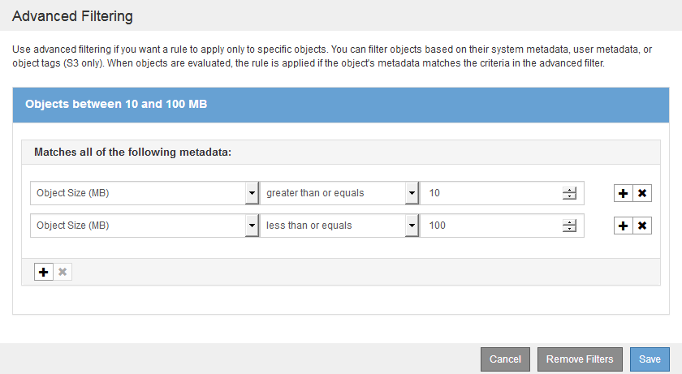

= 在 ILM 规则中使用高级筛选器
:icons: font
:imagesdir: ../media/

[role="lead"]
通过高级筛选功能，您可以创建仅根据特定对象的元数据应用于特定对象的 ILM 规则。为规则设置高级筛选时，您可以选择要匹配的元数据类型，选择运算符并指定元数据值。评估对象时， ILM 规则仅应用于元数据与高级筛选器匹配的对象。

下表显示了您可以在高级筛选器中指定的元数据类型，可用于每种元数据类型的运算符以及预期的元数据值。

[cols="1a,1a,2a"]
|===
| 元数据类型 | 支持的运算符 | 元数据值 

 a| 
载入时间（微秒）
 a| 
* 等于
* 不等于
* 小于
* 小于或等于
* 大于
* 大于或等于

 a| 
载入对象的时间和日期。

* 注意： * 要在激活新 ILM 策略时避免资源问题，您可以在可能更改大量现有对象位置的任何规则中使用 " 载入时间 " 高级筛选器。将载入时间设置为大于或等于新策略生效的大致时间，以确保现有对象不会发生不必要的移动。

 a| 
密钥
 a| 
* 等于
* 不等于
* 包含
* 不包含
* 开头为
* 不以开头
* 结尾为
* 结尾不为

 a| 
唯一 S3 或 Swift 对象密钥的全部或部分内容。

例如，您可能希望匹配以 ` .txt` 或以 `test-object/` 开头的对象。

 a| 
上次访问时间（微秒）
 a| 
* 等于
* 不等于
* 小于
* 小于或等于
* 大于
* 大于或等于
* exists
* 不存在

 a| 
上次检索（读取或查看）对象的时间和日期。

* 注意： * 如果您计划使用上次访问时间作为高级筛选器，则必须为 S3 存储分段或 Swift 容器启用上次访问时间更新。

xref:using-last-access-time-in-ilm-rules.adoc[在 ILM 规则中使用上次访问时间]

 a| 
位置限制（仅限 S3 ）
 a| 
* 等于
* 不等于

 a| 
创建 S3 存储分段的区域。使用 * ILM * > * 区域 * 定义显示的区域。

* 注： * 值 us-east-1 将匹配在 us-east-1 区域创建的分段中的对象以及未指定区域的分段中的对象。

xref:configuring-regions-optional-and-s3-only.adoc[配置区域（可选，仅 S3 ）]

 a| 
对象大小（ MB ）
 a| 
* 等于
* 不等于
* 小于
* 小于或等于
* 大于
* 大于或等于

 a| 
对象的大小（以 MB 为单位）。

纠删编码最适合大于 1 MB 的对象。请勿对小于 200 KB 的对象使用纠删编码，以避免管理极小的纠删编码片段所产生的开销。

* 注： * 要按小于 1 MB 的对象大小进行筛选，请键入一个小数值。您的浏览器类型和区域设置用于控制您是需要使用句点还是逗号作为小数分隔符。

 a| 
用户元数据
 a| 
* 包含
* 结尾为
* 等于
* exists
* 不包含
* 结尾不为
* 不等于
* 不存在
* 不以开头
* 开头为

 a| 
键值对，其中 * 用户元数据名称 * 是密钥， * 用户元数据值 * 是值。

例如，要筛选用户元数据为 `color=blue` 的对象，请为 * 用户元数据名称 * 指定 `color` ，为运算符指定 `Equals` ，为 * 用户元数据值 * 指定 `blue` 。

* 注： * 用户元数据名称不区分大小写；用户元数据值区分大小写。

 a| 
对象标记（仅限 S3 ）
 a| 
* 包含
* 结尾为
* 等于
* exists
* 不包含
* 结尾不为
* 不等于
* 不存在
* 不以开头
* 开头为

 a| 
键值对，其中 * 对象标记名称 * 是密钥， * 对象标记值 * 是值。

例如，要筛选对象标记为 `Image=True` 的对象，请为 * 对象标记名称 * 指定 `Image` ，为运算符指定 `等于` ，为 * 对象标记值 * 指定 `True` 。

* 注： * 对象标记名称和对象标记值区分大小写。您必须严格按照为对象定义的方式输入这些项。

|===

== 指定多个元数据类型和值

定义高级筛选时，您可以指定多种类型的元数据和多个元数据值。例如，如果您希望某个规则与大小介于 10 MB 到 100 MB 之间的对象匹配，则应选择 * 对象大小 * 元数据类型并指定两个元数据值。

* 第一个元数据值用于指定大于或等于 10 MB 的对象。
* 第二个元数据值用于指定小于或等于 100 MB 的对象。

使用多个条目可以精确控制匹配的对象。在以下示例中，规则适用场景 对象将品牌 A 或品牌 B 作为摄像机类型用户元数据的值。但是，规则仅对小于 10 MB 的品牌 B 对象执行适用场景 。

image::../media/advanced_filtering_multiple_rows.gif[用户元数据的高级筛选示例]
