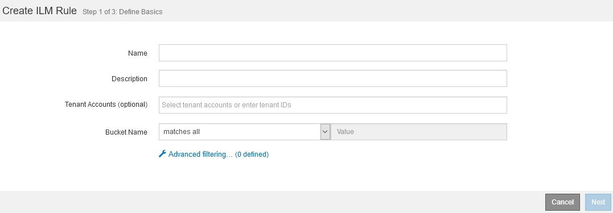

= 什么是 ILM 规则
:allow-uri-read: 
:icons: font
:imagesdir: ../media/

[role="lead"]
要管理对象，您需要创建一组信息生命周期管理（ ILM ）规则，并将其组织到 ILM 策略中。系统中载入的每个对象都会根据活动策略进行评估。如果策略中的规则与对象的元数据匹配，则规则中的说明将确定 StorageGRID 复制和存储该对象所采取的操作。

ILM 规则定义：

* 应存储哪些对象。规则可以应用于所有对象，也可以指定筛选器来标识规则适用场景 中的对象。例如，规则只能应用于与特定租户帐户，特定 S3 分段或 Swift 容器或特定元数据值关联的对象。
* 存储类型和位置。对象可以存储在存储节点，云存储池或归档节点上。
* 创建的对象副本的类型。可以复制副本或对副本进行纠删编码。
* 对于复制的副本，为创建的副本数。
* 对于纠删编码副本，使用纠删编码方案。
* 对象的存储位置和副本类型会随时间发生变化。
* 在将对象载入网格时如何保护对象数据（同步放置或双提交）。

请注意，对象元数据不受 ILM 规则管理。而是将对象元数据存储在 Cassandra 数据库中，该数据库称为元数据存储。每个站点会自动维护三个对象元数据副本，以防止数据丢失。这些副本会均匀分布在所有存储节点上。

== ILM 规则的要素

ILM 规则包含三个要素：

* * 筛选条件 * ：规则的基本和高级筛选器用于定义规则适用场景 的对象。如果某个对象与所有筛选器匹配，则 StorageGRID 将应用此规则并创建在规则的放置说明中指定的对象副本。
* * 放置说明 * ：规则的放置说明用于定义对象副本的数量，类型和位置。每个规则都可以包含一系列放置说明，以便随着时间的推移更改对象副本的数量，类型和位置。一个放置的时间段到期后，下一个放置中的说明将自动应用于下一个 ILM 评估。
* * 载入行为 * ：规则的载入行为定义了 S3 或 Swift 客户端将对象保存到网格时发生的情况。载入行为用于控制是否按照规则中的说明立即放置对象副本，或者是否创建了临时副本并稍后应用放置说明。

== 什么是 ILM 规则筛选

创建 ILM 规则时，您可以指定筛选器来标识规则适用场景 的对象。

最简单的情况是，规则可能不使用任何筛选器。任何不使用筛选器适用场景 all 对象的规则，因此它必须是 ILM 策略中的最后一个（默认）规则。默认规则为与其他规则中的筛选器不匹配的对象提供存储说明。

通过基本筛选器，您可以对不同的大型对象组应用不同的规则。通过创建 ILM 规则向导的定义基础知识页面上的基本筛选器，您可以将规则应用于特定租户帐户，特定 S3 分段或 Swift 容器，或者同时应用于这两者。

通过这些基本筛选器，您可以轻松地将不同规则应用于大量对象。例如，您公司的财务记录可能需要存储以满足法规要求，而营销部门的数据则可能需要存储以方便日常运营。在为每个部门创建单独的租户帐户后，或者将不同部门的数据隔离到单独的 S3 存储分段后，您可以轻松创建适用场景 一个规则来记录所有财务记录，并创建另一个适用场景 规则来记录所有营销数据。

创建 ILM 规则向导的 * 高级筛选 * 页面可提供精细控制。您可以创建筛选器，以便根据以下对象属性选择对象：

* 载入时间
* 上次访问时间
* 全部或部分对象名称（密钥）
* S3 存储分段区域（位置限制）
* 对象大小
* 用户元数据
* S3 对象标记

您可以按非常具体的条件筛选对象。例如，医院成像部门存储的对象在使用不到 30 天时可能会频繁使用，而在使用之后则很少使用，而包含患者就诊信息的对象可能需要复制到健康网络总部的计费部门。您可以创建筛选器，根据对象名称，大小， S3 对象标记或任何其他相关标准来标识每种类型的对象，然后创建单独的规则以适当存储每组对象。

您还可以根据需要在一个规则中组合使用基本筛选器和高级筛选器。例如，营销部门可能希望以不同于供应商记录的方式存储大型映像文件，而人力资源部门可能需要将人员记录集中存储在特定地理位置和策略信息中。在这种情况下，您可以创建规则，按租户帐户进行筛选以将记录与每个部门隔离，同时在每个规则中使用高级筛选器来标识规则适用场景 所使用的特定对象类型。

== 什么是 ILM 规则放置说明

放置说明用于确定对象数据的存储位置，存储时间和存储方式。一个 ILM 规则可以包含一个或多个放置指令。每个放置指令适用场景 都有一段时间。

创建放置说明时：

* 首先指定参考时间，该时间决定放置指令的开始时间。参考时间可能是：载入对象时，访问对象时，受版本控制的对象变为非当前状态时或用户定义的时间。
* 接下来，您可以指定相对于参考时间应用放置的时间。例如，放置可能从第 0 天开始，并持续 365 天，与对象载入的时间相关。
* 最后，您可以指定副本的类型（复制或纠删编码）以及副本的存储位置。例如，您可能希望将两个复制副本存储在两个不同的站点上。

每个规则可以定义一个时间段内的多个放置位置，也可以定义不同时间段的不同放置位置。

* 要在一段时间内将对象放置在多个位置，请选择加号图标 image:../media/icon_plus_sign_black_on_white.gif["加号图标，黑色，白色"] 为该时间段添加多行。
* 要在不同时间段内将对象放置在不同位置，请选择 * 添加 * 按钮以添加下一个时间段。然后，指定时间段内的一个或多个行。

此示例显示了创建 ILM 规则向导的定义放置页面。

image::../media/ilm_rule_multiple_placements_in_single_time_period.png[网格管理器中的 ILM 放置屏幕]

[cols="1a,3a"]
|===

 a| 
image:../media/icon_number_1.png["图标 1"]
 a| 
第一个放置指令在第一年有两行：

. 第一行会在两个数据中心站点创建两个复制的对象副本。
. 第二行使用三个数据中心站点创建 6+3 纠删编码副本。

 a| 
image:../media/icon_number_2.png["图标 2"]
 a| 
第二个放置指令会在一年后创建两个归档副本，并永久保留这些副本。

|===
为规则定义一组放置指令时，必须确保至少有一个放置指令从第 0 天开始，并且定义的时间段之间没有空隙， 最终放置指令将永久持续，或者一直持续到您不再需要任何对象副本为止。

规则中的每个时间段到期后，将应用下一时间段的内容放置说明。此时将创建新的对象副本，并删除任何不需要的副本。

== ILM 规则示例

此示例 ILM 规则适用场景 属于租户 A 的对象它会为这些对象创建两个复制副本，并将每个副本存储在不同的站点上。这两个副本会保留 "`Forever ，` " ，这意味着 StorageGRID 不会自动删除它们。相反， StorageGRID 将保留这些对象，直到客户端删除请求或存储分段生命周期到期时将其删除为止。

此规则对载入行为使用平衡选项：租户 A 将对象保存到 StorageGRID 后，系统会立即应用双站点放置指令，除非无法立即创建所需的两个副本。例如，如果租户 A 保存对象时无法访问站点 2 ，则 StorageGRID 将在站点 1 的存储节点上创建两个临时副本。一旦站点 2 可用， StorageGRID 就会在该站点创建所需的副本。

image::../media/ilm_example_rule_2_copies_tenant_a.png[示例 ILM 规则 2 复制租户 A]

.相关信息
* xref:data-protection-options-for-ingest.adoc[用于载入的数据保护选项]
* xref:what-storage-pool-is.adoc[什么是存储池]
* xref:what-cloud-storage-pool-is.adoc[什么是云存储池]

