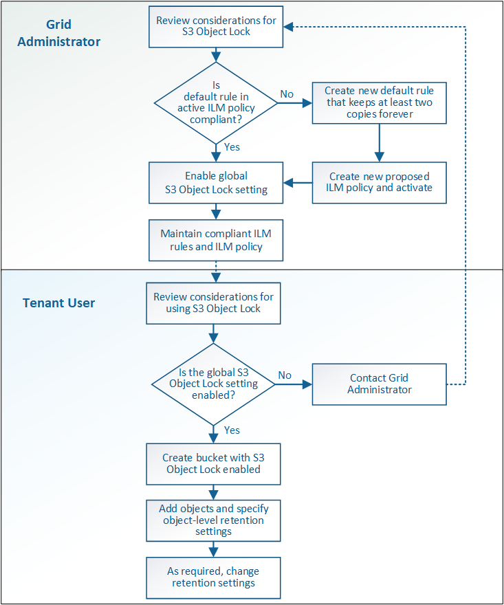

= S3 对象锁定的工作流
:allow-uri-read: 
:icons: font
:imagesdir: ../media/

[role="lead"]
作为网格管理员，您必须与租户用户密切协调，以确保对象受到保护，并满足其保留要求。

工作流图显示了使用 S3 对象锁定的高级步骤。这些步骤由网格管理员和租户用户执行。

== 网格管理任务

如工作流图所示，网格管理员必须执行两项高级任务， S3 租户用户才能使用 S3 对象锁定：

. 至少创建一个合规的 ILM 规则，并将该规则设置为活动 ILM 策略中的默认规则。
. 为整个 StorageGRID 系统启用全局 S3 对象锁定设置。

== 租户用户任务

启用全局 S3 对象锁定设置后，租户可以执行以下任务：

. 创建已启用 S3 对象锁定的分段。
. 指定存储分段的默认保留设置，这些设置将应用于添加到存储分段中但未指定其自身保留设置的对象。
. 向这些存储分段添加对象，并指定对象级别的保留期限和合法保留设置。
. 根据需要更新单个对象的保留期限或更改合法保留设置。

.相关信息
* xref:../tenant/index.adoc[使用租户帐户]
* xref:../s3/index.adoc[使用 S3]
* xref:../s3/operations-on-buckets.adoc#using-s3-object-lock-default-bucket-retention[使用 S3 对象锁定默认存储分段保留]

