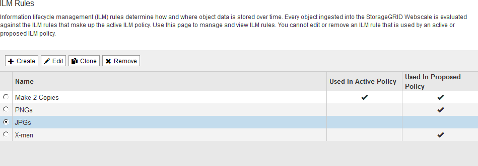

= 使用 ILM 规则和 ILM 策略
:allow-uri-read: 
:icons: font
:imagesdir: ../media/

[role="lead"]
创建 ILM 规则和 ILM 策略后，您可以继续使用它们，并随存储需求的变化修改其配置。

.您需要的内容
* 您将使用登录到网格管理器 xref:../admin/web-browser-requirements.adoc[支持的 Web 浏览器]。
* 您具有特定的访问权限。

== 删除 ILM 规则

要使当前 ILM 规则列表易于管理，请删除不可能使用的任何 ILM 规则。

如果某个 ILM 规则当前已在活动策略或建议的策略中使用，则不能将其删除。如果需要删除使用策略的 ILM 规则，必须先执行以下步骤：

. 克隆活动策略或编辑建议的策略。
. 从策略中删除 ILM 规则。
. 保存，模拟和激活新策略，以确保对象按预期受到保护。

.步骤
. 选择 * ILM * > * 规则 * 。
. 查看要删除的规则的表条目。
+
确认此规则未在活动 ILM 策略或建议的 ILM 策略中使用。

. 如果要删除的规则未在使用中，请选择单选按钮并选择 * 删除 * 。
. 选择 * 确定 * 确认要删除 ILM 规则。
+
此时将删除 ILM 规则。

+
[NOTE]
====
如果删除历史策略中使用的规则，则会显示 image:../media/icon_ilm_rule_historical.png["图标 ILM 规则历史记录"] 查看策略时会显示规则图标，表示此规则已成为历史规则。

image::../media/ilm_rule_historical.png[ILM 规则历史记录]

====

== 编辑 ILM 规则

要更改筛选器或放置指令，您可能需要编辑 ILM 规则。

如果某个规则正在建议的 ILM 策略或活动 ILM 策略中使用，则无法编辑该规则。而是可以克隆这些规则并对克隆的副本进行任何必要的更改。您也不能编辑在 StorageGRID 10.3 之前创建的常用 ILM 规则（创建 2 个副本）或 ILM 规则。

NOTE: 在将已编辑的规则添加到活动 ILM 策略发生原因 之前，请注意，更改对象的放置指令可能会导致系统负载增加。

.步骤
. 选择 * ILM * > * 规则 * 。
+
此时将显示 "ILM Rules" 页面。此页面显示所有可用规则，并指示活动策略或建议策略中正在使用哪些规则。

+

. 选择未使用的规则，然后选择 * 编辑 * 。
+
此时将打开编辑 ILM 规则向导。

+
image::../media/edit_ilm_rule_step_1.png[编辑 ILM 规则页面]

. 按照的步骤完成编辑 ILM 规则向导中的各个页面 xref:access-create-ilm-rule-wizard.adoc[创建 ILM 规则] 和 xref:using-advanced-filters-in-ilm-rules.adoc[使用高级筛选器]根据需要。
+
编辑 ILM 规则时，不能更改其名称。

. 选择 * 保存 * 。
+
[NOTE]
====
如果编辑历史策略中使用的规则，则可以使用 image:../media/icon_ilm_rule_historical.png["图标 ILM 规则历史记录"] 查看策略时会显示规则图标，表示此规则已成为历史规则。

image::../media/ilm_rule_historical.png[ILM 规则历史记录]

====

== 克隆 ILM 规则

如果某个规则正在建议的 ILM 策略或活动 ILM 策略中使用，则无法编辑该规则。而是可以克隆规则并对克隆的副本进行任何必要的更改。然后，如果需要，您可以从建议的策略中删除原始规则，并将其替换为修改后的版本。如果 ILM 规则是使用 StorageGRID 10.2 或更早版本创建的，则无法克隆该规则。

在将克隆规则添加到活动 ILM 策略发生原因 之前，请注意，更改对象的放置指令可能会导致系统负载增加。

.步骤
. 选择 * ILM * > * 规则 * 。
+
此时将显示 "ILM Rules" 页面。

+

. 选择要克隆的 ILM 规则，然后选择 * 克隆 * 。
+
此时将打开创建 ILM 规则向导。

. 按照编辑 ILM 规则和使用高级筛选器的步骤更新克隆的规则。
+
克隆 ILM 规则时，必须输入新名称。

. 选择 * 保存 * 。
+
此时将创建新的 ILM 规则。

== 查看 ILM 策略活动队列

您可以随时查看队列中要根据 ILM 策略进行评估的对象数量。您可能需要监控 ILM 处理队列以确定系统性能。队列较大可能表示系统无法跟上载入速率的增长，客户端应用程序的负载过大或存在异常情况。

.步骤
. 选择 * 信息板 * 。
+
image::../media/grid_manager_dashboard.png[网格管理界面中的信息板]

. 监控信息生命周期管理（ ILM ）部分。
+
您可以选择问号 image:../media/icon_nms_question.png["问号图标"] 以查看本节中各项的问题描述 。

