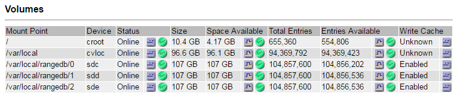

= 确定并卸载故障存储卷
:allow-uri-read: 
:icons: font
:imagesdir: ../media/

[role="lead"]
在恢复包含故障存储卷的存储节点时，您必须确定并卸载故障卷。您必须验证在恢复操作步骤 中仅重新格式化故障存储卷。

.您需要的内容
您必须使用登录到网格管理器 xref:../admin/web-browser-requirements.adoc[支持的 Web 浏览器]。

.关于此任务
您应尽快恢复发生故障的存储卷。

恢复过程的第一步是检测已断开连接，需要卸载或存在 I/O 错误的卷。如果故障卷仍然连接，但文件系统随机损坏，则系统可能无法检测到磁盘中未使用或未分配的部分有任何损坏。

NOTE: 您必须先完成此操作步骤 ，然后再执行手动步骤来恢复卷，例如添加或重新连接磁盘，停止节点，启动节点或重新启动。否则，在运行 `reformat_storage_block_devices.rb` 脚本时，可能会遇到文件系统错误，从而导致脚本挂起或失败。

NOTE: 在运行 `reboot` 命令之前，请修复硬件并正确连接磁盘。

CAUTION: 请仔细识别故障存储卷。您将使用此信息验证哪些卷必须重新格式化。重新格式化卷后，卷上的数据将无法恢复。

要正确恢复故障存储卷，您需要知道故障存储卷的设备名称及其卷 ID 。

在安装时，系统会为每个存储设备分配一个文件系统通用唯一标识符（ UUID ），并使用分配的文件系统 UUID 挂载到存储节点上的一个 rangedb 目录。文件系统 UUID 和 rangedb 目录将在 ` /etc/fstab` 文件中列出。网格管理器中将显示设备名称，范围 b 目录以及已挂载卷的大小。

在以下示例中，设备 ` /dev/sdc` 的卷大小为 4 TB ，使用 /`etc/` 文件中的设备名称 ` /dev/disk/by-uid/822b0547-3b2E-472b-ad5e-e1cf1809faba` 挂载到 ` /var/local/rangedb/0` ：

image::../media/mounting_storage_devices.gif[卷大小示例]

.步骤
. 完成以下步骤以记录故障存储卷及其设备名称：
+
.. 选择 * 支持 * > * 工具 * > * 网格拓扑 * 。
.. 选择 * 站点 * > * 故障存储节点 * > * LDR* > * 存储 * > * 概述 * > * 主 * ，然后查找包含警报的对象存储。
+
image::../media/ldr_storage_object_stores.gif[对象存储部分]

.. 选择 * 站点 * > * 故障存储节点 * > * SSM* > * 资源 * > * 概述 * > * 主 * 。确定上一步中确定的每个故障存储卷的挂载点和卷大小。
+
对象存储以十六进制表示法进行编号。例如， 0000 是第一个卷， 000f 是第 16 个卷。在此示例中， ID 为 0000 的对象存储对应于设备名称为 sdc 且大小为 107 GB 的 ` /var/local/rangedb/0` 。

+

. 登录到发生故障的存储节点：
+
.. 输入以下命令： `ssh admin@ grid_node_ip_`
.. 输入 `passwords.txt` 文件中列出的密码。
.. 输入以下命令切换到 root ： `su -`
.. 输入 `passwords.txt` 文件中列出的密码。

+
以 root 用户身份登录时，提示符将从 ` $` 更改为 ` #` 。

. 运行以下脚本以停止存储服务并卸载故障存储卷：
+
`sn-ununmount 卷 object_store_ID`

+
`object_store_ID` 是故障存储卷的 ID 。例如，在命令中为 ID 为 0000 的对象存储指定 `0` 。

. 如果出现提示，请按 * 。 * 停止存储节点上的存储服务。
+

NOTE: 如果存储服务已停止，则不会提示您。仅对卷 0 停止 Cassandra 服务。

+
image::../media/unmount_failed_storage_volume.png[卸载故障存储卷]

+
几秒钟后，存储服务将停止，卷将卸载。此时将显示消息，指示此过程的每个步骤。最后一条消息指示卷已卸载。

