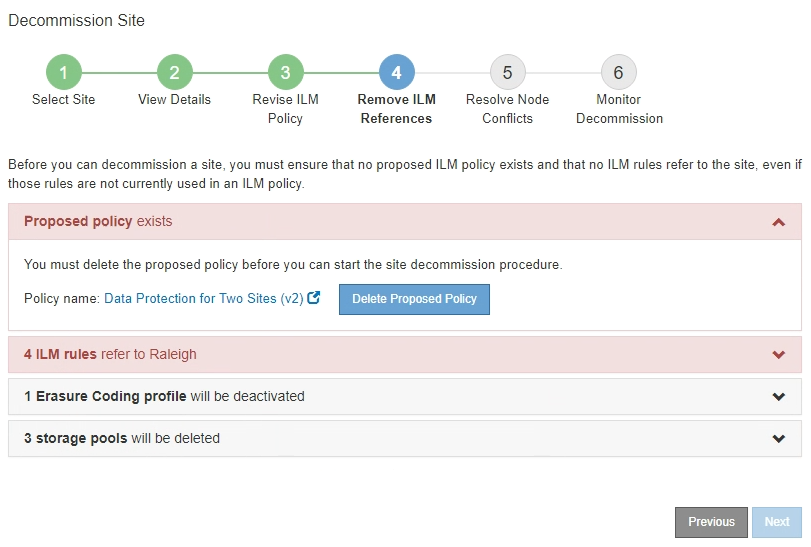

= 第 4 步：删除 ILM 引用
:allow-uri-read: 
:icons: font
:imagesdir: ../media/

[role="lead"]
从 " 弃用站点 " 向导的第 4 步（删除 ILM 引用）中，您可以删除建议的策略（如果存在），并删除或编辑仍引用此站点的任何未使用的 ILM 规则。

.关于此任务
在以下情况下，您将无法启动站点停用操作步骤 ：

* 已存在建议的 ILM 策略。如果您有建议的策略，则必须将其删除。
* 任何 ILM 规则均指站点，即使此规则未在任何 ILM 策略中使用也是如此。您必须删除或编辑引用此站点的所有规则。

.步骤
. 如果列出了建议的策略，请将其删除。
+

+
.. 选择 * 删除建议的策略 * 。
.. 在确认对话框中选择 * 确定 * 。

. 确定任何未使用的 ILM 规则是否引用站点。
+
image::../media/decommission_site_step_4_ilm_rules.png[停用站点步骤 4 ILM 规则]

+
列出的任何 ILM 规则仍引用站点，但不会在任何策略中使用。在示例中：

+
** 常用 * 创建 2 个副本 * 规则使用系统默认的 * 所有存储节点 * 存储池，该存储池使用所有站点站点站点。
** S3 租户 * 未使用的 * 3 个副本规则是指 * 罗利 * 存储池。
** 对于较小对象 * ，未使用的 * 2 个副本 2 个站点是指 * 罗利 * 存储池。
** 未使用的 * 较大对象 * 规则使用 * 所有 3 个站点 * 纠删编码配置文件中的罗利站点。
** 如果未列出 ILM 规则，请选择 * 下一步 * 以转到 * 步骤 5 （解决节点冲突） * 。
+
xref:step-5-resolve-node-conflicts.adoc[第 5 步：解决节点冲突（并开始停用）]

+

NOTE: 当 StorageGRID 停用站点时，它将自动停用引用该站点的任何未使用的擦除编码配置文件，并自动删除引用该站点的任何未使用的存储池。系统默认的所有存储节点存储池将被删除，因为它使用的是所有站点站点站点。

** 如果列出了一个或多个 ILM 规则，请转至下一步。

. 编辑或删除每个未使用的规则：
+
** 要编辑规则，请转到 "ILM 规则 " 页面，并更新使用擦除编码配置文件或引用站点的存储池的所有放置位置。然后，返回到 * 步骤 4 （删除 ILM 参考） * 。
+

NOTE: 有关详细信息，请参见有关通过信息生命周期管理来管理对象的说明。

** 要删除规则，请选择垃圾桶图标 image:../media/icon_trash_can.png["图标垃圾桶可以"] 并选择 * 确定 * 。
+

IMPORTANT: 您必须先删除常用的 * 创建 2 个副本 * 规则，然后才能停用站点。

. 确认不存在建议的 ILM 策略，未使用的 ILM 规则均未引用此站点，并且已启用 * 下一步 * 按钮。
+
image::../media/decommission_site_step_4_no_policy_or_rules.png[停用站点步骤 4 无策略或规则]

. 选择 * 下一步 * 。
+

NOTE: 删除此站点后，引用此站点的任何剩余存储池和擦除编码配置文件将无效。当 StorageGRID 停用站点时，它将自动停用引用该站点的任何未使用的擦除编码配置文件，并自动删除引用该站点的任何未使用的存储池。系统默认的所有存储节点存储池将被删除，因为它使用的是所有站点站点站点。

+
此时将显示第 5 步（解决节点冲突）。

