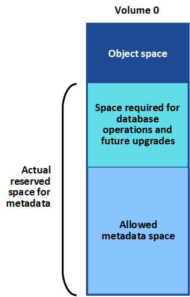

= 对元数据问题进行故障排除
:allow-uri-read: 
:experimental: 
:icons: font
:imagesdir: ../media/

[role="lead"]
您可以执行多项任务来帮助确定元数据问题的根源。

== 对 " 低元数据存储 " 警报进行故障排除

如果触发 * 低元数据存储 * 警报，则必须添加新的存储节点。

.您需要什么？ #8217 ；将需要什么
* 您必须使用登录到网格管理器 xref:../admin/web-browser-requirements.adoc[支持的 Web 浏览器]。

StorageGRID 会在每个存储节点的卷 0 上为对象元数据预留一定数量的空间。此空间称为实际预留空间，并细分为对象元数据允许的空间（允许的元数据空间）以及数据缩减和修复等基本数据库操作所需的空间。允许的元数据空间用于控制整体对象容量。

如果对象元数据占用的空间超过元数据允许的 100% ，则数据库操作将无法高效运行，并会发生错误。

您可以 xref:monitoring-storage-capacity.adoc#monitor-object-metadata-capacity-for-each-storage-node[监控每个存储节点的对象元数据容量] 帮助您预测错误并在发生错误之前予以更正。

StorageGRID 使用以下 Prometheus 指标来衡量允许的元数据空间的容量：

[listing]
----
storagegrid_storage_utilization_metadata_bytes/storagegrid_storage_utilization_metadata_allowed_bytes
----
当此 Prometheus 表达式达到特定阈值时，将触发 * 低元数据存储 * 警报。

* * 次要 * ：对象元数据正在使用允许的元数据空间的 70% 或更多。您应尽快添加新的存储节点。
* * 主要 * ：对象元数据正在使用允许的元数据空间的 90% 或更多。您必须立即添加新的存储节点。
+

IMPORTANT: 当对象元数据使用 90% 或更多的允许元数据空间时，信息板上会显示一条警告。如果显示此警告，则必须立即添加新的存储节点。绝不能允许对象元数据使用超过允许空间的 100% 。

* * 严重 * ：对象元数据正在使用 100% 或更多的允许元数据空间，并且开始占用基本数据库操作所需的空间。您必须停止载入新对象，并且必须立即添加新的存储节点。

在以下示例中，对象元数据使用的元数据空间超过允许的 100% 。这是一种严重情况，会导致数据库运行效率低下和出现错误。

image::../media/cdlp_dashboard_alarm.gif[元数据信息板警报]

IMPORTANT: 如果卷 0 的大小小于元数据预留空间存储选项（例如，在非生产环境中），则计算 * 低元数据存储 * 警报可能不准确。

.步骤
. 选择 * 警报 * > * 当前 * 。
. 如果需要，从警报表中展开 * 低元数据存储 * 警报组，然后选择要查看的特定警报。
. 查看警报对话框中的详细信息。
. 如果触发了主要或关键的 * 低元数据存储 * 警报，请执行扩展以立即添加存储节点。
+

NOTE: 由于 StorageGRID 会在每个站点保留所有对象元数据的完整副本，因此整个网格的元数据容量受最小站点的元数据容量限制。如果需要向一个站点添加元数据容量，则还应添加元数据容量 xref:../expand/index.adoc[扩展任何其他站点] 相同数量的存储节点。

+
执行扩展后， StorageGRID 会将现有对象元数据重新分发到新节点，从而增加网格的整体元数据容量。无需用户操作。已清除 * 低元数据存储 * 警报。

== 对服务进行故障排除：状态 - Cassandra （ SVST ）警报进行故障排除

服务：状态 - Cassandra （ SVST ）警报指示您可能需要为存储节点重建 Cassandra 数据库。Cassandra 用作 StorageGRID 的元数据存储。

.您需要什么？ #8217 ；将需要什么
* 您必须使用登录到网格管理器 xref:../admin/web-browser-requirements.adoc[支持的 Web 浏览器]。
* 您必须具有特定的访问权限。
* 您必须具有 `passwords.txt` 文件。

如果 Cassandra 停止超过 15 天（例如，存储节点已关闭），则在节点恢复联机后， Cassandra 将无法启动。您必须为受影响的 DDS 服务重建 Cassandra 数据库。

您可以 xref:running-diagnostics.adoc[运行诊断] 获取网格当前状态的追加信息 。

IMPORTANT: 如果两个或多个 Cassandra 数据库服务关闭超过 15 天，请联系技术支持，不要继续执行以下步骤。

.步骤
. 选择 * 支持 * > * 工具 * > * 网格拓扑 * 。
. 选择 * 站点 _* > * 存储节点 _* > * SSM* > * 服务 * > * 警报 * > * 主 * 以显示警报。
+
此示例显示已触发 SVST 警报。

+
image::../media/svst_alarm.gif[警报： SSM ：服务页面]

+
"SSM 服务主页 " 页面还指示 Cassandra 未运行。

+
image::../media/cassandra_not_running.gif[概述： SSM ：服务页面]

. 【重新启动 Cassandra_from_the_Storage_Node ， start=3]] 尝试从存储节点重新启动 Cassandra ：
+
.. 登录到网格节点：
+
... 输入以下命令： `ssh admin@grid_node_ip`
... 输入 `passwords.txt` 文件中列出的密码。
... 输入以下命令切换到 root ： `su -`
... 输入 `passwords.txt` 文件中列出的密码。以 root 用户身份登录时，提示符将从 ` $` 更改为 ` #` 。

.. 输入： ` /etc/init.d/Cassandra status`
.. 如果 Cassandra 未运行，请重新启动它： ` /etc/init.d/Cassandra restart`

. 如果 Cassandra 未重新启动，请确定 Cassandra 已关闭多长时间。如果 Cassandra 已关闭超过 15 天，则必须重建 Cassandra 数据库。
+

IMPORTANT: 如果两个或更多 Cassandra 数据库服务已关闭，请联系技术支持，不要继续执行以下步骤。

+
您可以通过绘制 Cassandra 图表或查看 servermanager.log 文件来确定 Cassandra 已关闭多长时间。

. 绘制 Cassandra 图表：
+
.. 选择 * 支持 * > * 工具 * > * 网格拓扑 * 。然后选择 * 站点 _* > * 存储节点 _* > * SSM* > * 服务 * > * 报告 * > * 图表 * 。
.. 选择 * 属性 * > * 服务：状态 - Cassandra* 。
.. 对于 * 开始日期 * ，请输入至少早于当前日期 16 天的日期。对于 * 结束日期 * ，输入当前日期。
.. 单击 * 更新 * 。
.. 如果图表显示 Cassandra 关闭超过 15 天，请重建 Cassandra 数据库。

以下图表示例显示 Cassandra 已关闭至少 17 天。

image::../media/cassandra_not_running_chart.png[概述： SSM ：服务页面]

. 查看存储节点上的 servermanager.log 文件：
+
.. 登录到网格节点：
+
... 输入以下命令： `ssh admin@grid_node_ip`
... 输入 `passwords.txt` 文件中列出的密码。
... 输入以下命令切换到 root ： `su -`
... 输入 `passwords.txt` 文件中列出的密码。以 root 用户身份登录时，提示符将从 ` $` 更改为 ` #` 。

.. 输入： `cat /var/local/log/servermanager.log`
+
此时将显示 servermanager.log 文件的内容。

+
如果 Cassandra 已关闭超过 15 天，则 servermanager.log 文件中将显示以下消息：

+
[listing]
----
"2014-08-14 21:01:35 +0000 | cassandra | cassandra not
started because it has been offline for longer than
its 15 day grace period - rebuild cassandra
----
.. 确保此消息的时间戳是您按照步骤中的说明尝试重新启动 Cassandra 的时间 <<restart_Cassandra_from_the_Storage_Node,从存储节点重新启动 Cassandra>>。
+
Cassandra 可以有多个条目；您必须找到最新的条目。

.. 如果 Cassandra 已关闭超过 15 天，则必须重建 Cassandra 数据库。
+
有关说明，请参见 xref:../maintain/recovering-storage-node-that-has-been-down-more-than-15-days.adoc[将存储节点恢复到关闭状态超过 15 天]。

.. 如果重建 Cassandra 后无法清除警报，请联系技术支持。

== 对 Cassandra 内存不足错误（ SMTTT 警报）进行故障排除

如果 Cassandra 数据库出现内存不足错误，则会触发总计事件（ SMT ）警报。如果发生此错误，请联系技术支持以使用问题描述 。

如果 Cassandra 数据库发生内存不足错误，则会创建堆转储，触发总事件（ SMT ）警报， Cassandra 堆内存不足错误计数将增加 1 。

.步骤
. 要查看事件，请选择 * 支持 * > * 工具 * > * 网格拓扑 * > * 配置 * 。
. 验证 Cassandra 堆内存不足错误计数是否为 1 或更高。
+
您可以 xref:running-diagnostics.adoc[运行诊断] 获取网格当前状态的追加信息 。

. 转至 ` /var/local/core/` ，压缩 `Cassandra.hprof` 文件，然后将其发送给技术支持。
. 备份 `Cassandra.hprof` 文件，然后将其从 ` /var/local/core/ 目录` 中删除。
+
此文件最大可达 24 GB ，因此您应将其删除以释放空间。

. 解决问题描述 后，选中 Cassandra 堆内存不足错误计数的 * 重置 * 复选框。然后选择 * 应用更改 * 。
+

NOTE: 要重置事件计数，您必须具有网格拓扑页面配置权限。

