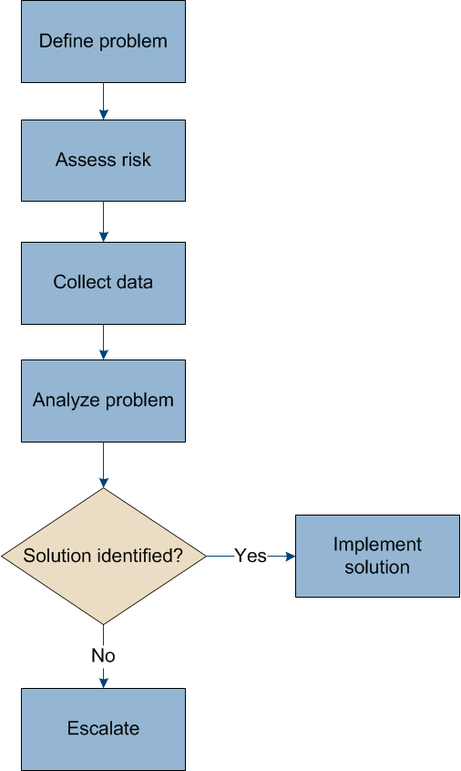

= 对 StorageGRID 系统进行故障排除
:allow-uri-read: 
:icons: font
:imagesdir: ../media/

[role="lead"]
如果在使用 StorageGRID 系统时遇到问题，请参阅本节中的提示和准则，以帮助确定和解决问题描述 。

== 问题确定概述

如果遇到问题，请执行此操作 xref:../admin/index.adoc[管理 StorageGRID 系统]，您可以使用此图中概述的过程来识别和分析问题描述 。在许多情况下，您可以自行解决问题；但是，您可能需要将某些问题上报给技术支持。

=== 定义问题

解决问题的第一步是明确定义问题。

下表提供了定义问题时可能收集的信息类型示例：

[cols="1a,1a"]
|===
| 问题 | 响应示例 

 a| 
StorageGRID 系统正在执行什么操作或不执行什么操作？其症状是什么？
 a| 
客户端应用程序报告无法将对象载入 StorageGRID 。

 a| 
问题是从何时开始的？
 a| 
对象载入于 2020 年 1 月 8 日 14 ： 50 时被首次拒绝。

 a| 
您是如何首次注意到该问题的？
 a| 
客户端应用程序已通知。同时还收到警报电子邮件通知。

 a| 
问题是持续发生还是仅偶尔发生？
 a| 
问题仍在继续。

 a| 
如果此问题经常发生，则说明发生发生原因 的步骤是什么
 a| 
每次客户端尝试载入对象时都会发生问题。

 a| 
如果此问题间歇性发生，何时发生？记录您所知的每个意外事件的时间。
 a| 
问题不是间歇性的。

 a| 
您以前是否遇到过此问题？您过去遇到此问题的频率如何？
 a| 
这是我第一次看到此问题描述 。

|===

=== 评估风险和对系统的影响

定义问题后，请评估其对 StorageGRID 系统的风险和影响。例如，存在严重警报并不一定意味着系统不提供核心服务。

下表总结了示例问题对系统操作的影响：

[cols="1a,1a"]
|===
| 问题 | 响应示例 

 a| 
StorageGRID 系统是否可以载入内容？
 a| 
否

 a| 
客户端应用程序是否可以检索内容？
 a| 
可以检索某些对象，而不能检索其他对象。

 a| 
数据是否存在风险？
 a| 
否

 a| 
开展业务的能力是否受到严重影响？
 a| 
可以，因为客户端应用程序无法将对象存储到 StorageGRID 系统，并且无法一致地检索数据。

|===

=== 收集数据

定义问题并评估其风险和影响后，收集数据以供分析。最有用的数据类型取决于问题的性质。

[cols="1a,2a,1a"]
|===
| 要收集的数据类型 | 为什么收集此数据 | 说明 

 a| 
创建最近更改的时间线
 a| 
对 StorageGRID 系统，其配置或环境进行更改可以发生原因 新行为。
 a| 
* ,创建最近更改的时间线

 a| 
查看警报和警报
 a| 
警报和警报可通过提供有关可能导致问题的根本问题的重要线索，帮助您快速确定问题的根本发生原因 。

查看当前警报和警报列表，查看 StorageGRID 是否已确定问题的根发生原因 。

查看过去触发的警报和警报，以获得更多见解。
 a| 
* xref:viewing-current-alerts.adoc[查看当前警报]
* xref:viewing-legacy-alarms.adoc[查看旧警报]
* xref:viewing-resolved-alerts.adoc[查看已解决的警报]
* xref:managing-alarms.adoc[查看历史警报和警报频率（传统系统）]

 a| 
监控事件
 a| 
事件包括节点的任何系统错误或故障事件，包括网络错误等错误。监控事件以了解有关问题的更多信息或帮助进行故障排除。
 a| 
* xref:monitoring-events.adoc[监控事件]

 a| 
使用图表和文本报告确定趋势
 a| 
趋势可以提供有关问题首次出现的宝贵线索，并有助于您了解事情发生的速度。
 a| 
* xref:using-charts-and-reports.adoc[使用图表和图形]
* xref:types-of-text-reports.adoc[使用文本报告]

 a| 
建立基线
 a| 
收集有关各种运行值的正常级别的信息。这些基线值以及与这些基线的偏差可以提供有价值的线索。
 a| 
* ,建立基线

 a| 
执行载入和检索测试
 a| 
要解决载入和检索的性能问题，请使用工作站存储和检索对象。将结果与使用客户端应用程序时看到的结果进行比较。
 a| 
* xref:monitoring-put-and-get-performance.adoc[监控 PUT 和 GET 性能]

 a| 
查看审核消息
 a| 
查看审核消息以详细了解 StorageGRID 操作。审核消息中的详细信息对于排除包括性能问题在内的多种类型的问题非常有用。
 a| 
* xref:reviewing-audit-messages.adoc[查看审核消息]

 a| 
检查对象位置和存储完整性
 a| 
如果存在存储问题，请验证对象是否已放置在预期位置。检查存储节点上对象数据的完整性。
 a| 
* xref:monitoring-object-verification-operations.adoc[监控对象验证操作]
* xref:confirming-object-data-locations.adoc[确认对象数据位置]
* xref:verifying-object-integrity.adoc[验证对象完整性]

 a| 
为技术支持收集数据
 a| 
技术支持可能会要求您收集数据或查看特定信息，以帮助您解决问题。
 a| 
* xref:collecting-log-files-and-system-data.adoc[收集日志文件和系统数据]
* xref:manually-triggering-autosupport-message.adoc[手动触发 AutoSupport 消息]
* xref:reviewing-support-metrics.adoc[查看支持指标]

|===

==== 创建最近更改的时间线

出现问题时，您应考虑最近发生了哪些更改以及何时发生了这些更改。

* 对 StorageGRID 系统，其配置或环境进行更改可以发生原因 新行为。
* 更改时间线可以帮助您确定哪些更改可能会对问题描述 造成影响，以及每个更改可能会对其开发产生何种影响。

创建一个系统近期更改的表，其中包含有关每次更改发生时间的信息以及有关更改的任何相关详细信息，以及有关更改进行期间发生的其他情况的信息：

[cols="1a,1a,1a"]
|===
| 更改时间 | 更改类型 | 详细信息 

 a| 
例如：

* 您何时开始节点恢复？
* 软件升级何时完成？
* 您是否中断了此过程？

 a| 
发生什么事了？您做了什么？
 a| 
记录有关变更的任何相关详细信息。例如：

* 网络更改的详细信息。
* 安装了哪个修补程序。
* 客户端工作负载如何更改。

请务必注意，如果同时发生多个更改。例如，是否在升级过程中进行了此更改？

|===

===== 近期重大变更的示例

以下是一些可能会发生重大变化的示例：

* StorageGRID 系统是最近安装，扩展还是恢复的？
* 系统近期是否已升级？是否应用了修补程序？
* 最近是否修复或更改过任何硬件？
* 是否已更新 ILM 策略？
* 客户端工作负载是否已更改？
* 客户端应用程序或其行为是否发生变化？
* 您是否更改了负载平衡器，添加或删除了管理节点或网关节点的高可用性组？
* 是否已启动可能需要很长时间才能完成的任务？示例包括：
+
** 恢复发生故障的存储节点
** 存储节点停用

* 是否对用户身份验证进行了任何更改，例如添加租户或更改 LDAP 配置？
* 是否正在进行数据迁移？
* 最近是否启用或更改了平台服务？
* 最近是否启用了合规性？
* 是否已添加或删除云存储池？
* 是否对存储压缩或加密进行了任何更改？
* 网络基础架构是否有任何变化？例如， VLAN ，路由器或 DNS 。
* 是否对 NTP 源进行了任何更改？
* 是否对网格，管理员或客户端网络接口进行了任何更改？
* 是否对归档节点进行了任何配置更改？
* 是否对 StorageGRID 系统或其环境进行了任何其他更改？

==== 建立基线

您可以通过记录各种运行值的正常级别来为系统建立基线。将来，您可以将当前值与这些基线进行比较，以帮助检测和解决异常值。

[cols="1a,1a,1a"]
|===
| 属性 | 价值 | 如何获取 

 a| 
平均存储消耗
 a| 
GB 已用 / 天

每日消耗百分比
 a| 
转到网格管理器。在节点页面上，选择整个网格或站点，然后转到存储选项卡。

在 " 已用存储 - 对象数据 " 图表上，找到一个线相当稳定的句点。将光标悬停在图表上方可估计每天占用的存储空间量

您可以收集整个系统或特定数据中心的此信息。

 a| 
平均元数据消耗
 a| 
GB 已用 / 天

每日消耗百分比
 a| 
转到网格管理器。在节点页面上，选择整个网格或站点，然后转到存储选项卡。

在 " 已用存储 - 对象元数据 " 图表上，找到一个线相当稳定的句点。将光标悬停在图表上方，可估算每天占用的元数据存储量

您可以收集整个系统或特定数据中心的此信息。

 a| 
S3/Swift 操作速率
 a| 
操作数 / 秒
 a| 
转到网格管理器中的信息板。在协议操作部分中，查看 S3 速率和 Swift 速率的值。

要查看特定站点或节点的载入率和检索率以及计数，请选择 * 节点 * > * 站点或存储节点 _* > * 对象 * 。将光标悬停在 Insest and retrieve 图表上，查看 S3 或 Swift 的图表。

 a| 
S3/Swift 操作失败
 a| 
操作
 a| 
选择 * 支持 * > * 工具 * > * 网格拓扑 * 。在 API Operations 部分的 Overview 选项卡上，查看 S3 Operations - Failed 或 Swift Operations - Failed 的值。

 a| 
ILM 评估率
 a| 
对象 / 秒
 a| 
从节点页面中，选择 * ； grid_* > * 。

在 ILM 队列图表中，找到线条相当稳定的句点。将光标悬停在图表上方可估算系统的 * 评估速率 * 基线值。

 a| 
ILM 扫描速率
 a| 
对象 / 秒
 a| 
选择 * 节点 * > * 网格 _* > * ILM * 。

在 ILM 队列图表中，找到线条相当稳定的句点。将光标悬停在图表上方可估算系统的 * 扫描速率 * 基线值。

 a| 
从客户端操作排队的对象
 a| 
对象 / 秒
 a| 
选择 * 节点 * > * 网格 _* > * ILM * 。

在 ILM 队列图表中，找到线条相当稳定的句点。将光标悬停在图表上方，可估算系统中 * 已排队（从客户端操作） * 的对象的基线值。

 a| 
平均查询延迟
 a| 
毫秒
 a| 
选择 * 节点 * > * 存储节点 _* > * 对象 * 。在查询表中，查看平均延迟的值。

|===

=== 分析数据

使用您收集的信息确定问题的发生原因 以及可能的解决方案。

分析与问题‐相关，但一般而言：

* 使用警报查找故障点和瓶颈。
* 使用警报历史记录和图表重建问题历史记录。
* 使用图表查找异常并将问题情况与正常运行进行比较。

=== 上报信息检查清单

如果您无法自行解决此问题，请联系技术支持。在联系技术支持之前，请收集下表中列出的信息，以便于解决问题。

[cols="2,2,4a"]
|===
| image:../media/feature_checkmark.gif["复选标记"] | 项目 | 注释： 

|  | 问题陈述  a| 
问题症状是什么？问题是从何时开始的？是否持续或间歇性发生？如果间歇性发生，发生过什么时间？

xref:troubleshooting-storagegrid-system.adoc[定义问题]

|  | 影响评估  a| 
问题的严重性是什么？对客户端应用程序有何影响？

* 客户端以前是否已成功连接？
* 客户端是否可以载入，检索和删除数据？

|  | StorageGRID 系统 ID  a| 
选择 * 维护 * > * 系统 * > * 许可证 * 。StorageGRID 系统 ID 显示为当前许可证的一部分。

|  | 软件版本  a| 
从网格管理器顶部，选择帮助图标并选择 * 关于 * 以查看 StorageGRID 版本。

|  | 自定义  a| 
总结 StorageGRID 系统的配置方式。例如，列出以下内容：

* 网格是否使用存储压缩，存储加密或合规性？
* ILM 是否会创建复制或擦除编码对象？ILM 是否可确保站点冗余？ILM 规则是否使用严格，平衡或双重提交载入行为？

|  | 日志文件和系统数据  a| 
收集系统的日志文件和系统数据。选择 * 支持 * > * 工具 * > * 日志 * 。

您可以收集整个网格或选定节点的日志。

如果仅收集选定节点的日志，请确保至少包含一个具有此 ADA 服务的存储节点。（一个站点的前三个存储节点包含此 ADC-Service 。）

xref:collecting-log-files-and-system-data.adoc[收集日志文件和系统数据]

|  | 基线信息  a| 
收集有关载入操作，检索操作和存储消耗的基线信息。

,建立基线

|  | 最近更改的时间线  a| 
创建一个时间线，用于汇总系统或其环境的所有近期更改。

,创建最近更改的时间线

|  | 诊断问题描述 的工作历史记录  a| 
如果您已自行采取步骤对问题描述 进行诊断或故障排除，请务必记录所采取的步骤和结果。

|===