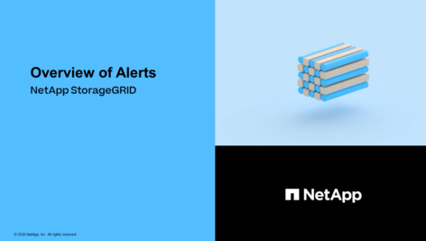
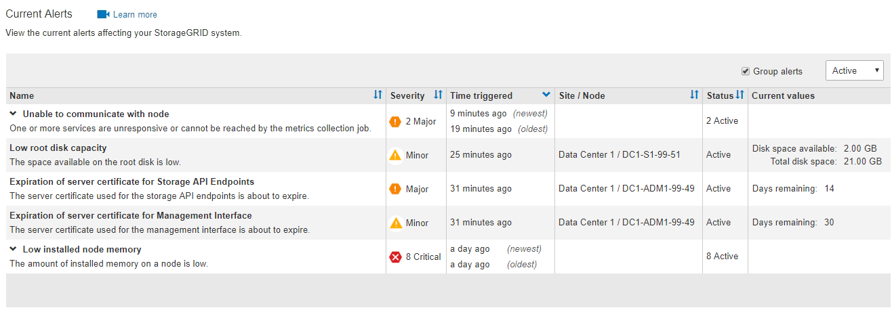

= 查看当前警报
:allow-uri-read: 
:icons: font
:imagesdir: ../media/

[role="lead"]
触发警报后，信息板上会显示一个警报图标。节点页面上还会显示节点的警报图标。除非警报已静音，否则也可能会发送电子邮件通知。

.您需要什么？ #8217 ；将需要什么
* 您必须使用登录到网格管理器 xref:../admin/web-browser-requirements.adoc[支持的 Web 浏览器]。
* 您也可以观看以下视频： https://netapp.hosted.panopto.com/Panopto/Pages/Viewer.aspx?id=2680a74f-070c-41c2-bcd3-acc5013c9cdd["视频：警报概述"^]。
+
[link=https://netapp.hosted.panopto.com/Panopto/Pages/Viewer.aspx?id=2680a74f-070c-41c2-bcd3-acc5013c9cdd]

.步骤
. 如果一个或多个警报处于活动状态，请执行以下操作之一：
+
** 在信息板上的 " 运行状况 " 面板中，单击警报图标或单击 * 当前警报 * 。（只有当前至少有一个警报处于活动状态时，才会显示警报图标和 * 当前警报 * 链接。）
** 选择 * 警报 * > * 当前 * 。
+
此时将显示当前警报页面。它会列出当前影响 StorageGRID 系统的所有警报。

+

+
默认情况下，警报显示如下：

** 首先显示最近触发的警报。
** 同一类型的多个警报显示为一个组。
** 未显示已静音的警报。
** 对于特定节点上的特定警报，如果达到阈值的严重性超过一个，则仅显示最严重的警报。也就是说，如果达到次要，主要和严重严重性的警报阈值，则仅显示严重警报。

+
" 当前警报 " 页面每两分钟刷新一次。

. 查看表中的信息。
+
[cols="1a,3a"]
|===
| 列标题 | Description 

 a| 
Name
 a| 
警报及其问题描述 的名称。

 a| 
severity
 a| 
警报的严重性。如果对多个警报进行了分组，则标题行将显示每个严重性发生的警报实例数。

** * 严重 * image:../media/icon_alert_red_critical.png["图标警报红色严重"]：存在已停止 StorageGRID 节点或服务正常运行的异常情况。您必须立即解决底层问题描述 。如果未解决问题描述 ，可能会导致服务中断和数据丢失。
** * 主要 * image:../media/icon_alert_orange_major.png["图标警报橙色主要"]：存在影响当前操作或接近严重警报阈值的异常情况。您应调查主要警报并解决任何根本问题，以确保异常情况不会停止 StorageGRID 节点或服务的正常运行。
** * 次要 * image:../media/icon_alert_yellow_minor.png["图标警报黄色次要"]：系统运行正常，但存在异常情况，如果系统继续运行，可能会影响系统的运行能力。您应监控和解决自身未清除的小警报，以确保它们不会导致更严重的问题。

 a| 
时间已触发
 a| 
触发警报多长时间前。如果对多个警报进行了分组，则标题行将显示警报的最新实例（ _lates_ ）和最旧的警报实例（ _oldest_ ）的时间。

 a| 
站点 / 节点
 a| 
发生警报的站点和节点的名称。如果对多个警报进行分组，则站点和节点名称不会显示在标题行中。

 a| 
Status
 a| 
警报处于活动状态还是已静音。如果对多个警报进行分组，并在下拉列表中选择了 * 所有警报 * ，则标题行将显示该警报处于活动状态的实例数以及已静音的实例数。

 a| 
当前值
 a| 
导致触发警报的指标的当前值。对于某些警报，还会显示其他值，以帮助您了解和调查此警报。例如，为 "* 对象数据存储空间不足 * " 警报显示的值包括已用磁盘空间百分比，磁盘空间总量和已用磁盘空间量。

* 注： * 如果对多个警报进行分组，则当前值不会显示在标题行中。

|===
. 要扩展和折叠警报组，请执行以下操作：
+
** 要显示组中的各个警报，请单击向下记号 image:../media/icon_alert_caret_down.png["Down caret 图标"] 或单击组的名称。
** 要隐藏组中的各个警报，请单击 UP caret  或单击组的名称。
+
image::../media/alerts_page_expanded_alert_group.png[警报页面已展开警报组]

. 要显示单个警报而不是多组警报，请取消选中表顶部的 * 组警报 * 复选框。
+
image::../media/alerts_page_group_alerts_button.png[组警报按钮]

. 要对警报或警报组进行排序，请单击向上 / 向下箭头  在每个列标题中。
+
** 如果选择 * 组警报 * ，则会对每个组中的警报组和各个警报进行排序。例如，您可能希望按 * 时间触发 * 对组中的警报进行排序，以查找特定警报的最新实例。
** 取消选择 * 组警报 * 后，系统将对整个警报列表进行排序。例如，您可能希望按 * 节点 / 站点 * 对所有警报进行排序，以查看影响特定节点的所有警报。

. 要按状态筛选警报，请使用表顶部的下拉菜单。
+
image::../media/alerts_page_active_drop_down.png[警报状态下拉列表]

+
** 选择 * 所有警报 * 可查看所有当前警报（活动警报和静音警报）。
** 选择 * 活动 * 可仅查看当前处于活动状态的警报。
** 选择 * 已静音 * 可仅查看当前已静音的警报。请参见 xref:silencing-alert-notifications.adoc[静默警报通知]。

. 要查看特定警报的详细信息，请从表中选择该警报。
+
此时将显示警报对话框。请参见 xref:viewing-specific-alert.adoc[查看特定警报]。

