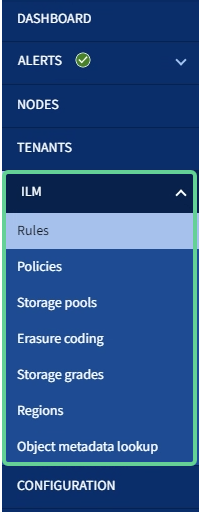

= 了解网格管理器
:allow-uri-read: 
:icons: font
:imagesdir: ../media/

[role="lead"]
网格管理器是一个基于浏览器的图形界面，可用于配置，管理和监控 StorageGRID 系统。

登录到网格管理器后，您将连接到管理节点。每个 StorageGRID 系统都包括一个主管理节点和任意数量的非主管理节点。您可以连接到任何管理节点，每个管理节点都会显示一个类似的 StorageGRID 系统视图。

您可以使用访问网格管理器 xref:../admin/web-browser-requirements.adoc[支持的 Web 浏览器]。

== 网格管理器信息板

首次登录到网格管理器时，您可以使用信息板一目了然地监控系统活动。

信息板包含有关系统运行状况，存储使用情况， ILM 进程以及 S3 和 Swift 操作的摘要信息。

image::../media/grid_manager_dashboard.png[网格管理器中的信息板]

有关每个面板上信息的说明，请单击帮助图标 image:../media/icon_nms_question.png["问号图标"] 。

.了解更多信息。
* xref:../monitor/index.adoc[监控和故障排除]

== 搜索字段

标题栏中的 * 搜索 * 字段可用于快速导航到网格管理器中的特定页面。例如，您可以输入 * 公里 * 以访问密钥管理服务器（ KMS ）页面。您可以使用 * 搜索 * 在网格管理器的边栏以及配置，维护和支持菜单中查找条目。

== 警报菜单

警报菜单提供了一个易于使用的界面，用于检测，评估和解决 StorageGRID 操作期间可能发生的问题。

image::../media/alerts_menu.png[警报菜单]

在警报菜单中，您可以执行以下操作：

* 查看当前警报
* 查看已解决的警报
* 配置静音以禁止警报通知
* 为触发警报的条件定义警报规则
* 为警报通知配置电子邮件服务器

.了解更多信息。
* xref:monitoring-and-managing-alerts.adoc[监控和管理警报]
* xref:../monitor/index.adoc[监控和故障排除]

== 节点页面

节点页面显示有关整个网格，网格中的每个站点以及站点上的每个节点的信息。

节点主页显示整个网格的组合指标。要查看特定站点或节点的信息，请选择站点或节点。

image::../media/nodes_menu.png[节点页面主页]

.了解更多信息。
* xref:viewing-nodes-page.adoc[查看节点页面]
* xref:../monitor/index.adoc[监控和故障排除]

== 租户页面

通过租户页面，您可以为 StorageGRID 系统创建和监控存储租户帐户。您必须至少创建一个租户帐户，以指定谁可以存储和检索对象以及这些对象可以使用哪些功能。

" 租户 " 页面还提供每个租户的使用情况详细信息，包括已用存储容量和对象数量。如果在创建租户时设置了配额，则可以查看已使用的配额量。

image::../media/tenants_menu_and_page.png[租户菜单和页面]

.了解更多信息。
* xref:managing-tenants-and-client-connections.adoc[管理租户和客户端连接]
* xref:../admin/index.adoc[管理 StorageGRID]
* xref:../tenant/index.adoc[使用租户帐户]

== ILM 菜单

您可以通过 ILM 菜单配置信息生命周期管理（ ILM ）规则和策略，以控制数据的持久性和可用性。您还可以输入对象标识符以查看该对象的元数据。

.了解更多信息。
* xref:using-information-lifecycle-management.adoc[使用信息生命周期管理]
* xref:../ilm/index.adoc[使用 ILM 管理对象]

== 配置菜单

通过配置菜单，您可以指定网络设置，安全设置，系统设置，监控选项和访问控制选项。

image::../media/configuration_menu.png[配置菜单]

.了解更多信息。
* xref:configuring-network-settings.adoc[配置网络设置]
* xref:managing-tenants-and-client-connections.adoc[管理租户和客户端连接]
* xref:reviewing-audit-messages.adoc[查看审核消息]
* xref:controlling-storagegrid-access.adoc[控制 StorageGRID 访问]
* xref:../admin/index.adoc[管理 StorageGRID]
* xref:../monitor/index.adoc[监控和故障排除]
* xref:../audit/index.adoc[查看审核日志]

== 维护菜单

通过维护菜单，您可以执行维护任务，系统维护和网络维护。

image::../media/maintenance_menu.png[维护菜单和页面]

=== 任务

维护任务包括：

* 执行停用操作以删除未使用的网格节点和站点。
* 用于添加新网格节点和站点的扩展操作。
* 用于更换故障节点和还原数据的恢复操作。
* 对象存在检查以验证对象数据是否存在（尽管不是正确）。

=== 系统

您可以执行的系统维护任务包括：

* 查看当前 StorageGRID 许可证的详细信息或上传新许可证。
* 生成恢复包。
* 在选定设备上执行 StorageGRID 软件更新，包括软件升级，修补程序和 SANtricity OS 软件更新。

=== 网络

您可以执行的网络维护任务包括：

* 编辑有关 DNS 服务器的信息。
* 配置网格网络上使用的子网。
* 编辑有关 NTP 服务器的信息。

.了解更多信息。
* xref:performing-maintenance-procedures.adoc[执行维护]
* xref:downloading-recovery-package.adoc[下载恢复包]
* xref:../expand/index.adoc[扩展网格]
* xref:../upgrade/index.adoc[升级软件]
* xref:../maintain/index.adoc[恢复和维护]
* xref:../sg6000/index.adoc[SG6000 存储设备]
* xref:../sg5700/index.adoc[SG5700 存储设备]
* xref:../sg5600/index.adoc[SG5600 存储设备]

== 支持菜单

" 支持 " 菜单提供了一些选项，可帮助技术支持分析您的系统并对其进行故障排除。支持菜单分为两部分：工具和警报（旧版）。

image::../media/support_menu.png[支持菜单]

=== 工具

从支持菜单的工具部分，您可以：

* 启用 AutoSupport 。
* 对网格的当前状态执行一组诊断检查。
* 访问网格拓扑树以查看有关网格节点，服务和属性的详细信息。
* 检索日志文件和系统数据。
* 查看详细指标和图表。
+

IMPORTANT: * 指标 * 选项中提供的工具供技术支持使用。这些工具中的某些功能和菜单项会有意失效。

=== 警报（原有）

从支持菜单的警报（旧）部分，您可以查看当前，历史和全局警报，设置自定义事件以及为旧警报和 AutoSupport 设置电子邮件通知。

NOTE: 虽然传统警报系统仍受支持，但警报系统具有显著优势，并且更易于使用。

.了解更多信息。
* xref:storagegrid-architecture-and-network-topology.adoc[StorageGRID 架构和网络拓扑]
* xref:viewing-nodes-page.adoc[StorageGRID 属性]
* xref:using-storagegrid-support-options.adoc[使用 StorageGRID 支持选项]
* xref:../admin/index.adoc[管理 StorageGRID]
* xref:../monitor/index.adoc[监控和故障排除]

== 帮助菜单

通过 "Help" 选项，您可以访问当前版本的 StorageGRID 文档中心以及 API 文档。您还可以确定当前安装的 StorageGRID 版本。

image::../media/help_menu.png[帮助菜单]

.了解更多信息。
* xref:../admin/index.adoc[管理 StorageGRID]

