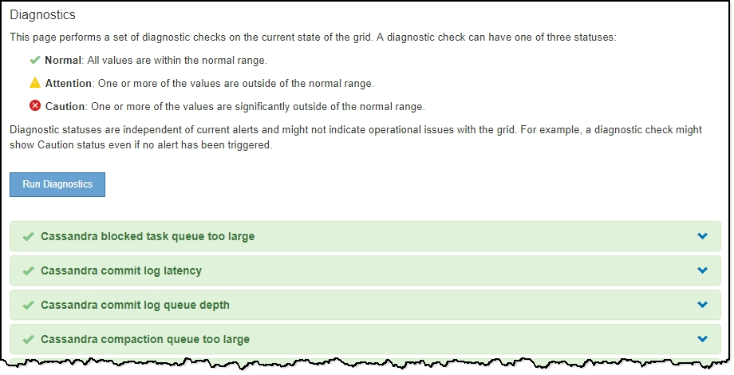

= 使用 StorageGRID 支持选项
:allow-uri-read: 
:icons: font
:imagesdir: ../media/

[role="lead"]
网格管理器提供了一些选项，可帮助您在 StorageGRID 系统出现问题描述 时与技术支持联系。

== 配置 AutoSupport

通过 AutoSupport 功能， StorageGRID 系统可以向技术支持发送运行状况和状态消息。使用 AutoSupport 可以显著加快问题的确定和解决速度。技术支持还可以监控系统的存储需求，并帮助您确定是否需要添加新节点或站点。您也可以将 AutoSupport 消息配置为发送到另一个目标。

您可以使用网格管理器配置 AutoSupport （ * 支持 * > * 工具 * > * AutoSupport * ）。* AutoSupport * 页面有两个选项卡： * 设置 * 和 * 结果 * 。

image::../media/autosupport_accessing_settings.png[网格管理器中的 AutoSupport 页面]

=== AutoSupport 消息中包含的信息

AutoSupport 消息包含如下信息：

* StorageGRID 软件版本
* 操作系统版本
* 系统级别和位置级别属性信息
* 近期警报和警报（旧系统）
* 所有网格任务的当前状态，包括历史数据
* 管理节点数据库使用情况
* 丢失或缺失对象的数量
* 网格配置设置
* NMS 实体
* 活动 ILM 策略
* 已配置网格规范文件
* 诊断指标

您可以在首次安装 StorageGRID 时启用 AutoSupport 功能和各个 AutoSupport 选项，也可以稍后启用它们。如果未启用 AutoSupport ，网格管理器信息板上将显示一条消息。此消息包含指向 AutoSupport 配置页面的链接。

image::../media/autosupport_disabled_message.png[AutoSupport 已禁用消息]

如果关闭此消息，则此消息将不会再次显示，直到清除浏览器缓存为止，即使 AutoSupport 仍处于禁用状态。

=== 使用 Active IQ

Active IQ 是一名基于云的数字顾问，利用 NetApp 客户群的预测性分析和社区智慧。其持续风险评估，预测性警报，规范化指导和自动化操作可帮助您在问题发生之前防患于未然，从而改善系统运行状况并提高系统可用性。

如果要使用 NetApp 支持站点上的 Active IQ 信息板和功能，则必须启用 AutoSupport 。

https://docs.netapp.com/us-en/active-iq/index.html["Active IQ 数字顾问文档"^]

== 收集 StorageGRID 日志

为了帮助解决问题，您可能需要收集日志文件并将其转发给技术支持。

StorageGRID 使用日志文件捕获事件，诊断消息和错误情况。每个网格节点都会维护 bycast.log 文件，它是主要的故障排除文件。StorageGRID 还会为各个 StorageGRID 服务创建日志文件，与部署和维护活动相关的日志文件以及与第三方应用程序相关的日志文件。

拥有适当权限且知道 StorageGRID 系统配置密码短语的用户可以使用网格管理器中的日志页面收集日志文件，系统数据和配置数据。收集日志时，您可以选择一个或多个节点并指定时间段。数据会收集并归档在 ` .tar.gz` 文件中，您可以将该文件下载到本地计算机。在此文件中，每个网格节点都有一个日志文件归档。

image::../media/support_logs_select_nodes.png[日志收集 UI 的屏幕截图]

== 使用指标并运行诊断

对问题描述 进行故障排除时，您可以与技术支持人员一起查看 StorageGRID 系统的详细指标和图表。您还可以运行预构建的诊断查询，主动评估 StorageGRID 系统的关键值。

=== 指标页面

您可以通过指标页面访问 Prometheus 和 Grafana 用户界面。Prometheus 是用于收集指标的开源软件。Grafana 是用于可视化指标的开源软件。

IMPORTANT: 指标页面上提供的工具供技术支持使用。这些工具中的某些功能和菜单项有意不起作用，可能会发生更改。

image::../media/metrics_page.png[指标页面]

您可以通过指标页面的 Prometheus 部分中的链接查询 StorageGRID 指标的当前值，并查看这些值随时间变化的图形。

image::../media/metrics_page_prometheus.png[指标页面说明]

NOTE: 名称中包含 _private_ 的指标仅供内部使用，在 StorageGRID 版本之间可能会发生更改，恕不另行通知。

您可以通过指标页面的 Grafana 部分中的链接访问预构建的信息板，其中包含一段时间内的 StorageGRID 指标图形。

image::../media/metrics_page_grafana.png[指标页面 Grafana]

=== 诊断页面

" 诊断 " 页面会对网格的当前状态执行一组预先构建的诊断检查。在此示例中，所有诊断均处于正常状态。

单击特定诊断可以查看有关诊断及其当前结果的详细信息。

在此示例中，显示了 StorageGRID 系统中每个节点的当前 CPU 利用率。所有节点值均低于警示和警示阈值，因此诊断的整体状态为正常。

image::../media/support_diagnostics_cpu_utilization.png[支持诊断 CPU 利用率]

.相关信息
* xref:../admin/index.adoc[管理 StorageGRID]
* xref:configuring-network-settings.adoc[配置网络设置]

