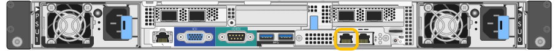

= 访问 StorageGRID 设备安装程序
:allow-uri-read: 
:icons: font
:imagesdir: ../media/

[role="lead"]
您必须访问 StorageGRID 设备安装程序来配置设备与三个 StorageGRID 网络之间的连接：网格网络，管理网络（可选）和客户端网络（可选）。

.您需要什么？ #8217 ；将需要什么
* 您正在使用可连接到 StorageGRID 管理网络的任何管理客户端。
* 客户端具有 xref:../admin/web-browser-requirements.adoc[支持的 Web 浏览器]。
* 服务设备已连接到您计划使用的所有 StorageGRID 网络。
* 您知道这些网络上服务设备的 IP 地址，网关和子网。
* 您已配置计划使用的网络交换机。

要首次访问 StorageGRID 设备安装程序，您可以使用 DHCP 为服务设备上的管理网络端口分配的 IP 地址（假设它已连接到管理网络），也可以将服务笔记本电脑直接连接到服务设备。

.步骤
. 如果可能，请使用服务设备上管理网络端口的 DHCP 地址来访问 StorageGRID 设备安装程序。
+
* SG100 管理网络端口 *

+

+
* SG1000 管理网络端口 *

+
image::../media/sg1000_admin_network_port.png[SG1000 上的管理网络端口]

+
.. 找到服务器设备正面的 MAC 地址标签，然后确定管理网络端口的 MAC 地址。
+
MAC 地址标签列出了 BMC 管理端口的 MAC 地址。

+
要确定管理网络端口的 MAC 地址，必须在标签上的十六进制数字中添加 * 。 2 *例如，如果标签上的 MAC 地址以 *09* 结尾，则管理端口的 MAC 地址将以 *0B* 结尾。如果标签上的 MAC 地址以 * （ _y_ ） FF* 结尾，则管理端口的 MAC 地址将以 * （ _y_+1 ） 01* 结尾。您可以通过在 Windows 中打开 Calculator ，将其设置为程序编程模式，选择十六进制，键入 MAC 地址，然后键入 * + 2 =* 来轻松进行计算。

.. 向网络管理员提供 MAC 地址，以便他们可以在管理网络上查找设备的 DHCP 地址。
.. 在客户端中，输入 StorageGRID 设备安装程序的以下 URL ： + ` * https://_services-appliance_IP_:8443*`
+
对于 ` service-appliation_ip_` ，请使用 DHCP 地址。

.. 如果系统提示您显示安全警报，请使用浏览器的安装向导查看并安装证书。
+
下次访问此 URL 时，不会显示此警报。

+
此时将显示 StorageGRID 设备安装程序主页页面。首次访问此页面时显示的信息和消息取决于设备当前与 StorageGRID 网络的连接方式。可能会显示错误消息，这些消息将在后续步骤中解决。

. 或者，如果无法使用 DHCP 获取 IP 地址，请使用链路本地连接访问 StorageGRID 设备安装程序。
+
.. 使用以太网缆线将服务笔记本电脑直接连接到服务设备上最右侧的 RJ-45 端口。
+
* SG100 链路本地连接 *

+
image::../media/sg100_link_local_port.png[SG100 链路本地连接]

+
* SG1000 链路本地连接 *

+
image::../media/sg1000_link_local_port.png[SG1000 链路本地连接]

.. 打开 Web 浏览器。
.. 输入 StorageGRID 设备安装程序的 URL ： + ` * \https://169.254.0.1:8443*`
+
此时将显示 StorageGRID 设备安装程序主页页面。首次访问此页面时显示的信息和消息取决于设备当前与 StorageGRID 网络的连接方式。可能会显示错误消息，这些消息将在后续步骤中解决。

+

NOTE: 如果无法通过链路本地连接访问主页，请将服务笔记本电脑 IP 地址配置为 `169.254.0.2` ，然后重试。

. 查看主页页面上显示的所有消息，并根据需要配置链路配置和 IP 配置。
+
image::../media/appliance_installer_home_services_appliance.png[设备安装程序主页— SG100 和 SG1000]

