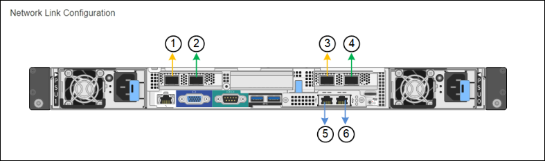
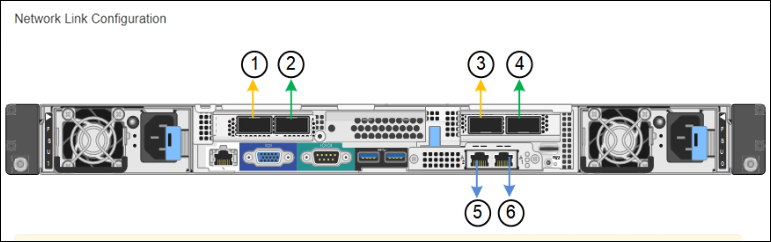
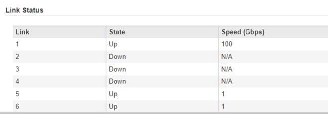

= 配置网络链路（ SG100 和 SG1000 ）
:allow-uri-read: 
:icons: font
:imagesdir: ../media/

[role="lead"]
您可以为用于将设备连接到网格网络，客户端网络和管理网络的端口配置网络链路。您可以设置链路速度以及端口和网络绑定模式。

.您需要什么？ #8217 ；将需要什么
* 您已获得所需的额外设备来满足您的缆线类型和链路速度要求。
* 您已将网络端口连接到支持所选速度的交换机。

如果您计划使用聚合端口绑定模式， LACP 网络绑定模式或 VLAN 标记：

* 您已将设备上的网络端口连接到可支持 VLAN 和 LACP 的交换机。
* 如果多个交换机参与 LACP 绑定，则这些交换机支持多机箱链路聚合组（ MLAG ）或等效项。
* 您了解如何将交换机配置为使用 VLAN ， LACP 和 MLAG 或等效项。
* 您知道要用于每个网络的唯一 VLAN 标记。此 VLAN 标记将添加到每个网络数据包中，以确保网络流量路由到正确的网络。

图中显示了四个网络端口在固定端口绑定模式下的绑定方式（默认配置）。

* SG100 固定端口绑定模式 *

image::../media/sg100_fixed_port_draft.png[SG100 固定端口绑定模式]

* SG1000 固定端口绑定模式 *

image::../media/sg1000_fixed_port.png[SG1000 固定端口绑定模式]

|===
| Callout | 哪些端口已绑定 

 a| 
C
 a| 
如果使用此网络，则端口 1 和 3 将绑定到客户端网络。

 a| 
g
 a| 
网格网络的端口 2 和 4 绑定在一起。

|===
此图显示了四个网络端口在聚合端口绑定模式下的绑定方式。

* SG100 聚合端口绑定模式 *

image::../media/sg100_aggregate_ports.png[聚合端口绑定模式 SG100]

* SG1000 聚合端口绑定模式 *

image::../media/sg1000_aggregate_ports.png[聚合端口绑定模式 SG1000]

|===
| Callout | 哪些端口已绑定 

 a| 
1.
 a| 
所有四个端口都分组在一个 LACP 绑定中，从而允许所有端口用于网格网络和客户端网络流量。

|===
下表总结了用于配置四个网络端口的选项。默认设置以粗体显示。只有在要使用非默认设置时，才需要在链路配置页面上配置设置。

NOTE: LACP 传输哈希策略默认为 layer2+3 模式。如有必要，您可以使用网格管理 API 将其更改为 layer3+4 模式。

* * 固定（默认）端口绑定模式 *
+
|===
| 网络绑定模式 | 客户端网络已禁用（默认） | 已启用客户端网络 

 a| 
Active-Backup （默认）
 a| 
** 端口 2 和 4 对网格网络使用主动备份绑定。
** 不使用端口 1 和 3 。
** VLAN 标记是可选的。

 a| 
** 端口 2 和 4 对网格网络使用主动备份绑定。
** 端口 1 和 3 对客户端网络使用主动备份绑定。
** 为了方便网络管理员，可以为两个网络指定 VLAN 标记。

 a| 
LACP （ 802.3ad ）
 a| 
** 端口 2 和 4 对网格网络使用 LACP 绑定。
** 不使用端口 1 和 3 。
** VLAN 标记是可选的。

 a| 
** 端口 2 和 4 对网格网络使用 LACP 绑定。
** 端口 1 和 3 对客户端网络使用 LACP 绑定。
** 为了方便网络管理员，可以为两个网络指定 VLAN 标记。

|===
* * 聚合端口绑定模式 *
+
|===
| 网络绑定模式 | 客户端网络已禁用（默认） | 已启用客户端网络 

 a| 
仅 LACP （ 802.3ad ）
 a| 
** 端口 1-4 对网格网络使用一个 LACP 绑定。
** 一个 VLAN 标记用于标识网格网络数据包。

 a| 
** 端口 1-4 对网格网络和客户端网络使用一个 LACP 绑定。
** 通过两个 VLAN 标记，可以将网格网络数据包与客户端网络数据包隔离。

|===

有关其他详细信息，请参见有关服务设备的 GbE 端口连接的文章。

此图显示了 SG100 上的两个 1-GbE 管理端口如何在管理网络的主动备份网络绑定模式下绑定。

这些图显示了设备上的两个 1-GbE 管理端口如何在管理网络的主动备份网络绑定模式下绑定。

* 绑定 SG100 管理网络端口 *

image::../media/sg100_bonded_management_ports.png[管理网络端口绑定 SG100]

* 绑定 SG1000 管理网络端口 *

image::../media/sg1000_bonded_management_ports.png[管理网络端口绑定 SG1000]

.步骤
. 从 StorageGRID 设备安装程序的菜单栏中，单击 * 配置网络连接 * > * 链接配置 * 。
+
" 网络链路配置 " 页面显示设备示意图，其中包含编号为的网络和管理端口。

+
* SG100 端口 *

+

+
* SG1000 端口 *

+

+
" 链路状态 " 表列出了已编号端口的链路状态和速度（所示为 SG1000 ）。

+

+
首次访问此页面时：

+
** * 链路速度 * 设置为 * 自动 * 。
** * 端口绑定模式 * 设置为 * 固定 * 。
** 对于网格网络， * 网络绑定模式 * 设置为 * 主动备份 * 。
** 此时将启用 * 管理网络 * ，并将网络绑定模式设置为 * 独立 * 。
** 已禁用 * 客户端网络 * 。
+
image::../media/sg1000_network_link_configuration_fixed.png[已修复网络链路配置]

. 从 * 链路速度 * 下拉列表中选择网络端口的链路速度。
+
您用于网格网络和客户端网络的网络交换机也必须支持此速度并为此速度进行配置。您必须使用适当的适配器或收发器来设置所配置的链路速度。请尽可能使用自动链路速度，因为此选项会与链路配对节点协商链路速度和正向错误更正（ FEC ）模式。

. 启用或禁用计划使用的 StorageGRID 网络。
+
网格网络为必填项。您不能禁用此网络。

+
.. 如果设备未连接到管理网络，请取消选中管理网络的 * 启用网络 * 复选框。
+
image::../media/admin_network_disabled.gif[显示用于启用或禁用管理网络的复选框的屏幕截图]

.. 如果设备已连接到客户端网络，请选中客户端网络的 * 启用网络 * 复选框。
+
此时将显示数据 NIC 端口的客户端网络设置。

. 请参见表，并配置端口绑定模式和网络绑定模式。
+
此示例显示：

+
** 为网格和客户端网络选择了 * 聚合 * 和 * LACP * 。您必须为每个网络指定唯一的 VLAN 标记。您可以选择 0 到 4095 之间的值。
** 已为管理网络选择 * 主动备份 * 。
+
image::../media/sg1000_network_link_configuration_aggregate.png[网络链路配置聚合]

. 对所做的选择感到满意后，单击 * 保存 * 。
+

NOTE: 如果更改了所连接的网络或链路，则可能会断开连接。如果 1 分钟内未重新连接，请使用分配给 StorageGRID 设备的其他 IP 地址之一重新输入此设备安装程序的 URL ： + ` * https://_services_appliance_IP_:8443*`

xref:obtaining-additional-equipment-and-tools-sg100-and-sg1000.adoc[获取其他设备和工具（ SG100 和 SG1000 ）]
