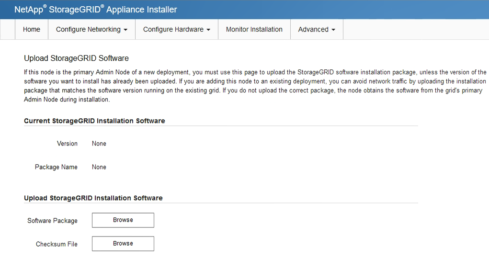
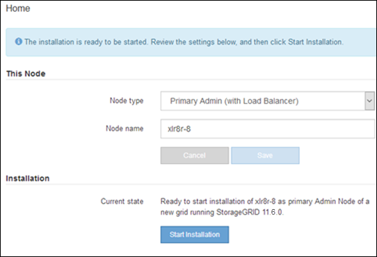

= 将服务设备部署为主管理节点
:allow-uri-read: 
:icons: font
:imagesdir: ../media/

[role="lead"]
在将服务设备部署为主管理节点时，您可以使用设备上提供的 StorageGRID 设备安装程序安装 StorageGRID 软件，或者上传要安装的软件版本。在安装任何其他设备节点类型之前，您必须先安装并配置主管理节点。主管理节点可以连接到网格网络以及可选的管理网络和客户端网络（如果配置了其中一个或两者）。

.您需要的内容
* 此设备已安装在机架或机柜中，并已连接到您的网络并已启动。
* 已使用 StorageGRID 设备安装程序为此设备配置网络链路， IP 地址和端口重新映射（如果需要）。
+

IMPORTANT: 如果已重新映射任何端口，则不能使用相同的端口配置负载平衡器端点。您可以使用重新映射的端口创建端点，但这些端点将重新映射到原始 CLB 端口和服务，而不是负载平衡器服务。按照中的步骤进行操作 xref:../maintain/removing-port-remaps.adoc[删除端口重新映射]。

+
请参见 xref:../admin/how-load-balancing-works-clb-service.adoc[负载平衡的工作原理— CLB 服务（已弃用）] 有关 CLB 服务的详细信息。

+

NOTE: CLB 服务已弃用。

* 您的服务笔记本电脑具有 xref:../admin/web-browser-requirements.adoc[支持的 Web 浏览器]。
* 您知道分配给设备的 IP 地址之一。您可以对任何已连接的 StorageGRID 网络使用此 IP 地址。

.关于此任务
要在设备主管理节点上安装 StorageGRID ，请执行以下操作：

* 您可以使用 StorageGRID 设备安装程序安装 StorageGRID 软件。如果要安装其他版本的软件，请先使用 StorageGRID 设备安装程序上传。
* 软件安装完毕后，请稍候。
* 安装软件后，设备将自动重新启动。

.步骤
. 打开浏览器，然后输入设备的 IP 地址。+ ` * https://_services_appliance_IP_:8443*`
+
此时将显示 StorageGRID 设备安装程序主页页面。

. 在 * 此节点 * 部分中，选择 * 主管理 * 。
. 在 * 节点名称 * 字段中，输入要用于此设备节点的名称，然后单击 * 保存 * 。
+
节点名称将分配给 StorageGRID 系统中的此设备节点。它显示在网格管理器的网格节点页面上。

. 或者，要安装其他版本的 StorageGRID 软件，请执行以下步骤：
+
.. 下载安装归档：https://mysupport.netapp.com/site/products/all/details/storagegrid-appliance/downloads-tab["NetApp下载：StorageGRID 设备"^]。
.. 提取归档。
.. 从 StorageGRID 设备安装程序中，选择 * 高级 * > * 上传 StorageGRID 软件 * 。
.. 单击 * 删除 * 以删除当前软件包。
+
image::../media/appliance_installer_rmv_current_software.png[设备安装程序 - 删除当前软件]

.. 单击 * 浏览 * 下载并提取的软件包，然后单击 * 浏览 * 获取校验和文件。
+

.. 选择 * 主页 * 以返回到主页页面。

. 确认当前状态为 "`Ready to start installation of primary Admin Node name with software version x.y` " ，并且已启用 * 开始安装 * 按钮。
+

NOTE: 如果要将管理节点设备部署为节点克隆目标，请在此停止部署过程，然后按照继续执行节点克隆操作步骤 xref:../maintain/index.adoc[恢复和维护] 说明。

. 在 StorageGRID 设备安装程序主页中，单击 * 开始安装 * 。
+

+
当前状态将更改为 "`Installation is in progress ，` " ，此时将显示监控器安装页面。

+

NOTE: 如果需要手动访问监控器安装页面，请单击菜单栏中的 * 监控器安装 * 。

