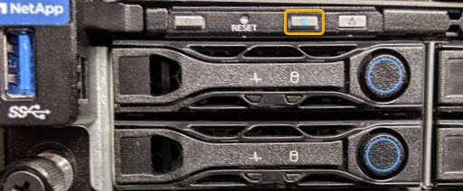

= 打开和关闭控制器标识 LED
:allow-uri-read: 
:icons: font
:imagesdir: ../media/

[role="lead"]
可以打开控制器正面和背面的蓝色标识 LED ，以帮助在数据中心中找到设备。

.您需要的内容
您必须具有要标识的控制器的 BMC IP 地址。

.步骤
. 访问控制器 BMC 界面。
. 选择 * 服务器标识 * 。
. 选择 * 开 * ，然后选择 * 执行操作 * 。
+
image::../media/sg6060_service_identify_turn_on.jpg[打开 BMC 中的控制器识别 LED]

.结果
控制器正面（如图所示）和背面的蓝色标识 LED 亮起。

NOTE: 如果控制器上安装了挡板，则可能很难看到正面的识别 LED 。

.完成后
要关闭控制器识别 LED ，请执行以下操作：

* 按下控制器前面板上的识别 LED 开关。
* 从控制器 BMC 界面中，选择 * 服务器标识 * ，选择 * 关闭 * ，然后选择 * 执行操作 * 。

控制器正面和背面的蓝色标识 LED 熄灭。

image::../media/sg6060_front_panel_service_led_off.jpg[正面识别 LED —熄灭]

.相关信息
xref:locating-controller-in-data-center.adoc[在数据中心中找到控制器]

xref:accessing-bmc-interface-sg1000.adoc[访问 BMC 界面]
