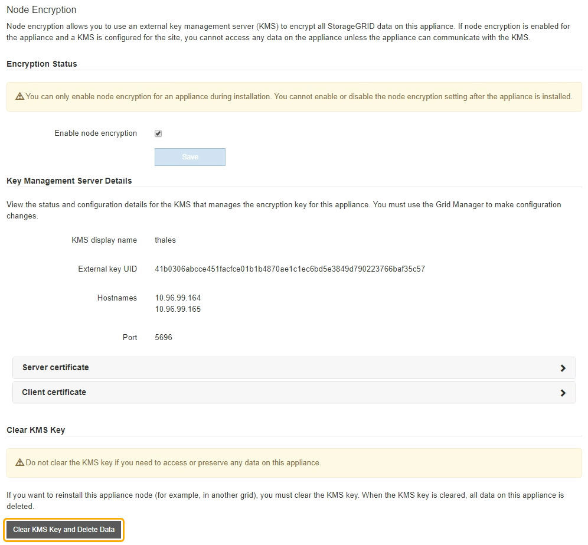

= 清除密钥管理服务器配置
:allow-uri-read: 
:icons: font
:imagesdir: ../media/

[role="lead"]
清除密钥管理服务器（ KMS ）配置将禁用设备上的节点加密。清除 KMS 配置后，设备上的数据将被永久删除，并且无法再访问。此数据不可恢复。

如果需要保留设备上的数据，则必须先执行节点停用操作步骤 或克隆节点，然后才能清除 KMS 配置。

IMPORTANT: 清除 KMS 后，设备上的数据将被永久删除，并且无法再访问。此数据不可恢复。

xref:../maintain/grid-node-decommissioning.adoc[停用节点] 将其包含的任何数据移动到 StorageGRID 中的其他节点。

清除设备 KMS 配置将禁用节点加密，从而删除设备节点与 StorageGRID 站点的 KMS 配置之间的关联。然后，设备上的数据将被删除，并且设备将保持预安装状态。此过程不能逆转。

必须清除 KMS 配置：

* 在将设备安装到不使用 KMS 或使用其他 KMS 的其他 StorageGRID 系统之前，请先安装此设备。
+

IMPORTANT: 如果您计划在使用相同 KMS 密钥的 StorageGRID 系统中重新安装设备节点，请勿清除 KMS 配置。

* 在恢复和重新安装 KMS 配置丢失且 KMS 密钥不可恢复的节点之前。
* 在退回您的站点上先前使用的任何设备之前。
* 停用已启用节点加密的设备后。

IMPORTANT: 在清除 KMS 以将其数据移动到 StorageGRID 系统中的其他节点之前，请停用此设备。在停用设备之前清除 KMS 将导致数据丢失，并可能导致设备无法运行。

.步骤
. 打开浏览器，然后输入设备计算控制器的 IP 地址之一。+ ` * https://_Controller_IP_:8443*`
+
` Controller_IP_` 是三个 StorageGRID 网络中任意一个网络上计算控制器（而不是存储控制器）的 IP 地址。

+
此时将显示 StorageGRID 设备安装程序主页页面。

. 选择 * 配置硬件 * > * 节点加密 * 。
+

+

IMPORTANT: 如果清除了 KMS 配置，则设备上的数据将被永久删除。此数据不可恢复。

. 在窗口底部，选择 * 清除 KMS 密钥和删除数据 * 。
. 如果确实要清除 KMS 配置，请键入 + ` * clear*` + 并选择 * 清除 KMS 密钥和删除数据 * 。
+
image::../media/fde_disable_confirmation.png[kms clear 确认]

+
KMS 加密密钥和所有数据将从节点中删除，设备将重新启动。这可能需要长达 20 分钟。

. 打开浏览器，然后输入设备计算控制器的 IP 地址之一。+ ` * https://_Controller_IP_:8443*`
+
` Controller_IP_` 是三个 StorageGRID 网络中任意一个网络上计算控制器（而不是存储控制器）的 IP 地址。

+
此时将显示 StorageGRID 设备安装程序主页页面。

. 选择 * 配置硬件 * > * 节点加密 * 。
. 验证是否已禁用节点加密，以及是否已从窗口中删除 * 密钥管理服务器详细信息 * 和 * 清除 KMS 密钥和删除数据 * 控件中的密钥和证书信息。
+
在将设备重新安装到网格中之前，无法在设备上重新启用节点加密。

在设备重新启动并确认 KMS 已清除且设备处于预安装状态后，您可以从 StorageGRID 系统中物理删除此设备。有关的信息，请参见恢复和维护说明 xref:../maintain/preparing-appliance-for-reinstallation-platform-replacement-only.adoc[准备要重新安装的设备]。

xref:../admin/index.adoc[管理 StorageGRID]
