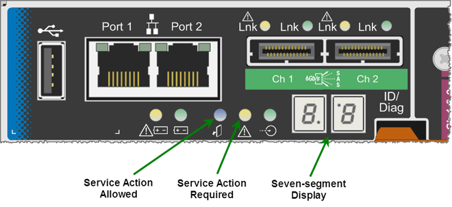

= E5600SG 控制器七段显示代码
:allow-uri-read: 
:icons: font
:imagesdir: ../media/

[role="lead"]
E5600SG 控制器上的七段显示在设备启动和硬件初始化期间显示状态和错误代码。您可以使用这些代码确定状态并对错误进行故障排除。

查看 E5600SG 控制器上的状态和错误代码时，您应查看以下类型的代码：

* * 常规启动代码 *
+
表示标准启动事件。

* * 正常启动代码 *
+
表示设备中发生的正常启动事件。

* * 错误代码 *
+
指示启动事件期间的问题。

StorageGRID 仅控制 E5600SG 控制器上的以下 LED ，并且仅在 StorageGRID 设备安装程序启动后才控制此 LED ：

* 允许服务操作 LED
* 需要执行服务操作 LED
* 七段式显示

StorageGRID 设备不会使用七段显示中的小数点：

* 与最小有效位数相邻的小数点上限为平台诊断 LED 。
+
在重置和初始硬件配置期间会启用此功能。否则，它将关闭。

* 与最重要数字相邻的小数点下限将关闭。

要诊断其他问题，您可能需要查看以下资源：

* 要查看所有其他硬件和环境诊断信息，请参见 E 系列操作系统硬件诊断。
+
其中包括查找电源，温度和磁盘驱动器等硬件问题。该设备依靠 E 系列操作系统监控所有平台环境状态。

* 要确定固件和驱动程序问题，请查看 SAS 和网络端口上的链路指示灯。
+
有关详细信息，请参见 E 系列 E5600 文档。

== 常规启动代码

在启动期间或硬件硬重置后，硬件初始化期间，允许服务操作和需要服务操作 LED 亮起。七段显示屏显示一系列代码，这些代码对于 E 系列硬件是相同的，而不是特定于 E5600SG 控制器的。

在启动期间，现场可编程门阵列（ Field Programmable Gate Array ， FPGA ）可控制硬件的功能和初始化。

|===
| 代码 | 指示 

 a| 
19
 a| 
FPGA 初始化。

 a| 
68
 a| 
FPGA 初始化。

 a| 
...
 a| 
FPGA 初始化。这是一个快速连续的代码。

 a| 
AA.
 a| 
平台 BIOS 启动。

 a| 
FF
 a| 
BIOS 启动完成。这是 E5600SG 控制器初始化和管理 LED 以指示状态之前的中间状态。

|===
出现 AA 和 FF 代码后，将显示正常启动代码或错误代码。此外，允许服务操作和需要服务操作 LED 也会关闭。

== 正常启动代码

这些代码按时间顺序表示设备中发生的正常启动事件。

|===
| 代码 | 指示 

 a| 
您好
 a| 
主启动脚本已启动。

 a| 
p
 a| 
平台 FPGA 固件正在检查更新。

 a| 
HP
 a| 
主机接口卡（ HIC ）正在检查更新。

 a| 
RB
 a| 
固件更新后，系统将根据需要重新启动。

 a| 
FP
 a| 
固件更新检查已完成。启动与 E2700 控制器进行通信和管理的进程（ utmagent ）。此过程有利于设备配置。

 a| 
他
 a| 
系统正在与 E 系列操作系统同步。

 a| 
HC
 a| 
正在检查 StorageGRID 安装。

 a| 
好的
 a| 
正在进行安装管理和主动连接。

 a| 
HA
 a| 
Linux 操作系统和 StorageGRID 正在运行。

|===

== E5600SG 控制器错误代码

这些代码表示设备启动时 E5600SG 控制器上可能显示的错误情况。如果发生特定的低级硬件错误，则会显示其他两位十六进制代码。如果其中任何一个代码持续一两秒以上，或者您无法通过执行规定的故障排除过程之一来解决此错误，请联系技术支持。

|===
| 代码 | 指示 

 a| 
22.
 a| 
在任何启动设备上均未找到主启动记录。

 a| 
23
 a| 
未安装 SATA 驱动器。

 a| 
2A ， 2B
 a| 
总线卡滞，无法读取 DIMM SPD 数据。

 a| 
40
 a| 
DIMM 无效。

 a| 
41.
 a| 
DIMM 无效。

 a| 
42
 a| 
内存测试失败。

 a| 
51
 a| 
SPD 读取失败。

 a| 
92 到 96
 a| 
PCI 总线初始化。

 a| 
A0 到 A3
 a| 
SATA 驱动器初始化。

 a| 
AB
 a| 
备用启动代码。

 a| 
AE
 a| 
正在启动操作系统。

 a| 
EA
 a| 
DDR3 培训失败。

 a| 
E8.
 a| 
未安装内存。

 a| 
欧盟
 a| 
未找到安装脚本。

 a| 
EP
 a| 
"ManagementSGa" 代码指示与 E2700 控制器的 pregrid 通信失败。

|===
.相关信息
xref:troubleshooting-hardware-installation.adoc[硬件安装故障排除（ SG5600 ）]

https://mysupport.netapp.com/site/global/dashboard["NetApp 支持"^]
