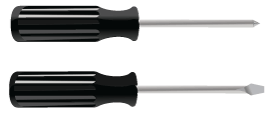

= 获取其他设备和工具（ SG5600 ）
:allow-uri-read: 
:icons: font
:imagesdir: ../media/

[role="lead"]
在安装 SG5600 设备之前，请确认您拥有所需的所有附加设备和工具。

* * 螺丝刀 *
+

+
十字线编号2 把螺丝刀

+
中型平口螺丝刀

* * ESD 腕带 *
+
image::../media/appliance_wriststrap.gif[ESD 腕带]

* * 以太网缆线 *
+
image::../media/appliance_ethernet_cables.gif[以太网缆线]

* * 以太网交换机 *
+

* * 服务笔记本电脑 *xref:../admin/web-browser-requirements.adoc[支持的 Web 浏览器]
+
image::../media/appliance_laptop.gif[管理工作站]

