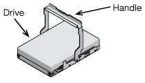
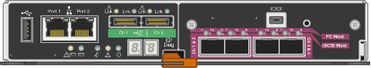

= 打开包装箱（ SG5600 ）
:allow-uri-read: 
:icons: font
:imagesdir: ../media/

[role="lead"]
安装 StorageGRID 设备之前，请打开所有包装箱的包装，并将包装箱上的物品与包装清单上的物品进行比较。

* * SG5660 机箱，一个 4U 机箱，含 60 个驱动器 *
+
image::../media/appliance_enclosure.gif[4U 机箱]

* * SG5612 机箱，一个 2U 机箱，含 12 个驱动器 *
+
image::../media/appliance_enclosure_2u.gif[DE1600 2U 机箱]

* * 4U 挡板或 2U 端盖 *
+
image:../media/appliance_bezel.gif["4U 挡板"] image:../media/appliance_bezel_2u_endcaps.gif["2U 端盖"]

* * NL-SAS 驱动器 *
+

+
驱动器预装在 2U SG5612 中，但不安装在 4U SG5660 中，以确保运输安全。

* * E5600SG 控制器 *
+

* * E2700 控制器 *
+
image::../media/sga_controller_2700_diagram.gif[E2700 控制器]

* * 安装导轨和螺钉 *
+
image::../media/appliance_mounting_rail_kit.png[安装导轨套件]

* * 机箱手柄（仅限 4U 机箱） *
+
image::../media/appliance_enclosure_handles.gif[机箱手柄]

== 缆线和连接器

StorageGRID 设备的发货包括以下缆线和连接器：

* * 您所在国家或地区的电源线 *
+
image::../media/appliance_power_cords.gif[电源线]

+
设备随附两根交流电源线，用于连接到外部电源，例如墙上插座。您的机柜可能使用专用电源线，而不是设备随附的电源线。

* * SAS 互连缆线 *
+
image::../media/appliance_mini_sas_cables.gif[迷你 SAS 缆线]

+
两根 0.5 米 SAS 互连缆线，带迷你 SAS HD 和迷你 SAS 连接器。

+
方形连接器插入 E2700 控制器，而方形连接器插入 E5600SG 控制器。

