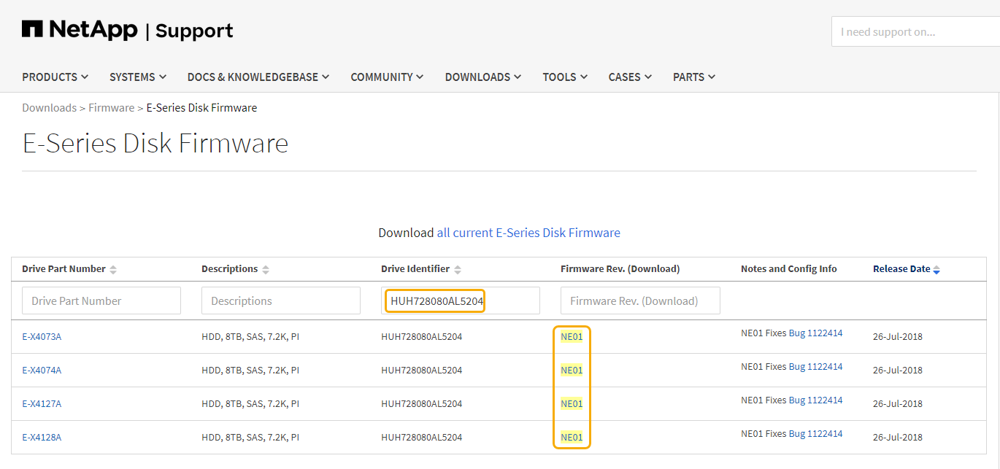

= 使用 SANtricity 存储管理器升级驱动器固件
:allow-uri-read: 
:icons: font
:imagesdir: ../media/

[role="lead"]
您可以升级驱动器固件，以确保具有所有最新功能和错误修复。

.您需要的内容
* 存储设备处于最佳状态。
* 所有驱动器均处于最佳状态。
* 您已安装与您的 SANtricity 版本兼容的最新版本 StorageGRID 存储管理器。
+
xref:upgrading-santricity-os-on-storage-controllers-using-grid-manager-sg5600.adoc[使用网格管理器升级存储控制器上的 SANtricity 操作系统]

+
xref:upgrading-santricity-os-on-e2700-controller-using-maintenance-mode.adoc[使用维护模式升级 E2700 控制器上的 SANtricity 操作系统]

* 您已拥有 xref:placing-appliance-into-maintenance-mode.adoc[已将 StorageGRID 设备置于维护模式]。
+

NOTE: 维护模式会中断与存储控制器的连接，停止所有 I/O 活动并使所有驱动器脱机。

IMPORTANT: 请勿一次升级多个 StorageGRID 设备上的驱动器固件。这样做可能会导致发生原因 数据不可用，具体取决于您的部署模式和 ILM 策略。

.步骤
. 确认此设备已位于中 xref:placing-appliance-into-maintenance-mode.adoc[维护模式]。
. 打开 Web 浏览器，然后输入 IP 地址作为 SANtricity 存储管理器的 URL ： + ` * https://_E2700_Controller_IP_*`
. 如果需要，输入 SANtricity Storage Manager 管理员用户名和密码。
. 在 SANtricity 企业管理中，选择 * 设备 * 选项卡。
+
此时将打开 SANtricity 阵列管理窗口。

. 在 SANtricity 阵列管理中，双击包含要升级的驱动器的存储阵列。
. 验证存储阵列和驱动器是否均处于最佳状态。
. 验证存储设备中当前安装的驱动器固件版本：
+
.. 在 SANtricity 企业管理中，选择 * 升级 * > * 驱动器固件 * 。
+
Download Drive Firmware - Add Packages 窗口将显示当前正在使用的驱动器固件文件。

.. 记下当前驱动器固件版本以及当前固件包下的驱动器标识符。
+
image::../media/sg_storagemanager_upgrade_drive_firmware.png[升级驱动器固件]

+
在此示例中：

+
*** 驱动器固件修订版为 * 。 NE00* 。
*** 驱动器标识符为 * 。 HUH728080AL5204* 。

+
选择 * 查看关联驱动器 * 可显示这些驱动器在存储设备中的安装位置。

. 下载并准备可用的驱动器固件升级：
+
.. 打开 Web 浏览器，导航到 NetApp 支持网站，然后使用您的 ID 和密码登录。
+
https://mysupport.netapp.com/site/["NetApp 支持"^]

.. 在 NetApp 支持网站上，选择 * 下载 * 选项卡，然后选择 * E 系列磁盘驱动器固件 * 。
+
此时将显示 E 系列磁盘固件页面。

.. 搜索存储设备中安装的每个 * 驱动器标识符 * ，并验证每个驱动器标识符是否具有最新的固件版本。
+
*** 如果固件版本不是链接，则此驱动器标识符的固件版本为最新。
*** 如果为驱动器标识符列出了一个或多个驱动器部件号，则可以对这些驱动器进行固件升级。您可以选择任何链接来下载固件文件。
+

.. 如果列出了更高版本的固件，请选择固件修订版中的链接（ download ）列以下载包含固件文件的 ` .zip` 归档。
.. 提取（解压缩）从支持站点下载的驱动器固件归档文件。

. 安装驱动器固件升级：
+
.. 从 SANtricity 存储管理器下载驱动器固件 - 添加软件包窗口中，选择 * 添加 * 。
.. 导航到包含固件文件的目录，并最多选择四个固件文件。
+
驱动器固件文件的文件名类似于 + `D HUC101212CS600_30602291_MS01_2800_0002.DLP`

+
选择多个固件文件以升级同一驱动器的固件可能会导致文件冲突错误。如果发生文件冲突错误，则会显示一个错误对话框。要解决此错误，请选择 * 确定 * 并删除除要用于升级驱动器固件的固件之外的所有其他固件文件。要删除固件文件，请在要传输的软件包信息区域中选择固件文件，然后选择 * 删除 * 。此外，一次最多只能选择四个驱动器固件包。

.. 选择 * 确定 * 。
+
系统将使用您选择的固件文件更新要传输的软件包信息区域。

.. 选择 * 下一步 * 。
+
此时将打开 Download Drive Firmware - Select Drives 窗口。

+
*** 系统会扫描设备中的所有驱动器以获取配置信息和升级资格。
*** 您可以根据存储阵列中的驱动器种类选择使用所选固件升级的兼容驱动器。默认情况下，系统会显示能够作为联机操作进行升级的驱动器。
*** 为驱动器选择的固件将显示在建议的固件信息区域中。如果必须更改固件，请选择 * 返回 * 以返回上一个对话框。

.. 从驱动器升级功能中，选择 * 并行 * 下载操作或 * 全部 * 。
+
由于设备处于维护模式，所有驱动器和所有卷的 I/O 活动都将停止，因此您可以使用上述任一升级方法。

.. 在兼容驱动器中，选择要升级选定固件文件的驱动器。
+
*** 对于一个或多个驱动器，选择要升级的每个驱动器。
*** 对于所有兼容驱动器，请选择 * 全选 * 。
+
最佳实践是，将所有相同型号的驱动器升级到相同的固件修订版。

.. 选择 * 完成 * ；然后键入 `yes` 并选择 * 确定 * 。
+
*** 驱动器固件下载和升级将开始， Download Drive Firmware - progress 用于指示所有驱动器的固件传输状态。
*** 参与升级的每个驱动器的状态将显示在 "Devices updateed" （已更新设备）的 "Transfer Progress" （传输进度）列中。
+
如果在 24 驱动器系统上升级所有驱动器，则并行驱动器固件升级操作可能需要多达 90 秒才能完成。在较大的系统上，执行时间会稍长。

.. 在固件升级过程中，您可以： +
+
*** 选择 * 停止 * 以停止正在进行的固件升级。当前正在进行的任何固件升级均已完成。任何已尝试固件升级的驱动器都会显示其各自的状态。列出的所有剩余驱动器的状态均为 "Not Attemped" 。
+

IMPORTANT: 停止驱动器固件升级过程可能会导致数据丢失或驱动器不可用。

*** 选择 * 另存为 * 以保存固件升级进度摘要的文本报告。此报告将使用默认的 .log 文件扩展名进行保存。如果要更改文件扩展名或目录，请更改保存驱动器下载日志中的参数。

.. 使用 Download Drive Firmware - 进度监控驱动器固件升级的进度。驱动器更新区域包含计划进行固件升级的驱动器列表以及每个驱动器的下载和升级传输状态。
+
参与升级的每个驱动器的进度和状态将显示在传输进度列中。如果在升级期间发生任何错误，请采取适当的建议操作。

+
*** * 待定 *
+
对于已计划但尚未启动的联机固件下载操作，将显示此状态。

*** 正在进行 *
+
正在将固件传输到驱动器。

*** * 正在进行重建 *
+
如果在快速重建驱动器期间发生卷传输，则会显示此状态。这通常是由于控制器重置或故障以及控制器所有者传输卷造成的。

+
系统将启动驱动器的完整重建。

*** * 失败 - 部分 *
+
在出现问题之前，固件仅部分传输到驱动器，从而无法传输其余文件。

*** * 失败 - 状态无效 *
+
此固件无效。

*** * 失败 - 其他 *
+
无法下载固件，可能是因为驱动器出现物理问题。

*** * 未尝试 *
+
未下载固件，原因可能有多种，例如下载在可能发生之前已停止，驱动器不符合升级条件或下载因错误而无法进行。

*** * 成功 *
+
已成功下载此固件。

. 驱动器固件升级完成后：
+
** 要关闭驱动器固件下载向导，请选择 * 关闭 * 。
** 要重新启动向导，请选择 * 传输更多 * 。

. 如果此操作步骤 已成功完成，并且您在节点处于维护模式时还需要执行其他过程，请立即执行。完成后，或者如果遇到任何故障并希望重新启动，请选择 * 高级 * > * 重新启动控制器 * ，然后选择以下选项之一：
+
** 选择 * 重新启动到 StorageGRID *
** 选择 * 重新启动至维护模式 * 以重新启动控制器，同时使节点仍处于维护模式。如果您在操作步骤 期间遇到任何故障并希望重新启动，请选择此选项。节点重新启动至维护模式后，从出现故障的操作步骤 中的相应步骤重新启动。
+
image::../media/reboot_controller_from_maintenance_mode.png[在维护模式下重新启动控制器]

+
设备重新启动并重新加入网格可能需要长达 20 分钟的时间。要确认重新启动已完成且节点已重新加入网格，请返回网格管理器。"* 节点 * " 页面应显示设备节点的正常状态（节点名称左侧没有图标），表示没有处于活动状态的警报，并且节点已连接到网格。

+
image::../media/node_rejoin_grid_confirmation.png[设备节点已重新加入网格]

