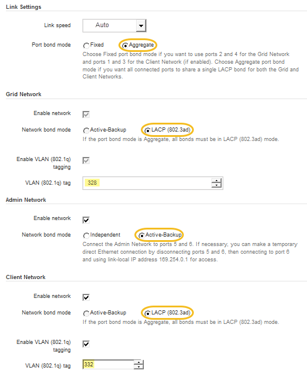

= 配置网络链路（ SG5700 ）
:allow-uri-read: 
:icons: font
:imagesdir: ../media/

[role="lead"]
您可以为用于将设备连接到网格网络，客户端网络和管理网络的端口配置网络链路。您可以设置链路速度以及端口和网络绑定模式。

如果您计划对 10/25/GbE 端口使用 25-GbE 链路速度：

* 您已在计划使用的端口中安装 SFP28 收发器。
* 您已将端口连接到可支持这些功能的交换机。
* 您了解如何配置交换机以使用此较高的速度。

如果您计划对 10/225-GbE 端口使用聚合端口绑定模式， LACP 网络绑定模式或 VLAN 标记：

* 您已将设备上的端口连接到可支持 VLAN 和 LACP 的交换机。
* 如果多个交换机参与 LACP 绑定，则这些交换机支持多机箱链路聚合组（ MLAG ）或等效项。
* 您了解如何将交换机配置为使用 VLAN ， LACP 和 MLAG 或等效项。
* 您知道要用于每个网络的唯一 VLAN 标记。此 VLAN 标记将添加到每个网络数据包中，以确保网络流量路由到正确的网络。
* 如果您计划对管理网络使用主动备份模式，则已将以太网缆线连接到控制器上的两个管理端口。

此图显示了在固定端口绑定模式（默认配置）下四个 10/225-GbE 端口的绑定方式。

image::../media/e5700sg_fixed_port.gif[图中显示了 E5700SG 控制器上的 10/225-GbE 端口如何在固定模式下绑定]

|===
| Callout | 哪些端口已绑定 

 a| 
C
 a| 
如果使用此网络，则端口 1 和 3 将绑定到客户端网络。

 a| 
g
 a| 
网格网络的端口 2 和 4 绑定在一起。

|===
此图显示了四个 10/25GbE 端口在聚合端口绑定模式下的绑定方式。

image::../media/e5700sg_aggregate_port.gif[图中显示了 E5700SG 控制器上的 10/225-GbE 端口如何在聚合模式下绑定]

|===
| Callout | 哪些端口已绑定 

 a| 
1.
 a| 
所有四个端口都分组在一个 LACP 绑定中，从而允许所有端口用于网格网络和客户端网络流量。

|===
下表总结了用于配置四个 10/225-GbE 端口的选项。默认设置以粗体显示。只有在要使用非默认设置时，才需要在链路配置页面上配置设置。

* * 固定（默认）端口绑定模式 *
+
|===
| 网络绑定模式 | 客户端网络已禁用（默认） | 已启用客户端网络 

 a| 
Active-Backup （默认）
 a| 
** 端口 2 和 4 对网格网络使用主动备份绑定。
** 不使用端口 1 和 3 。
** VLAN 标记是可选的。

 a| 
** 端口 2 和 4 对网格网络使用主动备份绑定。
** 端口 1 和 3 对客户端网络使用主动备份绑定。
** 为了方便网络管理员，可以为两个网络指定 VLAN 标记。

 a| 
LACP （ 802.3ad ）
 a| 
** 端口 2 和 4 对网格网络使用 LACP 绑定。
** 不使用端口 1 和 3 。
** VLAN 标记是可选的。

 a| 
** 端口 2 和 4 对网格网络使用 LACP 绑定。
** 端口 1 和 3 对客户端网络使用 LACP 绑定。
** 为了方便网络管理员，可以为两个网络指定 VLAN 标记。

|===
* * 聚合端口绑定模式 *
+
|===
| 网络绑定模式 | 客户端网络已禁用（默认） | 已启用客户端网络 

 a| 
仅 LACP （ 802.3ad ）
 a| 
** 端口 1-4 对网格网络使用一个 LACP 绑定。
** 一个 VLAN 标记用于标识网格网络数据包。

 a| 
** 端口 1-4 对网格网络和客户端网络使用一个 LACP 绑定。
** 通过两个 VLAN 标记，可以将网格网络数据包与客户端网络数据包隔离。

|===

有关端口绑定和网络绑定模式的详细信息，请参见 E5700SG 控制器的 10/225-GbE 端口连接信息。

此图显示了 E5700SG 控制器上的两个 1-GbE 管理端口如何在管理网络的主动备份网络绑定模式下绑定。

image::../media/e5700sg_bonded_management_ports.gif[SG6000 绑定管理端口]

.步骤
. 从 StorageGRID 设备安装程序的菜单栏中，单击 * 配置网络连接 * > * 链接配置 * 。
+
" 网络链路配置 " 页面显示设备示意图，其中包含编号为的网络和管理端口。

+
image::../media/sg5712_configuring_network_ports.png[SG5712 网络和管理端口]

+
链路状态表列出了已编号端口的链路状态（启动 / 关闭）和速度（ 1/25/40/100 Gbps ）。

+
image::../media/sg5712_configuring_network_linkstatus.png[SG5712 链路状态]

+
首次访问此页面时：

+
** * 链路速度 * 设置为 * 10GbE 。
** * 端口绑定模式 * 设置为 * 固定 * 。
** 网格网络的 * 网络绑定模式 * 设置为 * 主动备份 * 。
** 此时将启用 * 管理网络 * ，并将网络绑定模式设置为 * 独立 * 。
** 已禁用 * 客户端网络 * 。
+
image::../media/network_link_configuration_fixed.png[显示默认链路配置设置的屏幕截图]

. 如果您计划对 10/25 GbE 端口使用 25-GbE 链路速度，请从链路速度下拉列表中选择 * 25GbE* 。
+
您用于网格网络和客户端网络的网络交换机也必须支持此速度并为此速度进行配置。SFP28 收发器必须安装在端口中。

. 启用或禁用计划使用的 StorageGRID 网络。
+
网格网络为必填项。您不能禁用此网络。

+
.. 如果设备未连接到管理网络，请取消选中管理网络的 * 启用网络 * 复选框。
+
image::../media/admin_network_disabled.gif[显示用于启用或禁用管理网络的复选框的屏幕截图]

.. 如果设备已连接到客户端网络，请选中客户端网络的 * 启用网络 * 复选框。
+
现在，将显示 10/225-GbE 端口的客户端网络设置。

. 请参见表，并配置端口绑定模式和网络绑定模式。
+
示例显示：

+
** 为网格和客户端网络选择了 * 聚合 * 和 * LACP * 。您必须为每个网络指定唯一的 VLAN 标记。您可以选择 0 到 4095 之间的值。
** 已为管理网络选择 * 主动备份 * 。
+

. 对所做的选择感到满意后，单击 * 保存 * 。
+

NOTE: 如果更改了所连接的网络或链路，则可能会断开连接。如果 1 分钟内未重新连接，请使用分配给 StorageGRID 设备的其他 IP 地址之一重新输入此设备安装程序的 URL ： + ` * https://_E5700SG_Controller_IP_:8443*`

xref:port-bond-modes-for-e5700sg-controller-ports.adoc[E5700SG 控制器端口的端口绑定模式]
