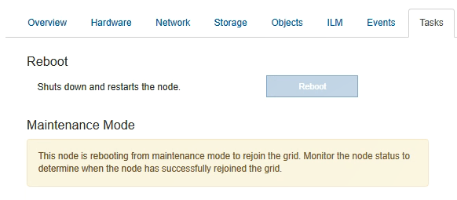

= 更换 E2800 控制器
:icons: font
:imagesdir: ../media/

[role="lead"]
如果 E2800 控制器运行不正常或出现故障，您可能需要更换它。

.关于此任务
* 您的更换控制器的部件号与要更换的控制器相同。
* 您已下载有关更换出现故障的 E2800 控制器箱的单工配置的说明。
+

IMPORTANT: 请仅在收到指示时或需要执行特定步骤的更多详细信息时才参考 E 系列说明。请勿依赖 E 系列说明来更换 StorageGRID 设备中的控制器，因为这些过程是不同的。

* 您可以通过标签来识别连接到控制器的每个缆线。
* 如果所有驱动器都受到保护，您已查看单工 E2800 控制器更换操作步骤 中的步骤，其中包括从 NetApp 支持站点下载并安装 E 系列 SANtricity 存储管理器，然后在更换控制器后使用企业管理窗口（ EMW ）解锁受保护的驱动器。
+

IMPORTANT: 只有在使用已保存的密钥解锁驱动器后，才能使用此设备。

* 您必须具有特定的访问权限。
* 您必须使用登录到网格管理器 xref:../admin/web-browser-requirements.adoc[支持的 Web 浏览器]。

您可以通过以下两种方式确定控制器箱是否发生故障：

* SANtricity System Manager 中的恢复 Guru 可指示您更换控制器。
* 控制器上的琥珀色警示 LED 亮起，表示控制器出现故障。

更换控制器后，无法访问设备存储节点。如果 E2800 控制器运行正常，您可以 xref:placing-appliance-into-maintenance-mode.adoc[将 E5700SG 控制器置于维护模式]。

更换控制器时，您必须从原始控制器中取出电池，然后将其安装到替代控制器中。

NOTE: 设备中的 E2800 控制器不包括主机接口卡（ HIC ）。

.步骤
. 按照 E2800 控制器更换操作步骤 中的说明准备卸下控制器。
+
您可以使用 SANtricity 系统管理器执行这些步骤。

+
.. 记下控制器上当前安装的 SANtricity OS 软件版本。
.. 记下当前安装的 NVSRAM 版本。
.. 如果启用了驱动器安全功能，请确保存在已保存的密钥，并且您知道安装该密钥所需的密码短语。
+

IMPORTANT: * 可能会丢失数据访问机会 -* 如果设备中的所有驱动器均已启用安全性，则新控制器将无法访问此设备，除非您使用 SANtricity 存储管理器中的企业管理窗口解锁受保护的驱动器。

.. 备份配置数据库。
+
如果删除控制器时出现问题，您可以使用保存的文件还原配置。

.. 收集设备的支持数据。
+

NOTE: 在更换组件之前和之后收集支持数据可确保在更换组件无法解决问题时，您可以向技术支持发送一整套日志。

. 如果 StorageGRID 设备正在 StorageGRID 系统中运行， xref:placing-appliance-into-maintenance-mode.adoc[将 E5700SG 控制器置于维护模式]。
. 如果 E2800 控制器运行充分，可以进行可控的关闭，请确认所有操作均已完成。
+
.. 从 SANtricity 系统管理器的主页中，选择 * 查看正在执行的操作 * 。
.. 确认所有操作均已完成。

. 从设备中删除控制器：
+
.. 戴上 ESD 腕带或采取其他防静电预防措施。
.. 为缆线贴上标签，然后断开缆线和 SFP 的连接。
+

IMPORTANT: To prevent degraded performance, do not twist, fold, pinch, or step on the cables.

.. 通过挤压凸轮把手上的闩锁，直到其释放，然后打开右侧的凸轮把手，将控制器从设备中释放。
.. 用两只手和凸轮把手将控制器滑出设备。
+

IMPORTANT: 请始终用双手支撑控制器的重量。

.. 将控制器放在无静电的平面上，可拆卸盖朝上。
.. 向下按按钮并滑动外盖，以卸下外盖。

. 从发生故障的控制器中取出电池，然后将其安装到替代控制器中：
+
.. 确认控制器（电池和 DIMM 之间）中的绿色 LED 熄灭。
+
如果此绿色 LED 亮起，则表示控制器仍在使用电池电源。您必须等待此 LED 熄灭，然后才能卸下任何组件。

+
image::../media/e2800_internal_cache_active_led.gif[E2800 上的绿色 LED]

+
|===
| 项目 | Description 

 a| 
1.
 a| 
内部缓存活动 LED

 a| 
2.
 a| 
电池

|===
.. 找到电池的蓝色释放闩锁。
.. 向下推动释放闩锁并将其从控制器中移出，以解锁电池。
+
image::../media/e2800_remove_battery.gif[电池闩锁]

+
|===
| 项目 | Description 

 a| 
1.
 a| 
电池释放闩锁

 a| 
2.
 a| 
电池

|===
.. 抬起电池，将其滑出控制器。
.. 从更换用的控制器上卸下盖板。
.. 调整更换控制器的方向，使电池插槽面向您。
.. 将电池略微向下插入控制器。
+
您必须将电池前部的金属法兰插入控制器底部的插槽中，然后将电池顶部滑入控制器左侧的小对齐销下。

.. 向上移动电池闩锁以固定电池。
+
当闩锁卡入到位时，闩锁的底部会挂到机箱上的金属插槽中。

.. 将控制器翻转，以确认电池安装正确。
+

IMPORTANT: * 可能的硬件损坏 * —电池正面的金属法兰必须完全插入控制器上的插槽（如第一图所示）。如果电池安装不正确（如图 2 所示），则金属法兰可能会接触控制器板，从而导致损坏。

+
*** * 正确—电池的金属法兰已完全插入控制器上的插槽： *
+
image::../media/e2800_battery_flange_ok.gif[电池法兰正确]

*** * 不正确 - 电池的金属法兰未插入控制器上的插槽： *
+
image::../media/e2800_battery_flange_not_ok.gif[电池法兰不正确]

.. 更换控制器盖板。

. 将替代控制器安装到设备中。
+
.. 将控制器翻转，使可拆卸盖朝下。
.. 在凸轮把手处于打开位置的情况下，将控制器完全滑入设备中。
.. 将凸轮把手移至左侧，将控制器锁定到位。
.. 更换缆线和 SFP 。
.. 等待 E2800 控制器重新启动。验证七段显示屏是否显示状态 `99` 。
.. 确定如何为替代控制器分配 IP 地址。
+

NOTE: 为替代控制器分配 IP 地址的步骤取决于您是否已将管理端口 1 连接到使用 DHCP 服务器的网络，以及所有驱动器是否都安全。

+
*** 如果管理端口 1 连接到使用 DHCP 服务器的网络，则新控制器将从 DHCP 服务器获取其 IP 地址。此值可能与原始控制器的 IP 地址不同。
*** 如果所有驱动器都受到保护，则必须使用 SANtricity 存储管理器中的企业管理窗口（ EMW ）解锁受保护的驱动器。只有在使用已保存的密钥解锁驱动器后，才能访问新控制器。有关更换单工 E2800 控制器的信息，请参见 E 系列说明。

. 如果设备使用安全驱动器，请按照 E2800 控制器更换操作步骤 中的说明导入驱动器安全密钥。
. 将设备恢复到正常运行模式。在 StorageGRID 设备安装程序中，选择 * 高级 * > * 重新启动控制器 * ，然后选择 * 重新启动至 StorageGRID * 。
+
image::../media/reboot_controller_from_maintenance_mode.png[在维护模式下重新启动控制器]

+
在重新启动期间，将显示以下屏幕：

+

+
设备将重新启动并重新加入网格。此过程可能需要长达 20 分钟。

. 确认重新启动已完成，并且节点已重新加入网格。在网格管理器中，验证节点页面是否显示设备节点的正常状态（节点名称左侧没有图标），表示没有活动警报且节点已连接到网格。
+
image::../media/node_rejoin_grid_confirmation.png[设备节点已重新加入网格]

. 从 SANtricity 系统管理器中，确认新控制器处于最佳状态，然后收集支持数据。

http://mysupport.netapp.com/info/web/ECMP1658252.html["NetApp E 系列系统文档站点"^]
