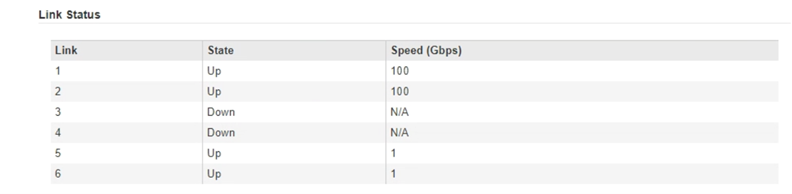

= 配置网络链路(SG6000系列)
:allow-uri-read: 
:icons: font
:imagesdir: ../media/

[role="lead"]
您可以为用于将设备连接到网格网络，客户端网络和管理网络的端口配置网络链路。您可以设置链路速度以及端口和网络绑定模式。

.您需要的内容
如果要克隆设备节点，请为源设备节点使用的所有链路配置目标设备的网络链路。

如果您计划使用 25 GbE 链路速度：

* 您正在使用 SFP28 双轴缆线，或者已在计划使用的网络端口中安装 SFP28 收发器。
* 您已将网络端口连接到可支持这些功能的交换机。
* 您了解如何配置交换机以使用此较高的速度。

如果您计划使用聚合端口绑定模式， LACP 网络绑定模式或 VLAN 标记：

* 您已将设备上的网络端口连接到可支持 VLAN 和 LACP 的交换机。
* 如果多个交换机参与 LACP 绑定，则这些交换机支持多机箱链路聚合组（ MLAG ）或等效项。
* 您了解如何将交换机配置为使用 VLAN ， LACP 和 MLAG 或等效项。
* 您知道要用于每个网络的唯一 VLAN 标记。此 VLAN 标记将添加到每个网络数据包中，以确保网络流量路由到正确的网络。

.关于此任务
此图显示了四个网络端口在固定端口绑定模式下的绑定方式（默认配置）。

image::../media/sg6000_cn_fixed_port.gif[图中显示了 SG6000-CN 控制器上的网络端口如何在固定模式下绑定]

[cols="1a,3a"]
|===
| Callout | 哪些端口已绑定 

 a| 
C
 a| 
如果使用此网络，则端口 1 和 3 将绑定到客户端网络。

 a| 
g
 a| 
网格网络的端口 2 和 4 绑定在一起。

|===
此图显示了四个网络端口在聚合端口绑定模式下的绑定方式。

image::../media/sg6000_cn_aggregate_port.gif[图中显示了 SG6000-CN 控制器上的网络端口如何在聚合模式下绑定]

[cols="1a,3a"]
|===
| Callout | 哪些端口已绑定 

 a| 
1.
 a| 
所有四个端口都分组在一个 LACP 绑定中，从而允许所有端口用于网格网络和客户端网络流量。

|===
下表汇总了用于配置四个网络端口的选项。默认设置以粗体显示。只有在要使用非默认设置时，才需要在链路配置页面上配置设置。

* * 固定（默认）端口绑定模式 *
+
[cols="1a,3a,3a"]
|===
| 网络绑定模式 | 客户端网络已禁用（默认） | 已启用客户端网络 

 a| 
Active-Backup （默认）
 a| 
** 端口 2 和 4 对网格网络使用主动备份绑定。
** 不使用端口 1 和 3 。
** VLAN 标记是可选的。

 a| 
** 端口 2 和 4 对网格网络使用主动备份绑定。
** 端口 1 和 3 对客户端网络使用主动备份绑定。
** 可以为两个网络指定VLAN标记。

 a| 
LACP （ 802.3ad ）
 a| 
** 端口 2 和 4 对网格网络使用 LACP 绑定。
** 不使用端口 1 和 3 。
** VLAN 标记是可选的。

 a| 
** 端口 2 和 4 对网格网络使用 LACP 绑定。
** 端口 1 和 3 对客户端网络使用 LACP 绑定。
** 可以为两个网络指定VLAN标记。

|===
* * 聚合端口绑定模式 *
+
[cols="1a,3a,3a"]
|===
| 网络绑定模式 | 客户端网络已禁用（默认） | 已启用客户端网络 

 a| 
仅 LACP （ 802.3ad ）
 a| 
** 端口 1-4 对网格网络使用一个 LACP 绑定。
** 一个 VLAN 标记用于标识网格网络数据包。

 a| 
** 端口 1-4 对网格网络和客户端网络使用一个 LACP 绑定。
** 通过两个 VLAN 标记，可以将网格网络数据包与客户端网络数据包隔离。

|===

请参见 xref:port-bond-modes-for-sg6000-cn-controller.adoc[SG6000-CN 控制器的端口绑定模式] 有关端口绑定和网络绑定模式的详细信息。

此图显示了 SG6000-CN 控制器上的两个 1-GbE 管理端口如何在管理网络的主动备份网络绑定模式下绑定。

image::../media/sg6000_cn_bonded_managemente_ports.gif[已绑定管理网络端口]

.步骤
. 在 StorageGRID 设备安装程序中，单击 * 配置网络连接 * > * 链路配置 * 。
+
" 网络链路配置 " 页面显示设备示意图，其中包含编号为的网络和管理端口。

+
image::../media/sg6060_configuring_network_ports.png[SG6060 网络端口]

+
链路状态表列出了已编号端口的链路状态（启动 / 关闭）和速度（ 1/25/40/100 Gbps ）。

+

+
首次访问此页面时：

+
** * 链路速度 * 设置为 * 自动 * 。
** * 端口绑定模式 * 设置为 * 固定 * 。
** 对于网格网络， * 网络绑定模式 * 设置为 * 主动备份 * 。
** 此时将启用 * 管理网络 * ，并将网络绑定模式设置为 * 独立 * 。
** 已禁用 * 客户端网络 * 。
+
image::../media/network_link_configuration_fixed.png[已修复网络链路配置]

. 如果您计划对网络端口使用 25 GbE 链路速度，请从链路速度下拉列表中选择 * 自动 * 。
+
您用于网格网络和客户端网络的网络交换机也必须支持此速度并为此速度进行配置。您必须使用 SFP28 双轴缆线或光缆和 SFP28 收发器。

. 启用或禁用计划使用的 StorageGRID 网络。
+
网格网络为必填项。您不能禁用此网络。

+
.. 如果设备未连接到管理网络，请取消选中管理网络的 * 启用网络 * 复选框。
+
image::../media/admin_network_disabled.gif[显示用于启用或禁用管理网络的复选框的屏幕截图]

.. 如果设备已连接到客户端网络，请选中客户端网络的 * 启用网络 * 复选框。
+
此时将显示网络端口的客户端网络设置。

. 请参见表，并配置端口绑定模式和网络绑定模式。
+
此示例显示：

+
** 为网格和客户端网络选择了 * 聚合 * 和 * LACP * 。您必须为每个网络指定唯一的 VLAN 标记。您可以选择 0 到 4095 之间的值。
** 已为管理网络选择 * 主动备份 * 。
+
image::../media/network_link_configuration_aggregate.gif[显示聚合模式的链路配置设置的屏幕截图]

. 对所做的选择感到满意后，单击 * 保存 * 。
+

NOTE: 如果更改了所连接的网络或链路，则可能会断开连接。如果您未在 1 分钟内重新连接，请使用其他 URL 之一重新输入 StorageGRID 设备安装程序的 URL xref:configuring-storagegrid-ip-addresses-sg6000.adoc[IP 地址] 已分配给设备： ` * https://_SG6000-CN_Controller_IP_:8443*`

