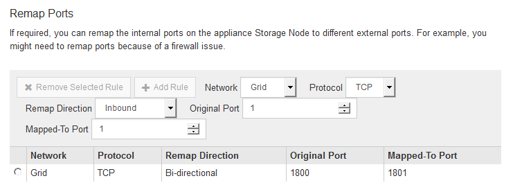

= 可选：重新映射设备的网络端口
:icons: font
:imagesdir: ../media/

[role="lead"]
您可能需要将设备存储节点上的内部端口重新映射到不同的外部端口。例如，由于使用了防火墙问题描述 ，您可能需要重新映射端口。

.您需要什么？ #8217 ；将需要什么
* 您先前已访问 StorageGRID 设备安装程序。
* 您尚未配置，也不打算配置负载平衡器端点。
+

NOTE: 如果重新映射任何端口，则不能使用相同的端口来配置负载平衡器端点。如果要配置负载平衡器端点且已重新映射端口，请按照中的步骤进行操作 xref:../maintain/removing-port-remaps.adoc[删除端口重新映射]。

.步骤
. 在 StorageGRID 设备安装程序中，单击 * 配置网络连接 * > * 删除端口 * 。
+
此时将显示 Remap Port 页面。

. 从 * 网络 * 下拉框中，为要重新映射的端口选择网络：网格，管理员或客户端。
. 从 * 协议 * 下拉框中，选择 IP 协议： TCP 或 UDP 。
. 从 * 映射方向 * 下拉框中，选择要为此端口重新映射的流量方向：入站，出站或双向。
. 对于 * 原始端口 * ，输入要重新映射的端口的编号。
. 对于 * 映射到端口 * ，请输入要使用的端口编号。
. 单击 * 添加规则 * 。
+
此时，新端口映射将添加到表中，重新映射将立即生效。

+

. 要删除端口映射，请选择要删除的规则对应的单选按钮，然后单击 * 删除选定规则 * 。

