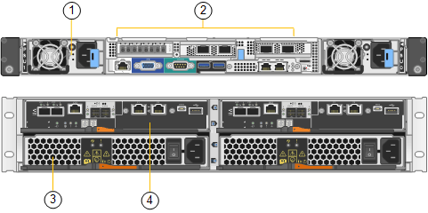

= SGF6024 概述
:allow-uri-read: 
:icons: font
:imagesdir: ../media/

[role="lead"]
StorageGRIDSGF6024 包括一个计算控制器和一个存储控制器架，可容纳 24 个固态驱动器。

== SGF6024 组件

SGF6024 设备包括以下组件：

|===
| 组件 | Description 

 a| 
计算控制器
 a| 
SG6000-CN 控制器，一种单机架单元（ 1U ）服务器，其中包括：

* 40 个核心（ 80 个线程）
* 192 GB RAM
* 高达 4 × 25 Gbps 聚合以太网带宽
* 4 × 16 Gbps 光纤通道（ FC ）互连
* 可简化硬件管理的基板管理控制器（ BMC ）
* 冗余电源

 a| 
闪存阵列（控制器架）
 a| 
E 系列 EF570 闪存阵列（也称为控制器架），一个 2U 磁盘架，其中包括：

* 两个 E 系列 EF570 控制器（双工配置），用于提供存储控制器故障转移支持
* 24 个固态驱动器（也称为 SSD 或闪存驱动器）
* 冗余电源和风扇

|===

== SGF6024 图表

此图显示了 SGF6024 的正面，其中包括一个 1U 计算控制器和一个 2U 机箱，其中包含两个存储控制器和 24 个闪存驱动器。

image::../media/sgf6024_front_view_with_and_without_bezels.png[SG6024 正面图]

|===
| Callout | Description 

 a| 
1.
 a| 
带有前挡板的 SG6000-CN 计算控制器

 a| 
2.
 a| 
EF570 闪存阵列，带前挡板

 a| 
3.
 a| 
SG6000-CN 计算控制器，已卸下前挡板

 a| 
4.
 a| 
已卸下前挡板的 EF570 闪存阵列

|===
此图显示了 SGF6024 的背面，包括计算和存储控制器，风扇和电源。

|===
| Callout | Description 

 a| 
1.
 a| 
SG6000-CN 计算控制器的电源（第 1 页，共 2 页）

 a| 
2.
 a| 
用于 SG6000-CN 计算控制器的连接器

 a| 
3.
 a| 
EF570 闪存阵列的电源（第 1 页，共 2 页）

 a| 
4.
 a| 
E 系列 EF570 存储控制器（图 1 ）和连接器

|===