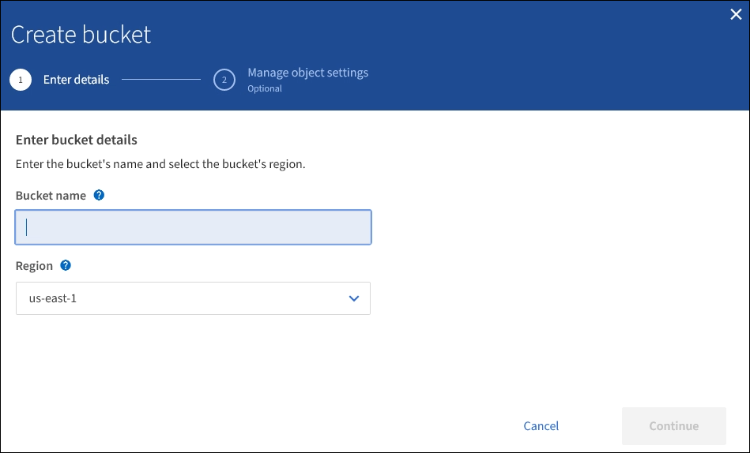

= 创建 S3 存储分段
:icons: font
:imagesdir: ../media/

[role="lead"]
您可以使用租户管理器为对象数据创建 S3 分段。创建存储分段时，必须指定存储分段的名称和区域。如果为 StorageGRID 系统启用了全局 S3 对象锁定设置，则可以选择为存储分段启用 S3 对象锁定。

.您需要什么？ #8217 ；将需要什么
* 您将使用登录到租户管理器 xref:../admin/web-browser-requirements.adoc[支持的 Web 浏览器]。
* 您属于具有 " 管理所有分段 " 或 " 根访问 " 权限的用户组。这些权限将覆盖组或存储分段策略中的权限设置。
+

NOTE: 可以授予设置或修改存储分段或对象的 S3 对象锁定属性的权限 xref:../s3/bucket-and-group-access-policies.adoc[存储分段策略或组策略]。

* 如果您计划使用 S3 对象锁定创建存储分段，则已为 StorageGRID 系统启用全局 S3 对象锁定设置，并已查看 S3 对象锁定存储分段和对象的要求。
+
xref:using-s3-object-lock.adoc[使用 S3 对象锁定]

.步骤
. 选择 * 存储（ S3 ） * > * 分段 * 。
. 选择 * 创建存储分段 * 。
+

. 输入存储分段的唯一名称。
+

IMPORTANT: 创建存储分段后，您无法更改存储分段名称。

+
存储分段名称必须符合以下规则：

+
** 每个 StorageGRID 系统必须是唯一的（而不仅仅是租户帐户中的唯一）。
** 必须符合 DNS 要求。
** 必须至少包含 3 个字符，并且不能超过 63 个字符。
** 每个标签必须以小写字母或数字开头和结尾，并且只能使用小写字母，数字和连字符。
** 不应在虚拟托管模式请求中使用句点。句点会在验证服务器通配符证书时出现发生原因 问题。

+

NOTE: 有关详细信息，请参见 https://docs.aws.amazon.com/AmazonS3/latest/userguide/bucketnamingrules.html["有关存储分段命名规则的 Amazon Web Services （ AWS ）文档"^]。

. 为此存储分段选择区域。
+
StorageGRID 管理员负责管理可用的区域。存储分段的区域可能会影响应用于对象的数据保护策略。默认情况下，所有分段都在 `us-east-1` 区域创建。

+

IMPORTANT: 创建存储分段后，您无法更改此区域。

. 选择 * 继续 * 。
. （可选）为存储分段启用对象版本控制。
+
如果要将每个对象的每个版本存储在此存储分段中，请启用对象版本控制。然后，您可以根据需要检索对象的先前版本。

. 如果显示 "S3 Object Lock" 部分，则可以选择为存储分段启用 S3 Object Lock 。
+

IMPORTANT: 创建存储分段后，您无法启用或禁用 S3 对象锁定。

+
只有在启用了全局 S3 对象锁定设置的情况下，才会显示 S3 对象锁定部分。

+
必须为存储分段启用 S3 对象锁定， S3 客户端应用程序才能为添加到存储分段的对象指定保留日期和合法保留设置。

+
如果为存储分段启用 S3 对象锁定，则会自动启用存储分段版本控制。您也可以 xref:../s3/operations-on-buckets.adoc#using-s3-object-lock-default-bucket-retention[指定存储分段的默认保留模式和默认保留期限] 应用于输入到存储分段中但未指定其自身保留设置的每个对象。

. 选择 * 创建存储分段 * 。
+
此时将创建存储分段并将其添加到 " 存储分段 " 页面上的表中。

xref:../ilm/index.adoc[使用 ILM 管理对象]

xref:understanding-tenant-management-api.adoc[了解租户管理 API]

xref:../s3/index.adoc[使用 S3]
