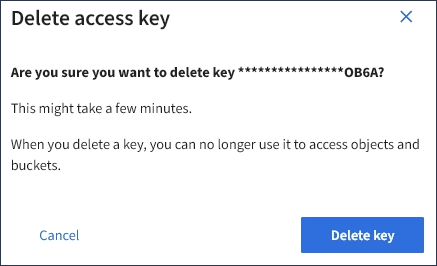

= 删除其他用户的 S3 访问密钥
:allow-uri-read: 
:icons: font
:imagesdir: ../media/

[role="lead"]
如果您使用的是 S3 租户，并且您拥有相应的权限，则可以删除其他用户的 S3 访问密钥。删除访问密钥后，无法再使用它访问租户帐户中的对象和分段。

.您需要的内容
* 您必须使用登录到租户管理器 xref:../admin/web-browser-requirements.adoc[支持的 Web 浏览器]。
* 您必须具有 root 访问权限。请参见 xref:tenant-management-permissions.adoc[租户管理权限]。

IMPORTANT: 可以使用租户管理器中为用户显示的访问密钥 ID 和机密访问密钥来访问属于用户的 S3 存储分段和对象。因此，请像使用密码一样保护访问密钥。定期轮换访问密钥，从帐户中删除任何未使用的密钥，并且切勿与其他用户共享这些密钥。

.步骤
. 选择 * 访问管理 * > * 用户 * 。
+
此时将显示 "Users" 页面，其中列出了现有用户。

. 选择要管理其 S3 访问密钥的用户。
+
此时将显示用户详细信息页面。

. 选择 * 访问密钥 * ，然后选中要删除的每个访问密钥对应的复选框。
. 选择 * 操作 * > * 删除选定密钥 * 。
+
此时将显示确认对话框。

+

. 选择 * 删除密钥 * 。
+
页面右上角将显示一条确认消息。由于缓存，更改可能需要长达 15 分钟才能生效。

