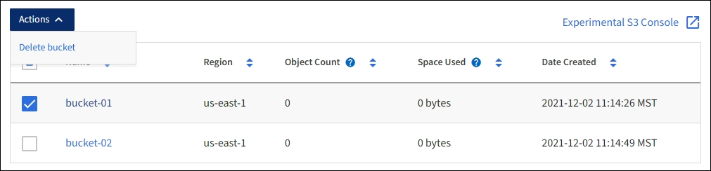

= 删除 S3 存储分段
:allow-uri-read: 
:icons: font
:imagesdir: ../media/

[role="lead"]
您可以使用租户管理器删除一个或多个空的 S3 分段。

.您需要什么？ #8217 ；将需要什么
* 您必须使用登录到租户管理器 xref:../admin/web-browser-requirements.adoc[支持的 Web 浏览器]。
* 您必须属于具有 " 管理所有分段 " 或 " 根访问 " 权限的用户组。这些权限将覆盖组或存储分段策略中的权限设置。请参见 xref:tenant-management-permissions.adoc[租户管理权限]。
* 要删除的存储分段为空。

以下说明介绍如何使用租户管理器删除 S3 存储分段。您也可以使用删除 S3 存储分段 xref:understanding-tenant-management-api.adoc[租户管理 API] 或 xref:../s3/s3-rest-api-supported-operations-and-limitations.adoc[S3 REST API]。

如果 S3 存储分段包含对象或非当前对象版本，则不能删除该存储分段。有关如何删除 S3 版本对象的信息，请参见 xref:../ilm/index.adoc[有关通过信息生命周期管理来管理对象的说明]。

.步骤
. 选择 * 存储（ S3 ） * > * 分段 * 。
+
此时将显示 " 分段 " 页面，其中会显示所有现有的 S3 分段。

+
image::../media/buckets_table.png[存储分段表]

. 选中要删除的空存储分段对应的复选框。您可以一次选择多个存储分段。
+
此时将启用操作菜单。

. 从操作菜单中，选择 * 删除存储分段 * （或者如果选择了多个存储分段 * ，则选择 * 删除存储分段 * ）。
+

. 显示确认对话框时，选择 * 是 * 可删除您选择的所有存储分段。
+
StorageGRID 会确认每个存储分段均为空，然后删除每个存储分段。此操作可能需要几分钟时间。

+
如果存储分段不为空，则会显示一条错误消息。必须先删除所有对象，然后才能删除存储分段。

